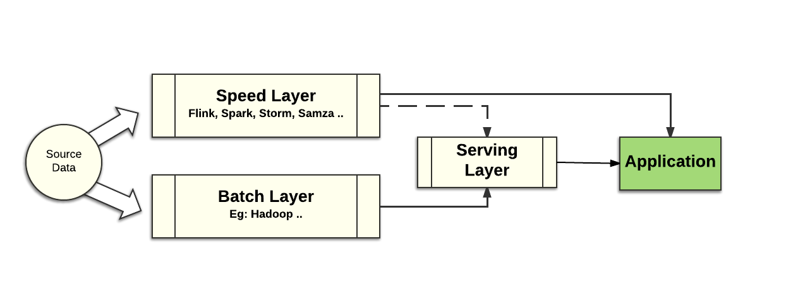

# Pravega Key Features

This document explains some of the key features of Pravega.  It may be
advantageous if you are already with the core [concepts of
Pravega](pravega-concepts.md).

## Pravega Design Principles

Pravega was designed to support the new generation of streaming applications:
applications that deal with a large amount of data arriving continuously that
also need to generate accurate analysis of that data in the face of late
arriving data, data arriving out of order and failures.  There is a
large variety of new open source tools to help developers build such
applications, including Apache Flink, Apache Beam, Spark Streaming and others.
To date, these applications used systems such as Apache Kafka or the Apache
Hadoop Distributed File System (HDFS) to ingest and store data. The combination
of these technologies has enabled us to build a number of important
effective applications across various domains. Interestingly, none of these
existing systems offers independently a way to store and retrieve streams.
Streams can be stored as a log temporarily, but for long-term storage, it needs
to be moved somewhere else.

We in this project have raised the question of how a stream store should look like
and endevored into building Pravega. Pravega is an attempt to expose streams
as a storage primitve that suits the next generation of streaming applications.
Exposing a storage primitive alone is not sufficient for building stream pipelines,
we also need a means for processing data. For the data processing engine, we have
chosen Apache Flink. Flink has a very powerful combination of features that enables
us to build the stream pipelines that we envision. 

The design of Pravega incorporates the lessons learned from using the Lambda and Kappa
architectures to build streaming applications and the challenges to deploy streaming
applications at scale that consistently deliver accurate results despite faults.
Pravega is based on solid storage principles such as durability and consistency,
delivering a rock solid foundation upon which streaming applications can be built.

With the Lambda architecture, the developer uses two data paths to process the data,
in rough terms, one that is slow and accurate and another that is fast and innacurate.
Such paths are implemented with a combination of systems including a batch processing
engine (e.g., Hadoop) and continuous processing engines like Storm, Samza, Kafka and
others.

Batch style processing is used to deliver accurate, but potentially stale
analysis results.  Near real-time processing can deliver faster results
but at a cost of some accuracy.  With this approach, there are two copies of the
application logic because the programming models of the speed layer are
different than those used in the batch layer.  An implementation of the Lambda
architecture can be costly to maintain and manage in production.  This style
of big data application design has been losing traction.  

As more applications, like IoT application, require continuous processing with
near real-time results, we simply cannot afford to think in terms of Lambda
architectures and old style middleware.

With the advent of more modern streaming tools, such as Flink and Pravega, a
different style of architecture is gaining favor.  A Kappa architecture style is
a reaction to the complexity of Lambda architectures and relies on middleware
components that are designed for streaming applications, supporting stronger
semantics and delivering both fast AND accurate data analysis.  A Kappa
architecture is a significantly simpler approach.  Using Pravega makes it even
simpler:

There is one set of middleware to deploy and operate, not two.  One expression
of application logic to develop and maintain, not two.  With the right tools,
built for the demands of processing streaming data in a fast and accurate
fashion, it becomes much simpler to design and run applications like IoT, real
time data analytics and other high data volume, high data velocity applications.

Although some streaming applications can be developed and deployed in terms of a
single application, most applications, certainly most IoT applications, involve
a pipeline of several, sometimes dozens of individual applications or jobs. 

So the real way to think about Kappa and the requirements this architecture
imposes on middleware is to think in terms of chains or pipelines of data
processing.  The requirements now involve not just component by component
capabilities, but end-end semantics.  We need to think about scaling in terms of
end-end scaling, not just scaling a single component.  We need to think in terms
of ordering, exactly once delivery semantics, fault-tolerance etc. across the
entire pipeline.  Using Pravega to coordinate the output of one component with
the input of a downstream component makes delivering a pipeline of stream
components much easier.

## Pravega - Storage Reimagined for a Streaming World

Pravega introduces a new storage primitive, a stream, that matches
continuous processing of unbounded data.  In Pravega, a stream is a named,
durable, append-only and unbounded sequence of bytes.  With this primitive, and
the key features discussed in this document, Pravega is an ideal component to
combine with stream processing engines such as Flink to build streaming
applications.  Because of Pravega's key features, we imagine that it will be the
fundamental storage primitive for a new generation of streaming-oriented
middleware.

Let's examine the key features of Pravega.

## Exactly Once Semantics

By exactly once semantics we mean that Pravega ensures that data is not duplicated
and no event is missed despite failures. Of course, this statement comes with a
number of caveats, like any other system that promises exactly-once semantics, but
let's not dive into the gory details here. An important consideration is that
exactly-once semantics is a natural part of Pravega and has been a goal and part
of the design from day zero.

To achieve exactly once semantics, Pravega Streams are durable, ordered,
consistent and transactional.  We discuss durable and transactional in separate
sections below.

By ordering, we mean that data is observed by readers in the order it is written.
In Pravega, data is written along with an application-defined routing key.  
Pravega makes ordering guarantees in terms of routing keys.  Two pieces of data
with the same routing key will always be read by a Reader in the order they were
written. Pravega's ordering guarantees allow data reads to be replayed (e.g.
when applications crash) and the results of replaying the reads will be the
same.

By consistency, we mean all Readers see the same ordered view of data for a
given routing key, even in the face of failure. Systems that are "mostly
consistent" are not sufficient for building accurate data processing.

Systems that provide "at least once" semantics might present duplication. In
such systems, a data producer might write the same data twice in some scenarios.
In Pravega, writes are idempotent, rewrites done as a result of reconnection
don't result in data duplication. Note that we make no guarantee when the data
coming from the source already contains duplicates. Written data is opaque to
Pravega and it makes no attempt to remove existing duplicates.

But this is not *just* exactly once semantics between two components within an
application architecture, we are talking here about the importance of end-end
exactly once semantics across an entire pipeline of streaming application
components with strict ordering of data in the face of component failures.
Data storage in Pravega is the foundation for exactly once across an entire data
processing pipeline. This is absolutely critical for building streaming
applications that are both timely and accurate.  Without accuracy at the storage
layer, application developers are faced with relying on the complexity of a
Lambda architecture to deliver accurate data analysis in combination with near
real-time processing of the data.

## Auto Scaling

Unlike systems with static partitioning, Pravega can automatically scale
individual data streams to accommodate changes in data ingestion rate.

Imagine an IoT application with millions of devices feeding thousands of data
streams with information about those devices.  Imagine a pipeline of Flink jobs
that process those streams to derive business value from all that raw IoT data:
predicting device failures, optimizing service delivery through those devices,
or tailoring a customer's experience when interacting with those devices.
 Building such an application at scale is difficult without having the
components be able to scale automatically as the rate of data increases and
decreases.

With Pravega, it is easy to elastically and independently scale data ingestion,
storage and processing – orchestrating the scaling of every component in a data
pipeline.

Pravega's support of auto-scaling starts with the idea that Streams are
partitioned into Stream Segments.  A Stream may have 1 or more Stream Segments,
any data written into the Stream is written to one of the Stream Segments based
on a routing key.  Writers use application-meaningful routing keys like
customer-id, timestamp, machine-id, etc to make sure like data is grouped
together.  

A Stream Segment is the fundamental unit of parallelism in Pravega Streams.  A
Stream with multiple Stream Segments can support more parallelism of data
writes; multiple Writers writing data into the different Stream Segments
potentially involving all the Pravega Servers in the cluster.  On the Reader
side, the number of Stream Segments represents the maximum degree of read
parallelism possible.  If a Stream has N Stream Segments, then a ReaderGroup
with N Readers can consume from the Stream in parallel.  Increase the number of
Stream Segments, you can increase the number of Readers in the ReaderGroup to
increase the scale of processing the data from that Stream.  And of course if
the number of Stream Segments decreases, it would be a good idea to reduce the
number of Readers.

A Stream can be configured to grow the number of Stream Segments as more data is
written to the Stream, and to shrink when data volume drops off.  We refer to
this configuration as the Stream's Service Level Objective or SLO.  Pravega
monitors the rate of data input to the Stream and uses the SLO to add or remove
Stream Segments from a Stream.  Segments are added by splitting a Segment.
 Segments are removed by merging two Segments.  See [AutoScaling: The number of
Stream Segments can vary over
time](pravega-concepts.md#autoscalingthenumber-of-stream-segments-can-vary-over-time),
for more detail on how Pravega manages Stream Segments.

It is possible to coordinate the auto scaling of Streams in Pravega with
application scale out.  Using metadata available from Pravega, applications can
configure the scaling of their application components; for example, to drive the
number of instances of a Flink job. Alternatively, you could use software such
as Cloud Foundry, Mesos/Marathon, Kubernetes or the Docker stack to deploy new
instances of an application to react to increased parallelism at the Pravega
level, or to terminate instances as Pravega scales down in response to reduced
rate of data ingestion.

## Distributed Computing Primitive

Pravega is great for distributed applications, such as micro-services; it can be
used as a data storage mechanism, for messaging between micro-services and for
other distributed computing services such as leader election. 

State Synchronizer, a part of the Pravega API, is the basis of sharing state
across a cluster with consistency and optimistic concurrency.  State
Synchronizer is based on a fundamental conditional write operation in Pravega,
so that data is written only if it would appear at a given position in the
Stream.  If a conditional write operation cannot meet the condition, it fails.

State Synchronizer is therefore a strong synchronization primitive that can be
used for shared state in a cluster, membership management, leader election and
other distributed computing scenarios.

You can learn more about the State Synchronizer
[here](state-synchronizer.md).

## Write Efficiency

Pravega shrinks write latency to milliseconds, and seamlessly scales to handle
high throughput reads and writes from thousands of concurrent clients, making it
ideal for IoT and other time sensitive applications.

Streams are light weight, Pravega can support millions of Streams, this frees
the application from worrying about statically configuring streams and pre
allocating a small fixed number of streams and husbanding or limiting stream
resource.

Write operations in Pravega are low latency, under 10 ms to return an
acknowledgement is returned to a Writer. Furthermore, writes are optimized so
that I/O throughput is limited by network bandwidth;  the persistence mechanism
is not the bottle neck.  Pravega uses Apache BookKeeper to persist all write
operations.  BookKeeper persists and protects the data very efficiently.
 Because data is protected before the write operation is acknowledged to the
Writer, data is always durable.  As we discuss below, data durability is a
fundamental characteristic of a storage primitive,  To add further efficiency,
writes to BookKeeper often involve data from multiple Stream Segments, so the
cost of persisting data to disk can be amortized over several write operations.

There is no durability-performance trade-off with Pravega.  Writes are durable
AND high performance.

Reads are efficient too.  A Reader can read from a Stream either at the tail of
the Stream or at any part of the Stream's history.  Unlike some log-based
systems that use the same kind of storage for tail reads and writes as well as
reads to historical data, Pravega uses two types of storage.  The tail of the
Stream is in so-called Tier-1 storage.  Writes are implemented by Apache
BookKeeper as mentioned above.  Tail reads are served out of a Pravega-managed
memory cache.  In fact, BookKeeper serves reads only in failure recovery
scenarios, where a Pravega Server has crashed and it is being recovered.  This
use of BookKeeper is exactly what it was designed for: fast
writes, occasional reads.   The historical part of the Stream is in so-caled
Tier-2 storage that is optimized for low cost storage with high throughput.
 Pravega uses efficient in-memory read ahead cache, taking advantage of the fact
that Streams are usually read in large contiguous chunks and that HDFS is well
suited for those sort of large, high throughput reads.  It is also worth noting
that tail reads do not impact the performance of writes.

## Infinite Retention

Data in Streams can be retained forever. Pravega provides one convenient API to
access both real-time and historical data.  With Pravega, batch and real-time
applications can both be handled efficiently; yet another reason why Pravega is
a great storage primitive for Kappa architectures.

If there is a value to keeping old data, why not keep it around?  For example,
in a machine learning example, you may want to periodically change the model and
train the new version of the model against as much historical data as possible
to yield more accurate predictive power of the model.  With Pravega
auto-tiering, keeping lots of historical data does not affect the performance of
tail reads and writes. 

Size of a stream is not limited by the storage capacity of a single server, but
rather, it is limited only by the storage capacity of your data center or cloud
provider.  As cost of storage decreases, the economic incentive to delete data
goes away

## Storage Efficiency 

Use Pravega to build pipelines of data processing, combining batch, real-time
and other applications without duplicating data for every step of the pipeline.
 

Consider the following data processing environment that combines real time
processing using Spark, Flink, and or Storm; Haddoop for batch; some kind of
Lucene-based Search mechanism like Elastic Search for full text search; and
maybe one (or several) NoSQL databases to support micro-services apps.

Using traditional approaches, one set of source data, for example sensor data
from an IoT app, would be ingested and replicated separately by each system.
 You would end up with 3 replicas of the data protected in the pub/sub system, 3
copies in HDFS, 3 copies in Lucene, 3 copies in the NoSQL database.  When we
consider the source data is measured in terabytes, the cost of data replication
separated by middleware category becomes prohibitively expensive.

Consider the same pipeline using Pravega and middleware adapted to use Pravega
for its storage:

With Pravega, the data is ingested and protected in one place; Pravega provides
the single source of truth for the entire pipeline.  Furthermore, with the bulk
of the data being stored in Tier-2 enabled with erasure coding to efficiently
protect the data, the storage cost of the data is substantially reduced.

# Durability

With Pravega, you don't  face a compromise between performance, durability and
consistency. Pravega provides durable storage of streaming data with strong
consistency, ordering guarantees and great performance.

Durability is a fundamental storage primitive requirement.  Storage that could
lose data is not reliable storage.  Systems based on such storage are not
production quality.

Once a write operation is acknowledged, the data will never be lost, even when
failures occur.  This is because Pravega always saves data in protected,
persistent storage before the write operation returns to the Writer.

With Pravega, data in the Stream is protected.  A Stream can be treated as a
system of record, just as you would treat data stored in databases or files.

# Transaction Support

A developer uses a Pravega Transaction to ensure that a set of events are
written to a stream atomically.

A Pravega Transaction is part of Pravega's Writer API.  Data can be written to a
Stream directly through the API, or an application can write data through a
Transaction.   With Transactions, a Writer can persist data now, and later
decide whether the data should be appended to a Stream or abandoned.

Using a Transaction, data is written to the Stream only when the Transaction is
committed.  When the Transaction is committed, all data written to the
Transaction is atomically appended to the Stream.  Because Transactions are
implemented in the same way as Stream Segments, data written to a Transaction is
just as durable as data written directly to a Stream.  If a Transaction is
abandoned (e.g. if the Writer crashes) the Transaction is aborted and all data
is discarded.  Of course an application can choose to abort the Transaction
through the API if a condition occurs that suggests the Writer should discard
the data. 

Transactions are key to chaining Flink jobs together.  When a Flink job uses
Pravega as a sink, it can begin a Transaction, and if it successfully finishes
processing, commit the Transaction, writing the data into its Pravega-based
sink.  If the job fails for some reason, the Transaction times out and data is
not written.  When the job is restarted, there is no "partial result" in the
sink that would need to be managed or cleaned up.

Combining Transactions and other key features of Pravega, it is possible to
chain Flink jobs together, having one job's Pravega-based sink be the source for
a downstream Flink job.  This provides the ability for an entire pipeline of
Flink jobs to have end-end exactly once, guaranteed ordering of data processing.

Of course, it is possible for Transactions across multiple Streams be
coordinated with Transactions, so that a Flink job can use 2 or more
Pravega-based sinks to provide source input to downstream Flink jobs.  In
addition, it is possible for application logic to coordinate Pravega
Transactions with external databases such as Flink's checkpoint store.

Learn more about Transactions
[here](transactions.md).
