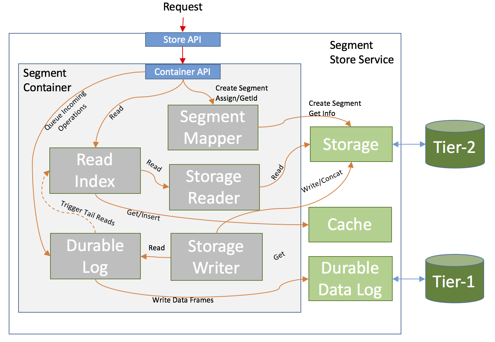
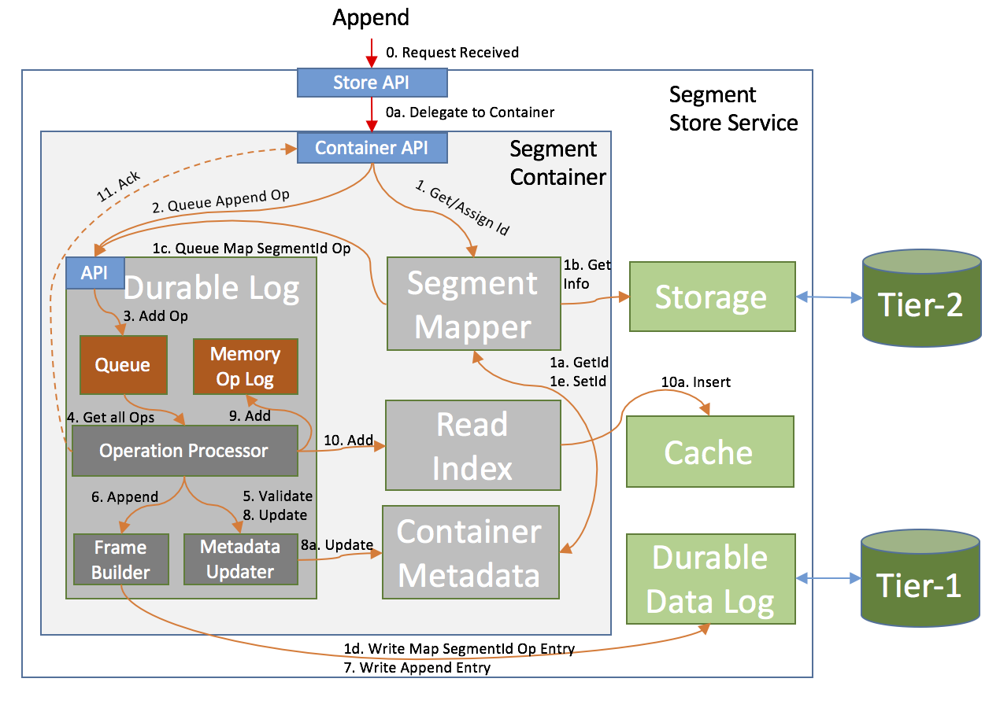
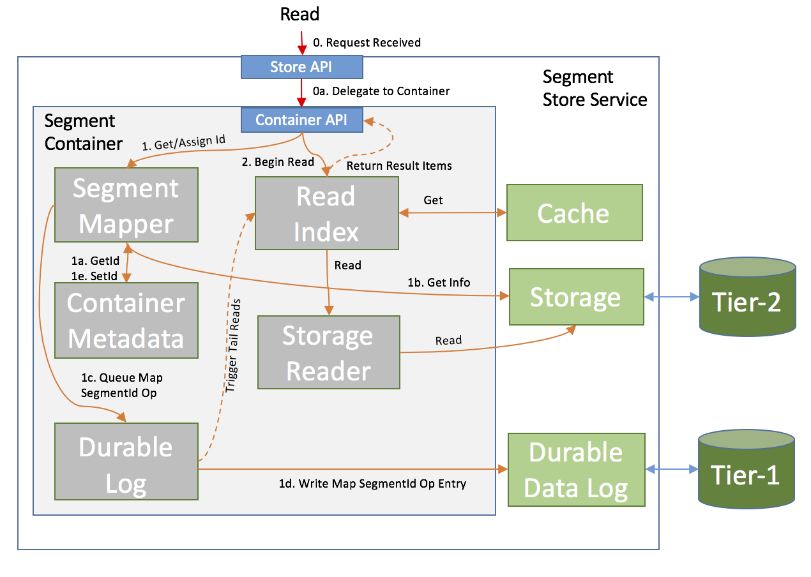
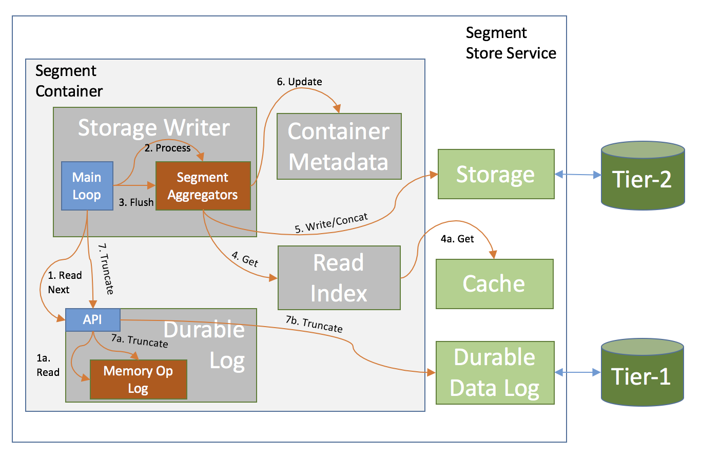
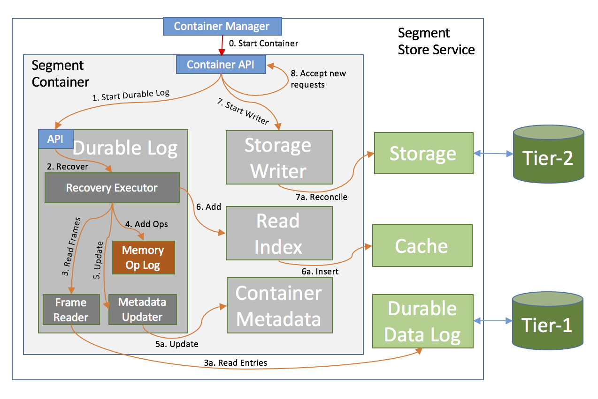

# Pravega Segment Store Service

The Pravega Segment Store Service is a subsystem that lies at the heart of the entire Pravega deployment. It is the main access point for managing Stream Segments, providing the ability to create, delete and modify/access their contents. The Pravega Client communicates with the Pravega Stream Controller to figure out which Segments need to be used (for a Stream), and both the Stream Controller and the Client deal with the Segment Store Service to actually operate on them.

The basic idea behind the Segment Store Service is that it buffers incoming data in a very fast and durable append-only medium (Tier 1), and syncs it to a high-throughput (but not necessarily low latency) system (Tier 2) in the background, while aggregating multiple (smaller) operations to a Segment into a fewer (but larger) ones.

The Pravega Segment Store Service can provide the following guarantees:
- Stream Segments that are unlimited in length, with append-only semantics, yet supporting arbitrary-offset reads.
- No throughput degradation when performing small appends, regardless of the performance of the underlying Tier-2 storage system.
- Multiple concurrent writers to the same Segment.
 - Order is guaranteed within the context of a single writer, but appends from multiple concurrent writers will be added in the order in which they were received (appends are atomic without interleaving their contents).
- Writing to and reading from a Segment concurrently with relatively low latency between writing and reading.

# Terminology
Throughout the rest of this document, we will use the following terminology:
- **Stream Segment** or **Segment**: A contiguous sequence of bytes. Similar to a file with no size limit. This is a part of a Stream, limited both temporally and laterally (by key). The scope of Streams and mapping Stream Segments to such Streams is beyond the purpose of this document.
- **Tier-2 storage** or **Permanent Storage**: The final resting place of the data.
- **Tier-1 storage**: Fast append storage, used for durably buffering incoming appends before distribution to Tier-2 Storage.
- **Pravega Segment Store Service** or **Segment Store**: The Service that this document describes. 
- **Transaction**: A sequence of appends that are related to a Segment, which, if persisted, would make up a contiguous range of bytes within it. This is used for ingesting very large records or for accumulating data that may or may not be persisted into the Segment (but its fate cannot be determined until later in the future).

# Architecture
The **Segment Store** is made up of the following components:
- **Pravega Node**: a host running a Pravega Process.
- **Stream Segment Container** (or **Segment Container**): A logical grouping of Stream Segments. The mapping of Segments to Containers is deterministic and does not require any persistent store; Segments are mapped to Containers via a hash function (based on the Segment's name).
- **Durable Data Log Adapter**: an abstraction layer for Tier-1 Storage.
- **Storage Adapter**: an abstraction layer for Tier-2 Storage.
- **Cache**: an abstraction layer for append data caching.
- **Streaming Client**: an API that can be used to communicate with the Pravega Segment Store. 

The **Segment Store** handles writes by first writing them to a log (Durable Data Log) on a fast storage (SSDs preferably) and immediately acking back to the client, after they have been persisted there. Subsequently, those writes are then aggregated into larger chunks and written in the background to Tier-2 storage. Data for appends that have been acknowledged (and are in Tier-1) but not yet in Tier-2 is stored in the Cache (in addition to Tier-1). Once such data has been written to Tier-2 Storage, it may or may not be kept in the Cache, depending on a number of factors, such as Cache utilization/pressure and access patterns.

More details about each component described above can be found in the **Components** section (below).

## System Diagram

In this image, we show the major components of the _Segment Store_ (for simplicity, only one _Segment Container_ is depicted). All Container components and major links between them (how they interact with each other) are shown. The _Container Metadata_ component is not shown, because every other component communicates with it in one form or another, and adding it would only clutter the diagram.

More detailed diagrams can be found under the _Data Flow_ section (below).

# Components

## Segment Containers
Segment Containers are a logical grouping of Segments, and are responsible for all operations on those Segments within their span. A Segment Container is made of multiple sub-components:
- **Segment Container Metadata**: A collection of Segment-specific metadata that describe the current state of each Segment (how much data in Tier-2, how much in Tier-1, whether it is sealed, etc.), as well as other misc info about each Container.
- **Durable Log**: The Container writes every operation it receives to this log and acks back only when the log says it has been accepted and durably persisted..
- **Read Index**: An in-memory index of where data can be read from. The Container delegates all read requests to it, and it is responsible for fetching the data from wherever it is currently located (Cache, Tier-1 Storage or Tier-2 Storage).
- **Cache**: Used to store data for appends that exist in Tier-1 only (not yet in Tier-2), as well as blocks of data that support reads.
- **Storage Writer**: Processes the durable log operations and applies them to Tier-2 storage (in the order in which they were received). This component is also the one that coalesces multiple operations together, for better back-end throughput.

### Segment Container Metadata
The Segment Container Metadata is critical to the good functioning and synchronization of its components. This metadata is shared across all components and it comes at two levels: Container-wide Metadata and per-Segment Metadata. Each serves a different purpose and is described below.

#### Container Metadata
Each Segment Container needs to keep some general-purpose metadata that affects all operations inside the container:

- **Operation Sequence Number**: The largest sequence number assigned by the _Durable Log_. Every time a new Operation is received and successfully processed by the _Durable Log_, this number is incremented (its value never decreases or otherwise roll back, even if an operation failed to be persisted).
 - The Operation Sequence Number is guaranteed to be strict-monotonic increasing (no two Operations have the same value, and an Operation will always have a larger Sequence Number than all Operations before it).
- **Online flag**: A value that indicates whether a Container is healthy. Sometimes, due to internal or external factors, a possible data corruption may be detected from which it is impossible to recover automatically. In such cases the container enters a hybrid On-Off state, where it is running, but will not process any operation, whether externally visible or in the background - doing so may actually lead to data loss.
- **Restart Counter**: A value used to determine if we have a runaway Container. It is possible that Containers fail to start (due to a number of reasons), in which case the Stream Controller may have them infinitely bounce over a larger number of Nodes (making any sort of debugging very hard). Having a Poison/Restart Counter can help us prevent situations like this by taking a Container offline if it restart it too many times without success.

#### Segment Metadata
Each Segment Container needs to keep per-segment metadata, which it uses to keep track of the state of each segment as it processes operations for it. The metadata can be volatile (it can be fully rebuilt upon recovery) and contains the following properties for each segment that is currently in use:

-   **Name** the name of the Segment.
-   **Id**: Internally assigned unique Segment Id. This is used to refer to Segments, which is preferred to the Name.
-   **Storage Length**: the highest offset of the data that exists in Tier-2 Storage.
-   **Durable Log Length**: the highest offset of the committed data in Tier-1 Storage.
-   **Last Modified**: the timestamp of the last processed (and acknowledged) append.
-   **IsSealed:** whether the Segment is closed for appends (this value may not have been applied to Tier-2 Storage yet).
-   **IsSealedInStorage**: whether the Segment is closed for appends (and this has been persisted in Tier-2 Storage).
-   **IsMerged**: whether this Segment has been merged into another one (but this has not yet been persisted in Tier-2 Storage). This only applies for Transactions. Once the merger is persisted into Tier-2, the Transaction Segment does not exist anymore (so _IsDeleted_ will become true).
-   **IsDeleted:** whether the Segment is deleted or has recently been merged into another Segment. This only applies for recently deleted Segments, and not for Segments that never existed.

The following is **always** true for any Segment:  **Storage Length** <= **Durable Log Offset**.

### Log Operations

A Log Operation is the basic unit that is enqueued in the _Durable Log_. It does not represent an action, per se, but is the base for several serializable operations (we can serialize multiple types of operations, not just Appends). Each Operation is the result of an external action (which denote the alteration of a Segment), or an internal trigger, such as Metadata maintenance operations.

Every Log Operation has the following elements:
-   **Sequence Number**: the unique sequence number assigned to this entry (see more under _Container Metadata_).

These are the various types of Log Operations: 
-   **Storage Operations** represent operations that need to be applied to the underlying Tier-2 Storage:
 -   **StreamSegmentAppendOperation**: Represents an Append to a particular Segment.
 -   **CachedStreamSegmentAppendOperation**: Same as _StreamSegmentAppendOperation_, but this is for internal use (instead of having an actual data payload, it points to a location in the cache from where the data can be retrieved).
 -   **StreamSegmentSealOperation**: When processed, it sets a flag in the in-memory metadata that no more appends can be received. When the _Storage Writer_ processes it, it marks the Segment as read-only in Tier-2 Storage.
 -   **MergeTransactionOperation**: Indicates that a Transaction is to be merged into its parent Segment.
-   **Metadata Operations** are auxiliary operations that indicate a change to the Container Metadata. They can be the result of an external operation (we received an request for a Segment we never knew about before, so we must assign a unique Id to it) or to snapshot the entire Metadata (which helps with recovery and cleaning up Tier-1 Storage). The purpose of the _Metadata Operations_ is to reduce the amount of time needed for failover recovery (when needed):
    -   **StreamSegmentMapOperation**: maps an Id to a Segment Name.
    -   **TransactionMapOperation**: maps an Id to a Transaction and to its Parent Segment.
    -   **Metadata Checkpoint** includes an entire snapshot of the Metadata. This can be useful when during recovery - this contains all metadata up to this point, which is a sufficient base for all operations after it.

### Durable Log

The Durable Log is the central component that handles all Log Operations. All Operations (which are created by the Container) are added to the Durable Log, which processes them in the order in which they were received. It is made up of a few other components, all of which are working towards a single goal of processing all incoming operations as quickly as possible, without compromising data integrity.

#### Information Flow in the Durable Log

1. All received operations are added to an Operation Queue (the caller receives a Future which will be completed when the operation is durably persisted)
2. The Operation Processor picks all operations currently available in the queue (if the queue is empty, it will wait until at least one Operation is added).
3. The Operation Processor runs as a continuous loop (in a background thread), and has four main stages.
 1. Dequeue all outstanding Operations from the Operation Queue (described above)
 2. Pre-process the Operations (validate that they are correct and would not cause undesired behavior, assign offsets (where needed), assign _Operation Sequence Numbers_, etc.)
 3. Write the operations to a DataFrameBuilder, which serializes and packs the operations in DataFrames. Once a DataFrame is complete (full or no more operations to add), the DataFrameBuilder sends the DataFrame to the DurableDataLog. Note that an Operation may span multiple DataFrames - the goal is to make best use of the DurableDataLog throughput capacity by making writes as large as possible (but also taking into account that there may be a maximum size limit per write).
 4. When a DataFrame has been durably persisted in a DurableDataLog, the OperationProcessor post-processes all operations that were fully written so far (adds them to in-memory structures, updates indices, etc.) and completes the Futures associated with them.

#### Truncation
Based on supplied configuration, the _Durable Log_ auto-adds a special kind of operation, named _MetadataCheckpointOperation_. This operation, when processed by the _Operation Processor_, collects a snapshot of the entire _Container Metadata_ and serializes it to the _Durable Data Log_. This special Operation marks a **Truncation Point** - a place in the stream of _Log Operations_ where we can issue Truncate operations. It is very important that after every truncation, the first operation to be found in the log is a _MetadataCheckpointOperation_, because without the prior operations to reconstruct metadata, this is the only way to be able to process subsequent operations.

#### Operation Processor
The Operation Processor is a sub-component of the _Durable Log_ that deals with incoming _Log Operations_. Its purpose is to validate, persist, and update Metadata and other internal structures based on the contents of each operation.

#### Operation Metadata Updater
The Operation Metadata Updater is a sub-component of the _Durable Log_ that is responsible with validating operations based on the current state of the metadata, as well as update the Metadata after a successful committal of an operation. Internally it has various mechanisms to cope with failures, and it can rollback certain changes in failure situations.

#### Durable Data Log
The Durable Data Log is an abstraction layer to an external component that provides append-only semantics. It is supposed to be a system which provides very fast appends to a log, that guarantees the durability and consistency of the written data. The read performance is not so much a factor, because we do not read directly from this component - we only read from it when we need to recover the contents of the _Durable Log_.

As explained above, _Log Operations_ are serialized into Data Frames (with a single Operation able to span multiple such Frames if needed), and these Frames are then serialized as entries into this Durable Data Log. This is used only as a fail-safe, and we only need to read these Frames back if we need to perform recovery (in which case we need to deserialize all _Log Operations_ contained in them, in the same order in which they were received).

#### In-Memory Operation Log
The In-Memory Operation Log (ML) contains committed (and replicated) _Log Operations_ in the exact same order as they were added to the Durable Data Log. While the Durable Data Log contains a sequence of DataFrames (which contain serializations of Operations), the ML contains the actual Operations, which can be used throughout the Durable Log (and the _Storage Writer_).

The ML is essentially a chain of _Log Operations_ ordered by the time when the Operation was received. We always add at one end, and we remove from the other. When we truncate the _Durable Data Log_ the ML is also truncated at the same location.

### Read Index
The Read Index helps the _Segment Container_ perform reads from streams at arbitrary offsets. While the _Durable Log_ records (and can only replay) data in the order in which it is received, the Read Index can access the data in a random fashion. The Read Index is made of multiple Segment Read Indices (one per live stream).

The **Segment Read Index** (SRI) is a data structure that is used to serve reads from memory, as well as pull data from Tier-2 Storage and provide _Future Reads_ (tail reads). When a read request is received, the SRI returns a read iterator, that will return data as long as the read request parameters have not yet been satisfied. The iterator will either fetch data that is immediately available in memory, or request data from Tier-2 storage (and bring it to memory) or, if it reached the current end of the Segment, return a Future that will be completed when new data is added (thus providing tailing or future reads).

### Cache
The Cache is a component where all data (whether from new appends or that was pulled from Tier-2 storage) is stored. It is a key-value store, and both the _Read Index_ and any other consumer of _Durable Log_ operations (via its _read_ method) will be accessing it to fetch data. 

The Cache is defined as an abstraction layer, and currently there is only an in-memory implementation (via a HashMap) of it. In the future, we might consider replacing that with a memory-disk hybrid component, which will not be bound by the limitations of available memory.

### Storage Writer
Pravega is by no means the final resting place of the data, nor is it meant to be a storage service. The Tier-2 Storage is where we want data to be in the long term and Pravega is only used to store a very short tail-end of it (using Tier-1 Storage), enough to make appends fast and aggregate them into bigger chunks for committal to Tier-2 Storage. In order to perform this, it needs another component (Storage Writer) that reads data from the _Durable Log_ in the order in which it was received, aggregates it, and sends it to Tier-2 Storage.

Just like the _Durable Log_, there is one Storage Writer per _Segment Container_. Each Writer reads Log Operations from the In-Memory Operation Log (exposed via the _read_ method in the _Durable Log_) in the order they were processed. It keeps track of the last read item by means of its Sequence Number. This state is not persisted, and upon recovery, it can just start from the beginning of the available _Durable Log_.

The Storage Writer can process any _Storage Log Operation_ (Append, Seal, Merge), and since Pravega is the sole actor modifying such data in Tier-2, it applies them without restraint. It has several mechanisms to detect and recover from possible data loss or external actors modifying data concurrently.

# Integration with Stream Controller
Actual methods for how _Segment Containers_ are mapped to hosts and what rules are used for moving from from one to another are beyond the scope of this document. Here, we just describe how the _Segment Store Service_ interacts with the _Stream Controller_ and how it manages the life cycle of _Segment Containers_ based on external events.

## Segment Container Manager
Each instance of a _Pravega Segment Store Service_ will need a Segment Container Manager. The role of this component is to manage the life cycle of the Segment Containers that are assigned to that node (service). It performs the following duties:
-   Connects to the Pravega Stream Controller Service-Side Client (i.e., a client that deals only with _Segment Container_ events, and not with the management of Streams and listens to all changes that pertain to Containers that pertain to its own instance.
-   When it receives a notification that it needs to start a _Segment Container_ for a particular Container Id, it initiates the process of bootstrapping such an object. It does not notify the requesting client of success until the operation completes without error.
- When it receives a notification that it needs to stop a _Segment Container_ for a particular Container Id, it initiates the process of shutting it down. It does not notify the requesting client of success until the operation completes without error.
- If the _Segment Container_ shuts down unexpectedly (whether during Start, or during its normal operation), it will not attempt to restart it locally; instead it will notify the Stream Controller Client of the fact.

# Storage Abstractions
The _Segment Store_ was not designed with particular implementations for Tier-1 or Tier-2 in mind. Instead, both Tier-1 and Tier-2 have been abstracted out in simple, well-defined interfaces, which can be implemented against any standard file system (Tier-2) or append-only log system (Tier-1). 

Possible candidates for Tier-1 storage:
- Apache BookKeeper
- Non-durable, non-replicated solutions:
 - Local File System (Single node deployment only - Pravega becomes a semi-durable buffer for Tier-2 storage; data loss is unavoidable and unrecoverable from in the case of complete node failure)
 - In-Memory (Single node deployment only - Pravega becomes a volatile buffer for Tier-2 storage; data loss is unavoidable and unrecoverable from in the case of process crash or system restart).

Possible candidates for Tier-2 storage:
- HDFS
- S2 (+ext)
- NFS (but not really desired)
- Non-durable, non-replicated solutions:
 - Local File System (Single node deployment only; data loss is unavoidable and unrecoverable from in the case of complete node failure)
 - In-Memory (Single node deployment only - limited usefulness; data loss is unavoidable and unrecoverable from in the case of process crash or system restart) 

# Data Flow
Here are a few examples on how data flows inside the Pravega Segment Store Service.

## Appends

The diagram above depicts these steps (note the step numbers may not match, but the order is the same):

0.  Segment Store receives append request with params: **Segment Name**, **Payload** and **AppendContext** .
 1.  Segment Store determines the ContainerId for the given Segment and verifies if it is Leader for given Segment Container. If not, it returns an appropriate error code.
 2.  Segment Store delegates request to the Segment Container instance.
1.  Segment Container verifies that the Segment belongs to the Segment Container and that the Segment actually exists. If not, it returns an appropriate error code. 
 - During this process, it also get an existing Segment Id or assigns a new one (by using the _Segment Mapper_ component).
2.  Segment Container creates a _StreamSegmentAppendOperation_ with the input data and sends it to the _Durable Log_.
3.  _Durable Log_ takes the Append Operation and processes it according to the algorithm described in the _Durable Log_ section.
 1. Puts it in its Operation Queue.
 2. Operation Processor pulls all operations off the Queue.
 3. Operation Processor uses the Frame Builder to construct Data Frames with the operations it has.
 4. Frame Builder writes the Data Frame to the _Durable Data Log_ (interface for Tier-1 Storage).
 5. Metadata is updated and the Operation is added to the _Memory Operation Log_.
4.  Upon completion:
    1.  **Success**: Append Operation is added to the _Read Index_ and any Future reads for the Segment are activated, if they meet the trigger criteria.
    2.  **Failure**: The call is failed with an appropriate error code.

## Reads

The diagram above depicts these steps (note the step numbers may not match, but the order is the same):
0.  Segment Store receives read request with **Segment Name**, **Read Offset**, **Max-Length**.
 1.  Segment Store determines the ContainerId for the given Segment and verifies if it is Leader for given Segment Container. If not, it returns an appropriate error code.
 2.  Segment Store delegates request to the Segment Container instance.
1.  Segment Container verifies that the Segment belongs to that Container and that it actually exists. If not, it returns an appropriate error code to the client. 
 - During this process, it also get an existing Segment Id or assigns a new one (by using the _Segment Mapper_ component).
2.  Segment Container delegates the request to its _Read Index_, which processes the read as described in the _Read Index_ section, by issuing Reads from _Storage_ (for data that is not in the _Cache_), and getting/updating the _Cache_ as needed.

## Seal Segment

0.  Segment Store receives read request with **Segment Name**.
 1.  Segment Store determines the ContainerId for the given Segment and verifies if it is Leader for given Segment Container. If not, it returns an appropriate error code.
 2.  Segment Store delegates request to the Segment Container instance.
1.  Segment Container verifies that the Segment belongs to that Container and that it actually exists. If not, it returns an appropriate error code to the client. 
 - During this process, it also get an existing Segment Id or assigns a new one (by using the _Segment Mapper_ component).
2.  Segment Container creates a new **StreamSegmentSealOperation** and adds it into the Durable Log.
    1.  Durable Log takes the Operation and processes it internally, similarly to how it processes an Append (see above).
    2. The Segment Metadata for the given segment is updated to reflect the _Seal_ status (after this, no more appends are accepted).
3.  Returns the length of the segment (from metadata) to the caller.

## Merge Transaction

0.  Segment Store receives read request with **Transaction Name**.
 1.  Segment Store determines the ContainerId for the given Transaction and verifies if it is Leader for given Segment Container. If not, it returns an appropriate error code.
 2.  Segment Store delegates request to the Segment Container instance.
1.  Segment Container verifies that the Transaction belongs to the SegmentContainer and that it actually exists. If not, it returns an appropriate error code to the client. 
 - During this process, it also get an existing Segment Id or assigns a new one (by using the _Segment Mapper_ component) for both the Transaction Segment and for its Parent Segment.
2.  Segment Container creates a **MergeTransactionOperation** and adds it to the _Durable Log_.
3.  _Durable Log_ processes the operation as described in the _Durable Log_ section above (and very similar to how it also processes an Append).
 1.  After completion, the Metadata for the Transaction Segment is marked as 'Merged' (no further direct access to it), and the Metadata for the Parent Segment is updated as well to reflect the new length.
 2. The _Read Index_ will also be updated with the information about the merger.
4.  Returns the length of the stream + batch (from metadata) to the caller.

## Synchronization with Tier-2 (Storage Writer)

The diagram above depicts these steps (note the step numbers may not match, but the order is the same):

0. The _Storage Writer_'s main loop is the sub-component that triggers all these operations
1. Read next Operation from the _Durable Log_ (in between each loop, the Writer remembers what the Sequence Number of the last processed Operation was)
2. All operations are processed, and added to the internal _Segment Aggregators_ (one Aggregator per Segment)
3. Eligible _Segment Aggregators_ are flushed to _Storage_ (eligibility depends on the amount of data collected in each aggregator, and whether there are any _Seal_ or _Merge_ operations queued up)
 - Each time an Append operation is encountered, a trip to the _Cache_ may be required in order to get the contents of the append
4. After every successful modification (write/seal/concat) to _Storage_, the _Container Metadata_ is updated to reflect the changes.
5. The _Durable Log_ is truncated (if eligible).

## Container Startup (Normal/Recovery)

The diagram above depicts these steps (note the step numbers may not match, but the order is the same):

0. The _Container Manager_ receives a request to start a Container in this instance of the _Segment Store Service_.
 - It creates, registers, and starts the Container.
1. The _Container_ starts the _Durable Log_ component.
2. _Durable Log_ initiates the recovery process (coordinated by the _Recovery Executor_).
3. _Recovery Executor_ reads all Data Frames from _Durable Data Log_
4. Deserialized Operations from the read Data Frames are added to the _Memory Operation Log_
5. The _Container Metadata_ is updated by means of the _Metadata Updater_.
6. The _Read Index_ is populated with the contents of those Operations that apply to it.
7. The _Container_ Starts the _Storage Writer_.
 - The _Storage Writer_'s Main Loop starts processing operations from the _Durable Log_, and upon first encountering a new _Segment_, it reconciles its content (and metadata) with the reality that exists in _Storage_.
8. After both the _Durable Log_ and the _Storage Writer_ have started, the _Container_ is ready to start accepting new external requests.
