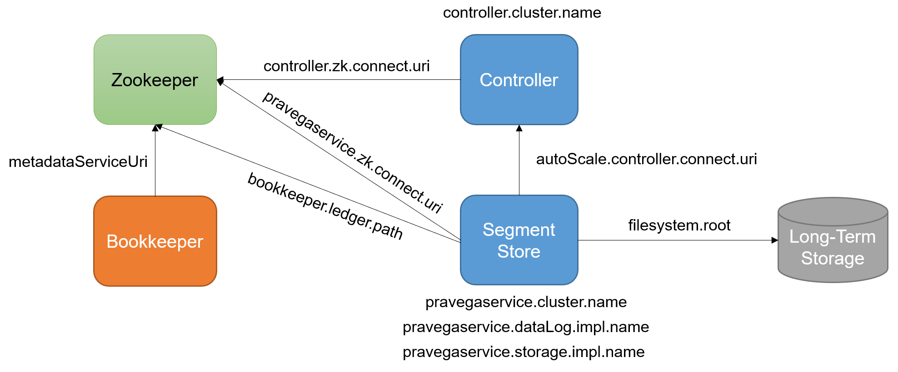

<!--
Copyright Pravega Authors.

Licensed under the Apache License, Version 2.0 (the "License");
you may not use this file except in compliance with the License.
You may obtain a copy of the License at

    http://www.apache.org/licenses/LICENSE-2.0

Unless required by applicable law or agreed to in writing, software
distributed under the License is distributed on an "AS IS" BASIS,
WITHOUT WARRANTIES OR CONDITIONS OF ANY KIND, either express or implied.
See the License for the specific language governing permissions and
limitations under the License.
-->
# Cluster Service Dependencies

A Pravega Cluster consists of a set of services (Zookeeper, Bookkeeper, Segment Store, Controller and Long-Term Storage)
that interact among each other. Understanding such dependencies and the parameters that express them is key. Next, we describe
such dependencies and the main parameters in this regard with a practical example: to configure a Pravega Cluster with
Zookeeper and Bookkeeper using NFS as Long-Term Storage.

Relevant configuration parameters:
 
- **`pravegaservice.zk.connect.uri`, `controller.zk.connect.uri`**: Full URL (host:port) where to find a ZooKeeper that 
can be used for coordinating this Pravega Cluster. 
_Type_: `String`. _Default_: `localhost:2181`. _Update-mode_: `read-only`.

- **`pravegaservice.dataLog.impl.name`**: DataLog implementation for Durable Data Log Storage. Valid values: BOOKKEEPER, 
INMEMORY.
_Type_: `String`. _Default_: `BOOKKEEPER`. _Update-mode_: `read-only`.

- **`pravegaservice.storage.impl.name`**: Storage implementation for Long-Term Storage. Valid values: HDFS, FILESYSTEM, 
EXTENDEDS3, INMEMORY.
_Type_: `String`. _Default_: `HDFS`. _Update-mode_: `read-only`.

- **`autoScale.controller.connect.uri`**: URI for the Pravega Controller.
_Type_: `String`. _Default_: `pravega://localhost:9090`. _Update-mode_: `cluster-wide`.

- **`bookkeeper.zk.connect.uri`**: Endpoint address (hostname:port) where the ZooKeeper controlling Bookkeeper for this 
cluster can be found at. This value must be the same for all Pravega SegmentStore instances in this cluster.
_Type_: `String`. _Default_: `localhost:2181`. _Update-mode_: `read-only`.

- **`bookkeeper.ledger.path`**: Default root path for Bookkeeper Ledger metadata. This property tells the Bookkeeper 
client where to look up Ledger Metadata for the Bookkeeper cluster it is connecting to. If this property isn't uncommented, 
then the default value for the path is the Pravega cluster namespace (`/pravega/<cluster-name>/`) with "ledgers" appended:
`/pravega/<cluster-name>/ledgers`. Otherwise, it will take the value specified below. 
_Type_: `String`. _Default_: `/pravega/bookkeeper/ledgers`. _Update-mode_: `read-only`.

- **`filesystem.root`**: Root path where NFS shared directory needs to be mounted before segmentstore starts execution.
_Type_: `String`. _Default_: ` `. _Update-mode_: `read-only`.

- **`metadataServiceUri`** (BOOKKEEPER): Metadata service uri in Bookkeeper that is used for loading corresponding 
metadata driver and resolving its metadata service location.
_Type_: `String`. _Default_: `zk+hierarchical://localhost:2181/ledgers`. _Update-mode_: `read-only`.

The above parameters express the dependencies within a Pravega cluster as follows:

 

Following with the proposed example, we need to configure the above parameters as follows. First, assuming that our
Zookeeper cluster is up and running at `zookeeper-service:2181` (no dependencies here), the first step is to deploy 
Bookkeeper. The most important parameter to configure in Bookkeeper is `metadataServiceUri`, as it dictates the metadata 
location of Bookkeeper ledgers, which is required by Pravega. Thus, in our cluster we need to configure 
`metadataServiceUri` as: 
- `metadataServiceUri=zk+hierarchical://zookeeper-service:2181/<bookkeeper.ledger.path>`

The value assigned to the `metadataServiceUri` ensures that Bookkeeper will store the metadata of ledgers in the location
that Pravega expects (i.e., `bookkeeper.ledger.path`). If you want to use an existing Bookkeeper cluster for Pravega,
then you will need to set `bookkeeper.ledger.path` with the location at which the Bookkeeper cluster is already storing the
metadata of ledgers.

With Bookkeeper up and running, we need to configure the rest of parameters in Pravega. First, both the Controller and
the Segment Store services should point to the Zookeeper service:  
- `[pravegaservice.zk.connect.uri|controller.zk.connect.uri]=zookeeper-service:2181`

Note that both properties should be configured given that Pravega currently separates the configuration for Controller
and Segment Store. In addition to that, and assuming that our Controller service has a service endpoint or DNS name
(e.g., `controller-service:9090`), we need to point the Segment Store to that endpoint in order to properly configure
the [Stream auto-scaling feedback loop](http://pravega.io/docs/latest/pravega-concepts/#elastic-streams-auto-scaling):
- `autoScale.controller.connect.uri=pravega://controller-service:9090`

Finally, we just need to configure the storage side of the Segment Store. On the one hand, the parameter 
`pravegaservice.dataLog.impl.name` can be left with its default value (`BOOKKEEPER`), given that we use Bookkeeper as
a durable log for Pravega. On the other hand, we need to configure `pravegaservice.storage.impl.name` to use a NFS
service and pointing to the right mount point (e.g., `NFS-IP/pravega-data`):
- `pravegaservice.storage.impl.name=FILESYSTEM`
- `filesystem.root=NFS-IP/pravega-data`

With this, we would be able to run our Pravega Cluster with Bookkeeper/Zookeeper and store data in the long term to a
NFS service. 