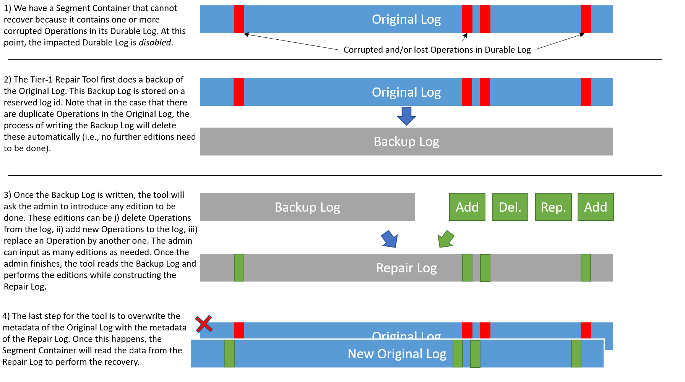

<!--
Copyright Pravega Authors.

Licensed under the Apache License, Version 2.0 (the "License");
you may not use this file except in compliance with the License.
You may obtain a copy of the License at

    http://www.apache.org/licenses/LICENSE-2.0

Unless required by applicable law or agreed to in writing, software
distributed under the License is distributed on an "AS IS" BASIS,
WITHOUT WARRANTIES OR CONDITIONS OF ANY KIND, either express or implied.
See the License for the specific language governing permissions and
limitations under the License.
-->

# Data Recovery Tools

This document provides an overview of the data recovery tools in Pravega. The target audience of this
document are administrators of Pravega clusters that may be responsible for recovering the cluster
after a data loss/corruption issue has happened. We strongly recommend reading this guide before
attempting any data recovery action on a real Pravega cluster, as the consequences of a non-expert
usage of these tools may worsen the original situation.

## Tier-1 Repair Tool

The Tier-1 Repair Tool allows an administrator to "edit" Durable Logs storing the sequence
of Operations that a Segment Container has processed. For more info, please [check out the PDP](https://github.com/pravega/pravega/wiki/PDP-54-(Tier-1-Repair-Tool)).

### Targeted Scenarios 
This tool works on the actual Operations stored in a Durable Log. In most cases where 
the data loss/corruption is related to the Operations of a Durable Log, this tool can be useful. For example,
imagine that by some reason, the Durable Log contains a duplicate Operation written (e.g., a network glitch
has uncovered a bug in the write path). If the Segment Container attempts to recover when there is a duplicate
Operation in the Durable Log, the recovery process will halt throwing a `DataCorruptionException` and the DurableLog will be disabled.
This tool can help "edit" the original Durable Log to _remove_ the duplicate Operation and recover the
Segment Container. Similarly, if an Operation that should be there is missing, we can _add_ an Operation to fill
that gap in the original Durable Log, or even _replacing_ a malformed Operation by another one. 

### Non-Targeted Scenarios 
This tool assumes that the metadata of the Durable Log is correct and works on the actual data. 
Therefore, it _cannot solve problems related to the metadata of a Durable Log_.
For instance, if a Bookkeeper-based Durable Log has few ledgers stored, but the ZNode pointing to them
has been corrupted, this tool is not going to help.

### Tool Workflow 
A Durable Log cannot be actually "edited", because it is an append-only data structure.
For this reason, editing a Durable Log implies copying and re-writing the data, which dictates the workflow
of this tool. The high-level view of the tool workflow can be observed in the figure below:

The workflow of the tool is as follows:
- We need the damaged Original Log to be _disabled_. This happens automatically when a `DataCorruptionException`
is detected during recovery. With this, we prevent an admin to accidentally run this command on an enabled Durable Log.
- The tool first creates a Backup Log with the Original Log contents. Also, in case that the Original Log
has some duplicate entries, the backup process removes them automatically.
  - It may happen that there is a Backup Log from a previous execution of the tool. In that case, the
administrator needs to decide what to do: i) re-use the existing Backup Log, ii) delete existing Backup Log, 
iii) quit. Note that the option of re-using the existing Backup Log gives an administrator the opportunity 
to re-try repair the Original Log, in case the previous attempt does not solve the problem and the Segment
Container is still unable to recover.
- Once the Backup Log is created, the tool will ask the administrator to input edits to be done to the
Original Log contents. Note that the creation of log edits may be non-trivial, so we provide more details in
the next section.
- With the desired edits to the Backup Log in place, the tool reads the Backup Log and applies them to create
a new log, namely the Repair Log. This log is the one supposed to fix the data corruption issues is the Original
Log.
- The last step for the tool is to overwrite the metadata of the Original Log by the metadata of the Repair
Log. With this, the Segment Container will read the data from the Repair Log during the recovery process.

### Usage Instructions

The Tier-1 Repair Tool is, in general, simple to use: the command expects the id of the Segment Container
that needs to be repaired: e.g., `data-recovery durableLog-repai 0`. Leaving aside the creation of Durable Log
edit operations, the rest of the tool execution will ask confirmation from the admin while making progress.
From the usage perspective, generating edits for the damaged Durable Log is the most complex part, so this
section is going to focus on this topic.

To modify a Durable Log content, the tool allows the user to create Log Edit Operations. Internally, a Log Edit 
Operation has an _initial sequence id_, a _final sequence id_, a _type_, and _new Operation_. Log Edit Operations
will instruct the tool how to actually do the changes on the damaged Durable Log. There are three types of edits:
- **Delete Edit Operation**: A Log Edit Operation that will instruct the tool to do not write Operations
to the Repair Log that were in the Backup Log. The initial (inclusive) and final (exclusive)
sequence numbers defined in this Log Edit Operation defines the Operations from the Backup Log to skip. Clearly,
there is no need to have any new Operation, as the purpose of this edit type is to delete Operations.
- **Add Edit Operation**: A Log Edit Operation that will add an Operation at the sequence number specified by
the initial sequence id field. In this case, the tool will write the new Operation contained in the Log Edit 
Operation and then will continue writing the existing Operations in the log after that sequence number.
- **Replace Edit Operation**: A Log Edit Operation that will replace the Operation at the sequence number 
specified by the initial sequence id field.

The previous Log Edit Operation will give us the flexibility to edit a Durable Log in any way. However, there
is one more caveat to it: Adding and replacing Operations in a Durable Log requires to create them somehow. The
tool also helps the administrator to create new Operations, and thus it will ask the admin for all the required
information needed to instantiate such Operations (you may need to think about that before running the tool).
In the following, we describe the Operations that an admin can create via this tool and the information that
will be requested:
- `DeleteSegmentOperation`: `segmentId` (long), `offset` (long).
- `MergeSegmentOperation`: `targetSegmentId` (long), `sourceSegmentId` (long), `offset` (long).
- `MetadataCheckpointOperation`: `content` (`ByteArraySegment`).
- `StorageMetadataCheckpointOperation`: `content` (`ByteArraySegment`).
- `StreamSegmentAppendOperation`: `segmentId` (long), `offset` (long), `content` (`ByteArraySegment`), 
`attributeUpdates` (`AttributeUpdateCollection`).
- `StreamSegmentMapOperation`: `segmentProperties` (`SegmentProperties`).
- `StreamSegmentSealOperation`: `segmentId` (long), `offset` (long).
- `StreamSegmentTruncateOperation`: `segmentId` (long), `offset` (long).
- `UpdateAttributesOperation`: `segmentId` (long), `attributeUpdates` (`AttributeUpdateCollection`).

Visibly, creating many of these Operations is relatively easy, as they require simple values to build them.
However, there are other Operations that require instantiating more complex inputs in form of objects. We 
provide more information on these in the following:
- `AttributeUpdateCollection`: To instantiate an `AttributeUpdateCollection`, the tool 
will require zero or more `AttributeUpdate` objects. Each `AttributeUpdate` is made by an `AttributeId` 
(String, currently we support only UUID), `type` (byte), `value` (long), and `comparisonValue` (long).
- `SegmentProperties`: To instantiate a `SegmentProperties` object, the tool will require as input the
`segmentName` (String), `offset` (long), `length` (long), `storageLength` (long), `sealed` (boolean),
`sealedInStorage` (boolean), `deleted` (boolean), `deletedInStorage` (boolean), and zero or more pairs of
attributes, each one consisting of `AttributeId` (String, currently we support only UUID) and `value` (long).
- `ByteArraySegment` (contents): Currently, the tool supports two ways of adding content to the Operations
requiring it: i) _zero_, which means create a byte array full of zeros of a length specified by the admin;
ii) _file_, so the admin can provide a path to a file which contains the right contents to be set on a specific
Operation. Given that the content of appends and checkpoints may be quite complex, at the moment the most
reasonable way to generate actual Operation contents may be to create ad-hoc script/tools for generating the
contents in a file, and this tool will pick these contents and use them to repair the damaged Durable Log.

