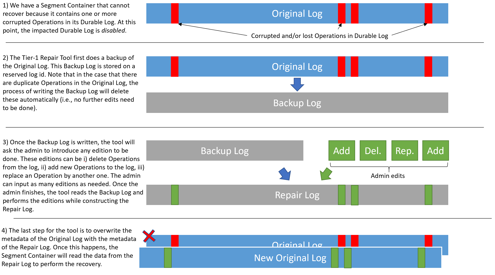

<!--
Copyright Pravega Authors.

Licensed under the Apache License, Version 2.0 (the "License");
you may not use this file except in compliance with the License.
You may obtain a copy of the License at

    http://www.apache.org/licenses/LICENSE-2.0

Unless required by applicable law or agreed to in writing, software
distributed under the License is distributed on an "AS IS" BASIS,
WITHOUT WARRANTIES OR CONDITIONS OF ANY KIND, either express or implied.
See the License for the specific language governing permissions and
limitations under the License.
-->

# Data Recovery Tools

This document provides an overview of the data recovery tools in Pravega. The target audience of this
document are administrators of Pravega clusters that may be responsible for recovering the cluster
after a data loss/corruption issue has happened. We strongly recommend reading this guide before
attempting any data recovery action on a real Pravega cluster, as the consequences of a non-expert
usage of these tools may worsen the original situation.

## Tier-1 Repair Tool

The Tier-1 Repair Tool allows an administrator to "edit" Durable Logs storing the sequence
of Operations that a Segment Container has processed. For more info, please [check out the PDP](https://github.com/pravega/pravega/wiki/PDP-54-(Tier-1-Repair-Tool)).

###Targeted Scenarios 
This tool works on the actual Operations stored in a Durable Log. In most cases where 
the data loss/corruption is related to the Operations of a Durable Log, this tool can be useful. For example,
imagine that by some reason, the Durable Log contains a duplicate Operation written (e.g., a network glitch
has uncovered a bug in the write path). If the Segment Container attempts to recover when there is a duplicate
Operation in the Durable Log, the recovery process will halt throwing a `DataCorruptionException` and the DurableLog will be disabled.
This tool can help "editing" the original Durable Log to _remove_ the duplicate Operation and recover the
Segment Container. Similarly, if an Operation that should be there is missing, we can _add_ an Operation to fill
that gap in the original Durable Log, or even _replacing_ a malformed Operation by another one. 

###Non-Targeted Scenarios 
This tool assumes that the metadata of the Durable Log is correct and just
works on the actual data. Therefore, it _cannot solve problems related to the metadata of a Durable Log_.
For instance, if a Bookkeeper-based Durable Log has few ledgers stored, but the ZNode pointing to them
has been corrupted, this tool is not going to help.

###Tool Workflow 
A Durable Log cannot be actually "edited", because it is an append-only data structure.
For this reason, editing a Durable Log implies copying and re-writing the data, which dictates the workflow
of this tool. The high-level view of the tool workflow can be observed in the figure below:

The workflow of the tool is as follows:
- We need the damaged Original Log to be _disabled_. This happens automatically when a `DataCorruptionException`
is detected during recovery. With this, we prevent an admin to accidentally run this command on an enabled Durable Log.
- The tool first creates a Backup Log with the Original Log contents. Also, in case that the Original Log
has some duplicate entries, the backup process removes them automatically.
  - It may happen that there is a Backup Log from a previous execution of the tool. In that case, the
administrator needs to decide what to do: i) re-use the existing Backup Log, ii) delete existing Backup Log, 
iii) quit. Note that the option of re-using the existing Backup Log gives an administrator the opportunity 
to re-try repair the Original Log, in case the previous attempt does not solve the problem and the Segment
Container is still unable to recover.
- Once the Backup Log is created, the tool will ask the administrator to input edits on to be done to the
Original Log contents. Note that the creation of log edits may be non-trivial, so we provide more details in
the next section.
- With the desired edits to the Backup Log in place, the tool read the Backup Log and apply them to create
a new log, namely the Repair Log. This log is the one supposed to fix the data corruption issues is the Original
Log.
- The last step for the tool is to overwrite the metadata of the Original Log by the metadata of the Repair
Log. With this, the Segment Container will read the data from the Repair Log during the recovery process.

###Usage Instructions

