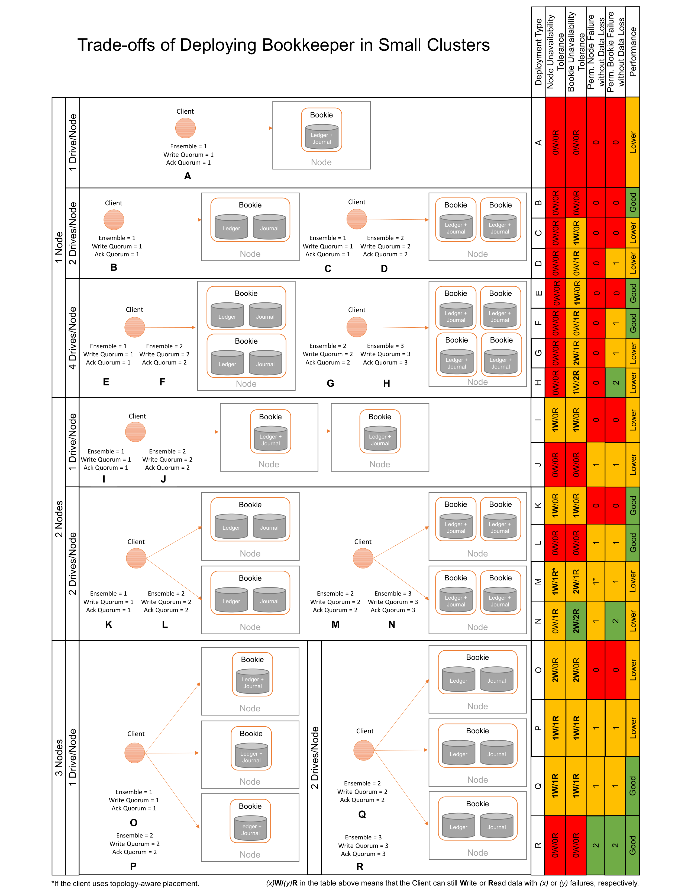

<!--
Copyright Pravega Authors.

Licensed under the Apache License, Version 2.0 (the "License");
you may not use this file except in compliance with the License.
You may obtain a copy of the License at

    http://www.apache.org/licenses/LICENSE-2.0

Unless required by applicable law or agreed to in writing, software
distributed under the License is distributed on an "AS IS" BASIS,
WITHOUT WARRANTIES OR CONDITIONS OF ANY KIND, either express or implied.
See the License for the specific language governing permissions and
limitations under the License.
-->
# Trade-offs Deploying Small Bookkeeper Clusters for Pravega

Apache Bookkeeper is the main Tier-1 implementation of Pravega.
In some cases, users may deploy large Pravega clusters that involve
plenty of Bookies. In this scenario, we can safely assume that
Segment Store instances could write data to a number of Bookies
significantly larger than the `ensembleSize`, meaning that in the
case of Bookie crashes, these can be replaced without impacting
Pravega writes to Bookkeeper. Deployments in a large on-premise 
clusters or in public clouds may fit into this category.

However, there may be cases in which users need to deploy Pravega
(and Bookkeeper) in small clusters (i.e., limited number of nodes
and/or drives per node). In this case, the approach taken to deploy
Bookkeeper may have important implications in, at least, the following
key aspects: 
- _Tolerance to temporary failures_: Whether a temporary failure in a 
node or bookie implies that Pravega can continue reading (_R_) or writing
(_W_) data to Bookkeeper. For instance, if a given Bookkeeper cluster and 
client configuration can tolerate 
- _Tolerance to permanent crashes_: (node/bookie), and 
- _Performance_: 

