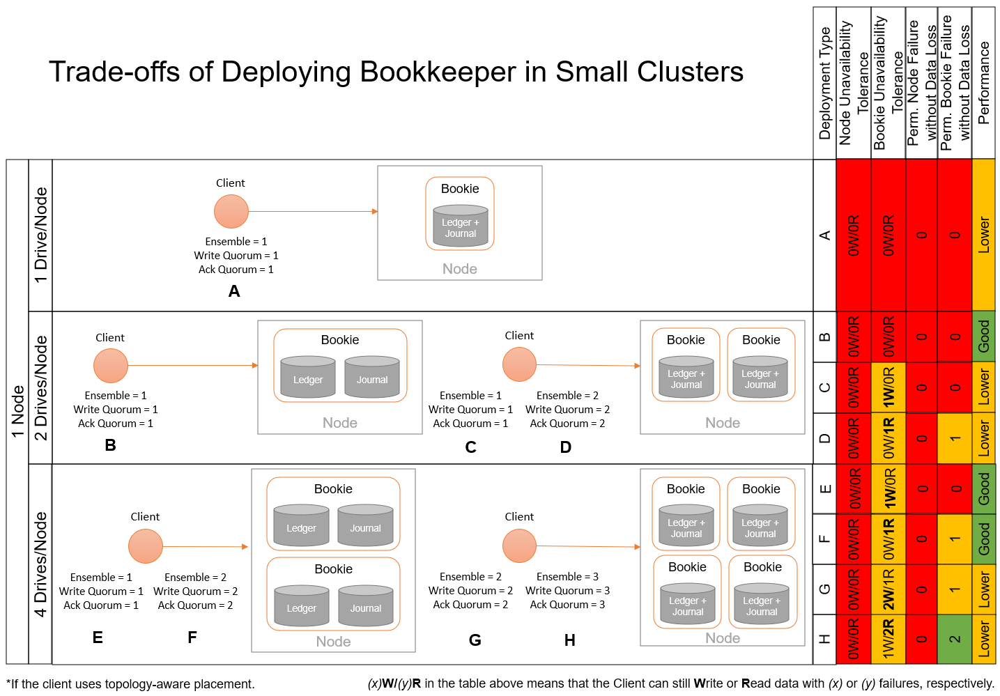
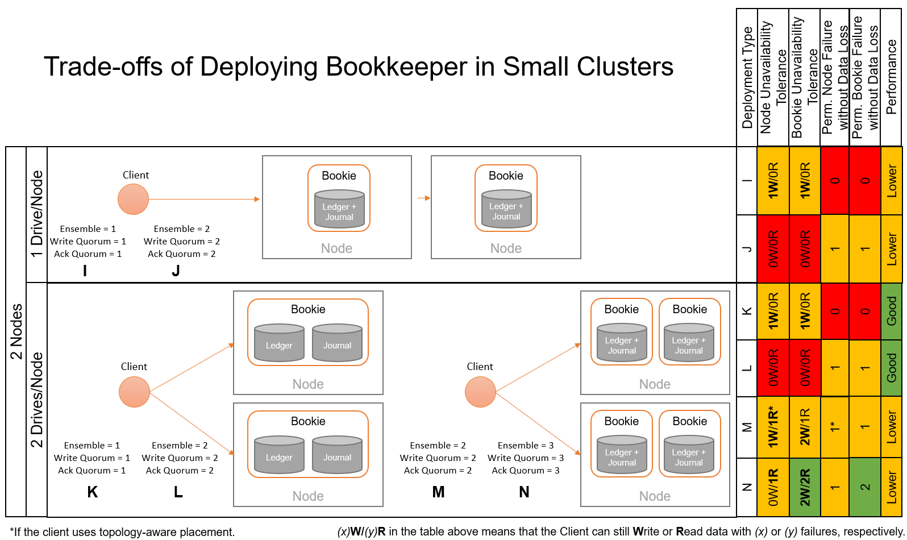
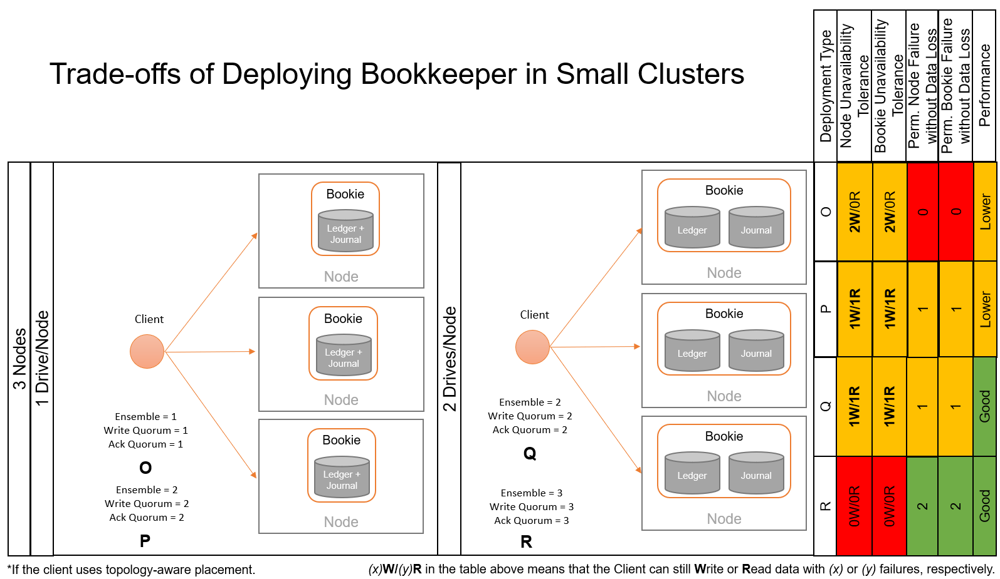

<!--
Copyright Pravega Authors.

Licensed under the Apache License, Version 2.0 (the "License");
you may not use this file except in compliance with the License.
You may obtain a copy of the License at

    http://www.apache.org/licenses/LICENSE-2.0

Unless required by applicable law or agreed to in writing, software
distributed under the License is distributed on an "AS IS" BASIS,
WITHOUT WARRANTIES OR CONDITIONS OF ANY KIND, either express or implied.
See the License for the specific language governing permissions and
limitations under the License.
-->
# Trade-offs Deploying Small Bookkeeper Clusters for Pravega

[Apache Bookkeeper](https://bookkeeper.apache.org/) is the main 
Tier-1 implementation of Pravega. Often, users may deploy large 
Pravega clusters that involve instantiating multiple Bookies. 
In this scenario, we can safely assume that Segment Store instances 
could write data to a number of Bookies significantly larger than the 
`ensembleSize`, meaning that in the case of Bookie crashes, these can 
be replaced without impacting Pravega writes to Bookkeeper. Deployments 
in large on-premise clusters or in 
[public clouds](https://cncf.pravega.io/blog/2020/06/20/deploying-pravega-in-kubernetes/) 
are examples of this kind of deployment.

However, there may be cases in which users need to deploy Pravega
(and Bookkeeper) in small clusters (i.e., very limited number of nodes
and/or storage per node). Note that a "node" can be either a physical or
a virtual instance running Bookies. In this scenario, the decisions taken to 
deploy Bookkeeper and configure the Bookkeeper client in Pravega may have 
important implications on, at least, the following key aspects:

- _Tolerance to temporary failures_: Whether a temporary failure in a 
node or a Bookie implies that Pravega can continue reading (_R_) or writing
(_W_) data to Bookkeeper. For instance, if a given Bookkeeper cluster and 
client configuration can tolerate one temporary Bookie failure while writing
data, we could denote it as `1W/0R`. Similarly, if a client can read data
while a Bookie is unavailable, we denote it as `0W/1R`. This aspect is
relevant, as it determines whether Pravega can continue performing IO while
one or more Bookies/nodes are not reachable for some time.

- _Tolerance to permanent failures_: Apart from temporary unavailability of
Bookies and nodes, users may also face permanent crashes that imply the
loss of data of a given Bookie or even a whole node. This is a critical
aspect to take into account, as in general we should not allow data to 
be lost.

- _Performance_: Bookkeeper stores data using two main storage locations:
_journal_ and _ledger_ (we can leave _index_ aside in this discussion).
The main reason for having two storage locations for data is the different
types of workloads they exhibit (e.g., sequential, synchronous writes
vs buffered, random writes plus reads). This design decision is key
if using hard drives, as it allows us to use one dedicated drive per workload
type to improve performance. But even using modern SSD or NVMe drives for Bookies,
users need to decide whether to dedicate individual drives for journal and ledger
or collocating them in the same drive (note that you can have [multiple journal and
directories](https://bookkeeper.apache.org/docs/reference/config/) to increase write 
parallelism). This still plays a relevant role in performance.

In the following, we provide an overview of the trade-offs deploying small Bookkeeper clusters
for various deployment sizes.

## 1-Node deployment

The smallest Bookkeeper cluster we can deploy is with 1 node. While this deployment may not be
advisable as it cannot guarantee failure tolerance at the node level, in some scenarios it may
be an option to consider.

Some observations about the figure above:
- If the node has only 1 drive, we cannot guarantee any kind of failure tolerance. Also, both
journal and ledger directories will land on the same drive, thus impacting performance.
- If the node has 2 drives, we have the option to chose whether to instantiate one or two Bookies.
With one Bookie, we can place journal and ledger in separate directories to favor performance but without
being able to tolerate a permanent failure of a drive or a Bookie itself. With two Bookies, we can decide 
to create 1 or 2 data replicas. The former choice would have better performance, and it would 
tolerate temporarily unavailability of one of the Bookies while continue serving writes but no permanenet failures. 
The latter choice would have lower performance due to replication costs, but it can tolerate permanent failure 
of one Bookie or drive.
- The situation in which the node has 4 drives is similar to the case for 2 drives, but in this case
we could tolerate up to 2 permanent Bookie or drive failures without losing data.

## 2-Node deployment

With 2 nodes to deploy Bookkeeper, we could achieve configurations that tolerate one node failure without
losing data, which is desirable in many cases.

Some observations about the figure above:
- If nodes have only 1 drive, we have to choose between data durability and performance. While performance
may be already impacted due to the fact of co-locating ledger and journal directories on the same drives,
configuring the client to write 2 replicas of data will induce additional performance penalty. Clearly, the
benefit of writing 2 data replicas is that we can tolerate the permanent failure of a drive/Bookie or node
without losing data.
- If nodes have 2 drives each, then we can choose between instantiating 2 or 4 Bookies. If we instantiate 2
Bookies, then we can devote one drive to each ledger and journal directories on each Bookie, which is best
for performance. In this case, we need also to decide whether to create 1 or 2 replicas of data, with the
associated durability vs performance trade-off. Similarly, if we instantiate 4 Bookies (using only one drive
for both journal and ledger), we could consider creating 2 o 3 replicas of data, depending on the data durability
needs of our deployment.
- Note that in the case of 4 Bookies, we could tolerate the permanent failure of 1 node using only 2 replicas.
This is possible if we configure the [topology-aware placement in the Bookkeeper client](https://bookkeeper.apache.org/docs/latest/api/javadoc/org/apache/bookkeeper/client/TopologyAwareEnsemblePlacementPolicy.html),
so the 2 replicas will always be placed at Bookies running in different nodes.

## 3-Node deployment

A 3-node Bookkeeper cluster can be considered as the minimum deployment for a scenario aiming at tolerating
data loss.

Some observations about the figure above:
- With 1 drive per node, we could decide whether to create 1 or 2 replicas of data, for instance. The performance
penalty of co-locating journal and ledger directories for Bookies is unavoidable. Still, we can decide whether
we favor performance (1 replica) or data durability (2 replicas).
- With 2 drives per node, we could make Bookies to operate in the optimal configuration using 1 drive for each
journal and ledger. In this case, we could consider creating 2 or 3 data replicas, with the associated performance
and data durability trade-offs.

## Final Remarks

In summary, we highlight the following takeaways:
- In these guidelines, we have intentionally mentioned examples using `ensembleSize = writeQuorum = ackQuorum` 
  as a way to simplify the discussion. However, it is important to understand that the Bookkeeper client implements
  "opportunistic striping". That is, if we configure `ensembleSize=3`, `writeQuorum=2` and `ackQuorum=2`, 
  the Bookkeeper client will exploit the throughput of 3 Bookies to write 2 replicas of data. Also, it can 
  tolerate a temporary failure of one Bookie; in that case, the ledgers created during the temporary failure 
  will be written using `ensembleSize=2`, `writeQuorum=2` and `ackQuorum=2`.
- In many cases, you need to chose between tolerating temporary write failure or read failures. 
  This is because for very small clusters, the replication factor
  configured in the client is the same as the number of Bookies, so no write failure
  is allowed (but we can still read data and tolerate permanent Bookie crashes).
- Some cluster layouts force users to trade-off between good performance
  (i.e., dedicating 1 drive to each journal and ledger) and tolerate permanent crashes.
- [Topology-awareness in Bookkeeper client](https://bookkeeper.apache.org/docs/latest/api/javadoc/org/apache/bookkeeper/client/EnsemblePlacementPolicy.html)
  is very important in some deployments to prevent data loss when we have very few nodes to run Bookies.