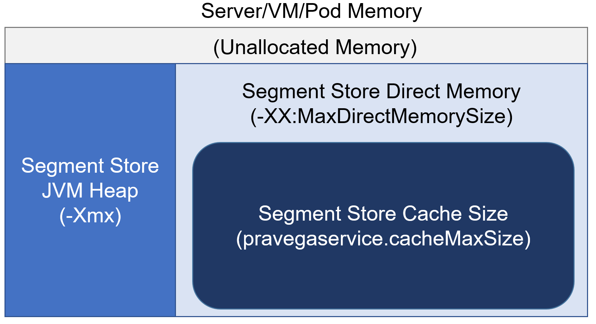

<!--
Copyright Pravega Authors.

Licensed under the Apache License, Version 2.0 (the "License");
you may not use this file except in compliance with the License.
You may obtain a copy of the License at

    http://www.apache.org/licenses/LICENSE-2.0

Unless required by applicable law or agreed to in writing, software
distributed under the License is distributed on an "AS IS" BASIS,
WITHOUT WARRANTIES OR CONDITIONS OF ANY KIND, either express or implied.
See the License for the specific language governing permissions and
limitations under the License.
-->

# Segment Store Cache Size and Memory Settings

In a Pravega Cluster, the Segment Store is perhaps the component that requires more effort in terms of memory configuration.
A production-like cluster requires the memory settings to be defined correctly, or otherwise we could induce unnecessary
instability in the system. In this section, the main configuration parameters we overview are the following:

- **`pravegaservice.cache.size.max`**: Maximum size (in bytes) for the Local Shared Cache (shared by all Segment 
Containers on this Segment Store instance). Valid values: Positive integer. Recommended values: Multiples of 1GB, 
but less than XX:MaxDirectMemorySize. Choosing a lower size will conserve memory at the expense of a lot of cache misses 
(resulting in Long Term Storage reads and possibly high latencies). Choosing a higher size will keep data in the cache 
for longer, but at the expense of memory. The Segment Store uses a Direct Memory Cache backed by direct ByteBuffers, so 
if XX:MaxDirectMemorySize is not set to a value higher than this one, the process will# eventually crash with an 
OutOfMemoryError.
_Type_: `Integer`. _Default_: `4294967296`. _Update-mode_: `per-server`.

- **`-Xmx`** (SEGMENT STORE JVM SETTING): Defines the maximum heap memory size for the JVM. 

- **`-XX:MaxDirectMemorySize`** (SEGMENT STORE JVM SETTING): Defines the maximum amount of direct memory for the JVM.

When configuring the memory settings for the Segment Store, we need to take into account three points: the host
machine available memory, the Segment Store heap memory, and the Segment Store direct memory usage. The diagram
below illustrates these elements:

 

The guidelines to configure the memory settings in the Segment Store are as follows:

- _Host memory_: The host (e.g., server, VM, pod) running the Segment Store has a defined memory capacity. We need to
be fully aware of it to define the rest of memory settings.

- _JVM Heap (`-Xmx`)_: In production, we recommend setting a JVM Heap size of at least 4GB for the Segment Store. The
Segment Store process may create a significant amount of objects under small event workloads, so we need to ensure that
there is enough heap memory to do not induce constant GC activity.

- _JVM Direct Memory (`-XX:MaxDirectMemorySize`)_: In general, we should provision the Segment Store with more direct 
memory than heap memory. The reason is that the Segment Store read cache, Netty and the Bookkeeper client make a
significant use of direct memory as a result of an IO workload. As a rule of thumb, we should reserve at least 1GB or 
2GB for Netty and Bookkeeper client in the Segment Store, and assign the rest of direct memory to the read cache.

- _Segment Store read cache size (`pravegaservice.cache.size.max`)_: As mentioned before, all the available direct memory
(`-XX:MaxDirectMemorySize`) not used by Netty/Bookkeeper client should be contributed to the read cache. A larger 
read cache improves performance for read workloads, especially if we consider mixed read patterns.

As a final note, we need to ensure that the sum of JVM Heap and JVM Direct Memory is strictly lower than the host
memory (e.g., 0.5GB-1GB). Otherwise, during high load situations the host instance/machine can crash due to lack of
memory resources.

To conclude this section, let's use an example. Assume that we are running our Segment Store instances on Kubernetes
pods with 16GB of memory defined as a limit. In this case, a valid configuration for our Segment Store could be:
`-Xmx=4g` and `-XX:MaxDirectMemorySize=11g`. As you can see, the sum of both JVM Heap and JVM Direct Memory is 15GB, so
1GB is left to do not reach the maximum capacity of the pod. Then, we can define the read cache size as 
`pravegaservice.cache.size.max=9663676416` (9GB), which leaves 2GB of direct memory for Netty/Bookkeeper. We have 
developed a [provisioner tool for Pravega](https://github.com/pravega/pravega-tools/tree/master/pravega-provisioner) 
to help you reason about these aspects.