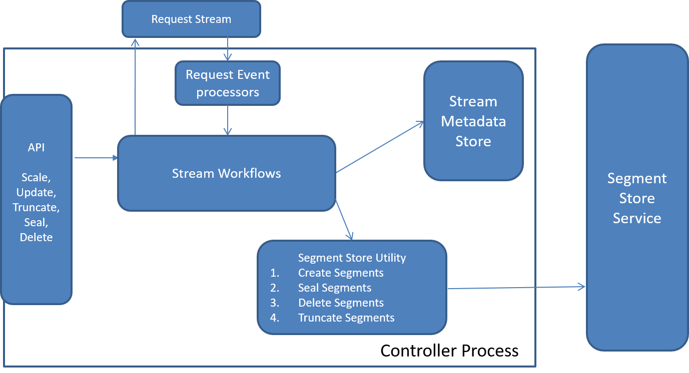
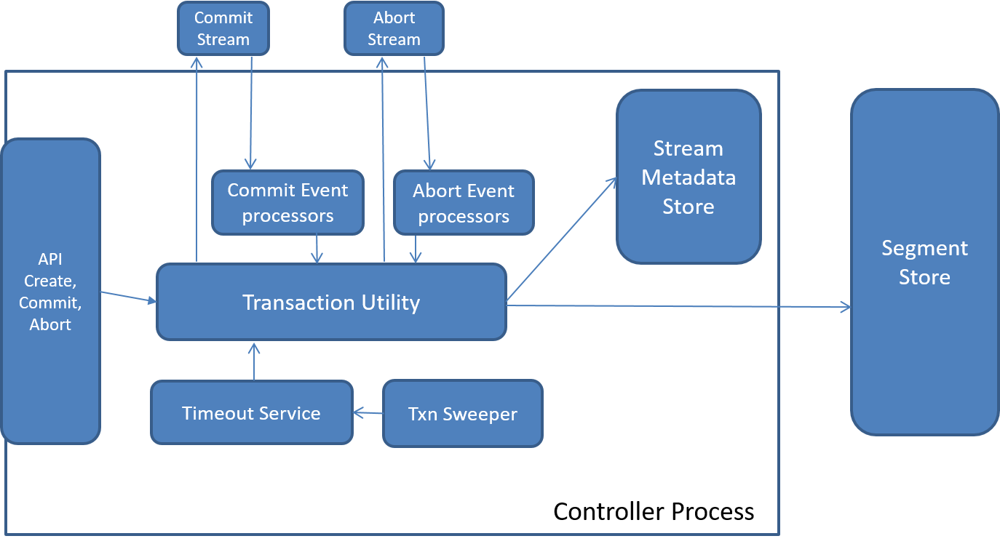

<!--
Copyright (c) 2017 Dell Inc., or its subsidiaries. All Rights Reserved.

Licensed under the Apache License, Version 2.0 (the "License");
you may not use this file except in compliance with the License.
You may obtain a copy of the License at

    http://www.apache.org/licenses/LICENSE-2.0
-->
Pravega Controller Service
========================================================================================================================
*  [Introduction](#introduction)
*  [Architecture](#architecture)
    - [Stream Management](#stream-management)
    - [Cluster Management](#cluster-management)
* [System Diagram](#system-diagram)
* [Components](#components)
    - [Service Endpoints](#service-endpoints)
    - [Controller Service](#Controller-service)
    - [Stream Metadata Store](#stream-metadata-store)
        - [Stream Metadata](#stream-meta-data)
        - [Stream Store Caching](#stream-store-caching)
    - [Stream Buckets](#stream-buckets)
    - [Controller Cluster Listener](#controller-cluster-listener)
    - [Host Store](#host-store)
    - [Background workers](#background-workers)
* [Roles and Responsibilities](#roles-and-responsibilities)
    - [Stream Operations](#stream-operations)
        - [Stream State](#stream-state)
        - [Create Stream](#create-stream)
        - [Update Stream](#update-stream)
        - [Scale Stream](#scale-stream)
        - [Truncate Stream](#truncate-stream)
        - [Seal Stream](#seal-stream)
        - [Delete Stream](#delete-stream)
    - [Stream Policy Manager](#stream-policy-manager)
        - [Scaling Infrastructure](#scaling-infrastructure)
        - [Retention Infrastructure](#retention-infrastructure)
    - [Transaction Manager](#transaction-manager)
        - [Create Transaction](#create-transaction)
        - [Commit Transaction](#commit-transaction)
        - [Abort Transaction](#abort-transaction)
        - [Ping Transaction](#ping-transaction)
        - [Transaction Timeout Management](#transaction-timeout-management)
    - [Segment Container to Host Mapping](#segment-container-to-host-mapping)
* [Resources](#resources)

# Introduction

The Controller service is a core component of Pravega that implements
the control plane. It acts as the central coordinator and manager for
various operations performed in the cluster, mainly divided into two
categories:

  - Stream management
  - Cluster management.

The Controller service, referred to simply as *Controller* henceforth, is
responsible for providing the abstraction of a [Stream](pravega-concepts.md#streams), which is the
main abstraction that Pravega exposes to applications. A stream
comprises one or more [segments](pravega-concepts.md#stream-segments). Each segment is an append-only data
structure that stores a sequence of bytes. A segment on its own is
agnostic to presence of other segments and is not aware of its logical
relationship with its peer segments. The Segment Store, which owns and
manages these segments, does not have any notion of a stream. A stream
is a logical view conceptualized by Controller by composing a
dynamically changing set of segments that satisfy a predefined set of
logical invariants. The Controller provides the stream abstraction and
orchestrates all lifecycle operations on a stream while ensuring that
the abstraction stays consistent.

The Controller plays a central role in the lifecycle of a stream:
_creation_, _modification_, [_scaling_](pravega-concepts.md#elastic-streams-auto-scaling), and _deletion_. It does these by
maintaining metadata per stream and performs requisite operations on
segments as and when necessary. For example, as part of stream’s
lifecycle, new segments can be created and existing segments sealed. The
Controller decides when to perform these operation such that streams
continue to be available and consistent to the clients accessing them.

# Architecture

The Controller Service is made up of one or more instances of
stateless worker nodes. Each new Controller instance can be brought up
independently and to become part of Pravega cluster it merely needs to
point to the same [Apache Zookeeper](https://zookeeper.apache.org/). For high availability it is advised to have
more than one instance of Controller service per cluster.

Each Controller instance is capable of working independently and uses a
shared persistent store as the source of truth for all state owned and
managed by Controller service. We currently use Apache ZooKeeper as the
store for persisting all metadata consistently.  Each instance comprises
various subsystems which are responsible for performing specific
operations on different categories of metadata. These subsystems include
different API endpoints, metadata store handles, policy managers and
background workers.

The Controller exposes two endpoints which can be used to interact with
a Controller service. The first port is for providing programmatic
access for Pravega clients and is implemented as an `RPC` using [gRPC](https://grpc.io/). The
other endpoint is for administrative operations and is implemented as a
`REST` endpoint.

### Stream Management

The Controller owns and manages the concept of stream and is
responsible for maintaining "metadata" and "lifecycle" for each stream.
Specifically, it is responsible for _creating, updating, scaling,
truncating, sealing_ and _deleting streams_.

The stream management can be broadly divided into three categories:

  1. **Stream Abstraction**: A stream can be viewed as a series of dynamically changing segment sets
where the stream transitions from one set of consistent segments to the
next. Controller is the place for creating and managing this stream abstraction.
Controller decides when and how a stream transitions from one state to another and is responsible
for performing these transitions while keeping the state of the stream consistent and available.
These transitions are governed user-defined policies that the
Controller enforces. Consequently, as part of stream management, the
Controller also performs roles of Policy Manager for policies like
retention and scale.

  2. **Policy Management**: Controller is responsible for storing and enforcing user-defined Stream policies by actively monitoring the state of the stream. Presently we
have two policies that users can define, namely [**Scaling** **Policy**](https://github.com/pravega/pravega/blob/master/client/src/main/java/io/pravega/client/stream/ScalingPolicy.java) and
[**Retention** **Policy**](https://github.com/pravega/pravega/blob/master/client/src/main/java/io/pravega/client/stream/RetentionPolicy.java).
Scaling policy describes if and under what circumstances a stream should automatically scale its number of segments.
Retention policy describes a policy about how much data to retain within a stream.

  3. [**Transaction**](pravega-concepts.md#transactions) **Management**: Implementing transactions requires the manipulation of segments. With
each transaction, Pravega creates a set of transaction segments, which
are later merged onto the stream segments upon commit or discarded upon
aborts. The Controller performs the role of transaction manager and is
responsible for creating and committing transactions on a given stream.
Upon creating transactions, Controller also tracks transaction timeouts
and aborts transactions whose timeouts have elapsed. Details of
transaction management can be found later in the document.

### Cluster Management

The Controller is responsible for managing Segment Store cluster. Controller manages
life cycle of Segment Store nodes as they are added to/removed from the
cluster and performs redistribution of segment containers across
available Segment Store nodes.

## System Diagram

The following diagram shows the main components of a Controller process.
We discuss the elements of the diagram in detail next.

 

Controller Process Diagram

# Components

## Service Endpoints

There are two ports exposed by Controller: **Client-Controller APIs** and
**Administration APIs**. The client Controller communication is implemented as `RPC` which
exposes APIs to perform all stream related control plane operations.
Apart from this Controller also exposes an administrative API set
implemented as `REST`.

Each endpoint performs appropriate call to the *Controller Service backend subsystem*
which has the actual implementation for various operations like create, read, update and
delete (CRUD) on entities owned and managed by Controller.

### gRPC  

Client Controller communication endpoint is implemented as a [gRPC](https://grpc.io/)
interface. Please check the complete list of [APIs](https://github.com/pravega/pravega/blob/master/shared/Controller-api/src/main/proto/Controller.proto).
This exposes APIs used by Pravega clients (readers, writers and stream
manager) and enables stream management. Requests enabled by this API
include creating, modifying, and deleting streams.
The underlying `gRPC` framework provides both _synchronous_ and _asynchronous_ programming models.
We use the asynchronous model in our client Controller interactions so that the client thread does not block on the response from the server.  
To be able to append to and read data from streams, writers and readers
query Controller to get active segment sets, successor and predecessor
segments while working with a stream. For transactions, the client uses
specific API calls to request Controller to create and commit
transactions.

### REST  
For administration, the Controller implements and exposes a `REST`
interface. This includes API calls for stream management as well as
other administration API primarily dealing with creation and deletion of
scopes. We use swagger to describe our `REST` APIs. Please see, the swagger [`yaml`](https://github.com/pravega/pravega/tree/master/shared/Controller-api/src/main/swagger) file.

## Controller Service

This is the backend layer behind the Controller endpoints `gRPC` and
`REST`. All the business logic required to serve Controller API calls are
implemented here. This layer contains handles to all other subsystems like the various store implementations
(stream store, host store and checkpoint store) and background processing frameworks (task framework, event processor framework).
Stores are interfaces that provide access to various types of metadata managed by Controller. Background
processing frameworks are used to perform asynchronous processing that typically implement workflows involving metadata updates
and requests to Segment Store.

## Stream Metadata Store

A stream is dynamically changing sequence of segments, where regions of
the Routing Key space map to open segments. As the set of segments of a
stream changes, so does the mapping of the Routing Key space to segment.

A set of segments is consistent if, union of key space regions mapping
to segments in the set covers the entire key space and no
overlap between key space regions.

For example, suppose a set **S** = {**S****1**, **S**2, **S****3**}, such that:

   -   Region \[0, 0.3) maps to segment **S****1**.
   -   Region \[0.3, 0.6) maps to segment **S****2**.
   -   Region \[0.6, 1.0) maps to segment **S****3**.

**S** is a consistent segment set.  

A stream goes through transformations as it scales over time. A stream
starts with an initial set of segments that is determined by the stream
configuration when created and it transitions to new sets of segments as
scale operations are performed on the stream. Each generation of
segments that constitute stream at any given point in time are
considered to belong to an epoch. So a stream starts with initial _epoch 0_
and upon each transition, it moves ahead in its epochs
to describe the change in generation of segments in the stream.

The Controller maintains the stream store the information about all
epochs that constitute a given stream and how they transition. The store
is designed to optimally store and query information pertaining to
segments and their inter-relationships.

Apart from the epoch information, it keeps some additional metadata,
such as [state](#stream-state) and its [policies](#stream-policy-manager) and ongoing transactions on the stream.

Various sub-components of Controller access the stored metadata for each
stream via a well-defined
[interface](https://github.com/pravega/pravega/blob/master/Controller/src/main/java/io/pravega/Controller/store/stream/StreamMetadataStore.java).
We currently have two concrete implementations of the stream store
interface: _in-memory_ and _Zookeeper_ backed stores. Both share a common
base implementation that relies on stream objects for providing
store-type specific implementations for all stream-specific metadata.
The base implementation of stream store creates and caches these stream
objects.

The stream objects implement a store/stream interface. The concrete
stream implementation is specific to the store type and is responsible
for implementation of store specific methods to provide consistency and
correctness. We have a common base implementation of all store types
that provide optimistic concurrency. This base class encapsulates the
logic for queries against stream store for all concrete stores that
support Compare and Swap (CAS). We currently use Zookeeper as our
underlying store which also supports CAS. We store all stream metadata
in a hierarchical fashion under stream specific **znodes** (ZooKeeper
data nodes).

For the ZooKeeper based store, we structure our metadata into different
groups to support a variety of queries against this metadata. All stream
specific metadata is stored under a scoped/stream root node. Queries
against this metadata include, but not limited to, querying segment sets
that form the stream at different points in time, segment specific
information, segment predecessors and successors. Refer to [stream
metadata](#stream-metadata) interface for details about APIs exposed by stream metadata
store.

### Stream Metadata

Clients need information about what segments constitute a stream to
start their processing and they obtain it from the epoch information the
Controller stores in the stream store. A reader client typically starts
from the head of the stream, but it might also choose to access the
stream starting from any arbitrarily interesting position. Writers on
the other hand always append to the tail of the stream.

Clients need ability to query and find segments at any of the three
cases efficiently. To enable such queries, the stream store provides API
calls to get initial set of segments, segments at specific time and current set of segments.

As mentioned earlier, a stream can transition from one set of segments
(epoch) to another set of segments that constitute the stream. A stream
moves from one epoch to another if there is at least one segment that is
sealed and that is replaced by one or more set of segments that cover
precisely the key space of the sealed segments. As clients work on
streams, they may encounter the end of sealed segments and consequently
need to find new segments to be able to move forward. To enable the
clients to query for the next segments, the stream store exposes via the
Controller service efficient queries for finding immediate successors
and predecessors for any arbitrary segment.  

To enable serving queries like those mentioned above, we need to efficiently store a time series of these segment transitions and index them against time.
We store this information about the current and historical state of a stream-segments in a set of tables which are designed to optimize on aforementioned queries.
Apart from segment specific metadata record, the current state of stream comprises of other metadata types that are described henceforth.

#### Tables  

To efficiently store and query the segment information, we have split
segment data into the following three append only tables.

  - **Segment Table**:  
_Segment-info: ⟨segmentid, time, keySpace-start, keySpace-end⟩_  
The Controller stores the segment table in an append-only table with
**i**-**th** row corresponding to metadata for segment id **i**. It is important
to note that each row in the segment table is of fixed size. As new
segments are added, they are assigned new segment *Ids* in a strictly
increasing order. So this table is very efficient in creating new
segments and querying segment information response with *O(1)* processing
for both these operations.

 - **History Table**:  
_Epoch: ⟨time, list-of-segments-in-epoch⟩_
The History Table stores a series of active segments as they transition
from one epoch to another. Each row in the history table stores an epoch
which captures a logically consistent (as defined earlier) set of
segments that form the stream and are valid through the lifespan of the
epoch. This table is designed to optimize queries to find set of
segments that form the stream at any arbitrary time. There are three
most commonly used scenarios where we want to efficiently know the set
of segments that form the stream - _initial set of segments, current set
of segments_ and _segments at any arbitrary time_.  First two queries are
very efficiently answered in _O(1)_ time because they correspond to first
and last rows in the table.
Since rows in the table are sorted by increasing order of time and
capture time series of streams segment set changes, so we could easily
perform binary search to find row which corresponds to segment sets at
any arbitrary time.

 - **Index Table**  
_Index: ⟨time, offset-in-history-table⟩_  
Since history rows are of variable length, we index history rows for
timestamps in the index table. This enables us to navigate the history
table and perform binary search to efficiently answer queries to get
segment set at any arbitrary time. We also perform binary searches on
history table to determine successors of any given segment.

#### Stream Configuration
 Znode under which stream configuration is serialized and persisted. A
 stream configuration contains stream policies that need to be
 enforced.
 Scaling policy and Retention policy are supplied by the application at
 the time of stream creation and enforced by Controller by monitoring
 the rate and size of data in the stream.

   - Scaling policy describes if and when to automatically scale based on
 incoming traffic conditions into the stream. The policy supports two
 flavours - _traffic as rate of events per second_ and _traffic as rate of
 bytes per second_. The application specifies their desired traffic
 rates into each segment by means of scaling policy and the supplied
 value is chosen to compute thresholds that determine when to scale a
 given stream.

   - Retention Policy describes the amount of data that needs to be
 retained into Pravega cluster for this stream. We support a time based
 and a size based retention policy where applications can choose
 whether they want to retain data in the stream by size or by time by
 choosing the appropriate policy and supplying their desired values.

#### Stream State
 Znode which captures the state of the stream. It is an enumerator with
 values from *creating, active, updating, scaling, truncating, sealing,*
 and *sealed*. Once _active_, a stream transitions between performing a
 specific operation and active until it is sealed. A transition map is
 defined in the
 [State](https://github.com/pravega/pravega/blob/master/Controller/src/main/java/io/pravega/Controller/store/stream/tables/State.java)
 class which allows and prohibits various state transitions.
 Stream state describes the current state of the stream. It transitions
 from _active_ to respective action based on the action being performed
 on the stream. For example, during scaling the state of the stream
 transitions from *active* to *scaling* and once scaling completes, it
 transitions back to *active*. Stream state is used as a barrier to
 ensure only one type of operation is being performed on a given stream
 at any point in time. Only certain state transitions are allowed and
 are described in the State Transition object. Only legitimate state
 transitions are allowed and any attempt for disallowed transition
 results in appropriate exception.

#### Truncation Record
 This corresponds to the stream cut which was last used to truncate the
 given stream. All stream segment queries superimpose the truncation
 record and return segments that are strictly greater than or equal to
 the stream cut in truncation record.

#### Sealed Segments Record
 Since the segment table is append only, any additional information
 that we need to persist when a segment is sealed is stored in sealed
 segments record. Presently, it simple contains a map of segment number
 to its sealed size.

The following are the Transaction Related metadata records:

   - **Active Transactions**: Each new Transaction is created under this znode. This stores metadata
 corresponding to each Transaction as *ActiveTransactionRecord*. Once a
 Transaction is completed, a new node is created under the global
 Completed Transaction znode and removed from under the stream specific
 _active_ Transaction node.

   - **Completed Transactions**: All completed transactions for all streams are moved under this single
 znode upon completion (via either commit or abort paths). We can
 subsequently garbage collect these values periodically following any
 collection scheme we deem fit. We have not implemented any scheme at
 this point though.

### Stream Store Caching

Since there could be multiple concurrent requests for a given stream
being processed by same Controller instance, it is suboptimal to read
the value by querying Zookeeper every time. So we have introduced an
in-memory cache that each stream store maintains. It caches retrieved
metadata per stream so that there is maximum one copy of the data per
stream in the cache. There are two in-memory caches: _A cache of
multiple stream objects in the store_ and _ache properties of a stream in
the stream object_.

We have introduced a concept of operation context and at the start of
any new operation a new operation context is created. The creation of a
new operation context invalidates the cached entities for a stream and
each entity is lazily retrieved from the store whenever requested. If a
value is updated during the course of the operation, it is again
invalidated in the cache so that other concurrent read/update operations
on the stream get the new value for their subsequent steps.  

## Stream Buckets

To enable some scenarios, we may need our background workers to
periodically work on each of the streams in our cluster to perform
some specific action on them. We bring in a notion of a bucket to
distribute this periodic background work across all available
Controller instances. For this we hash each stream into one of the
predefined buckets and then distribute buckets across available
Controller instances.

Number of buckets for a cluster is a fixed (configurable) value for
the lifetime of a cluster.

Controller instances map all available streams in the system into
buckets and distribute buckets amongst themselves so that all long
running background work can be uniformly distributed across multiple
Controller instances. Each bucket corresponds to a unique znode in
Zookeeper. Fully qualified scoped stream name is used to compute a
hashed to assign the stream to a bucket. All Controller instances, upon
startup, attempt to take ownership of buckets. Upon _failover_, ownerships
are transferred as surviving nodes compete to acquire ownership of
orphaned buckets. The Controller instance which owns a bucket is
responsible for all long running scheduled background work corresponding
to all nodes under the bucket. Presently this entails running periodic
workflows to capture StreamCuts (called Retention-Set) for each stream at desired frequencies.

### Retention Set

 One retention set per stream is stored under the corresponding
 bucket/stream znode. As we compute StreamCuts periodically, we keep
 preserving them under this znode. As some automatic truncation is
 performed, the StreamCuts that are no longer valid are purged from
 this set.

## Controller Cluster Listener

Each node in Pravega Cluster registers itself under a cluster znode as
an ephemeral node. This includes both Controller and Segment Store
nodes. Each Controller instance registers a watch on the cluster znode
to listen for cluster change notifications. These notify about the added and removed nodes.

One Controller instance assumes leadership amongst all Controller
instances. This leader Controller instance is responsible for handling
Segment Store node change notifications. Based on change in topology,
Controller instance periodically rebalances segment containers to
Segment Store node mapping.

All Controller instances listen for Controller node change
notifications. Each Controller instance has multiple sub components that
implement the _failover sweeper_ interface. Presently there are three
components that implement failover sweeper interface namely,
`TaskSweeper`, `EventProcessors` and `TransactionSweeper`. Whenever a
Controller instance is identified to have been removed from the cluster,
the cluster listener invokes all registered failover sweepers to
optimistically try to sweep all the orphaned work previously owned by
the failed Controller host.

## Host Store

Host store interface is used to store _Segment Container_ to _Segment Store_
node mapping. It exposes APIs like `getHostForSegment` where it computes
consistent hash of segment Id to compute the owner Segment Container.
Then based on the container-host mapping, it returns the appropriate Uri
to the caller.

## Background workers

Controller process has two different mechanisms or frameworks for
processing background work. These background works typically entail
multiple steps and updates to metadata under a specific metadata root
entity and potential interactions with one or more Segment Stores.

We initially started with a simple task framework that allows ability to
run tasks that take exclusive rights over a given resource (typically a
stream) and allow for tasks to failover from one Controller instance to
another. However, this model was limiting in its scope and locking
semantics and had no inherent notion of ordering of tasks as multiple
tasks could race to acquire working rights (lock) on a resource
concurrently and any one of them could succeed.

To overcome this limitation we came up with a new infrastructure called
**Event Processor**. It is built using Pravega Streams. This provides us a clear mechanism to
ensure _mutually exclusive_ and _ordered processing_.

### Task Framework

Task framework is designed to run exclusive background processing per
resource such that in case of Controller instance failure, the work can
easily failover to another Controller instance and brought to
completion. The framework, on its own, does not guarantee idempotent
processing and the author of a task has to handle it if required. The
model of tasks is defined to work on a given resource exclusively, which
means no other task can run concurrently on the same resource. This is
implemented by way of a persisted distributed lock implemented on
Zookeeper. The failover of a task is achieved by following a scheme of
indexing the work a given process is performing. So if a process fails,
another process will sweep all outstanding work and attempt to transfer
ownership to itself.

**Note:** Upon failure of a Controller process, multiple surviving Controller processes can concurrently attempt sweeping of orphaned tasks. Each of them will index the task in their
host-index but exactly one of them will be able to successfully acquire
the lock on the resource and hence permission to process the task. The
parameters for executing a task are serialized and stored under the
resource.

Currently we use task framework only for create stream tasks. All the
other background processing is done using event processor framework.

### Event Processor Framework

Event processors framework is a background worker sub system which reads
events from an internal stream and processes it, hence the name event
processor. All event processors in our system provide **at least once
processing** guarantee. And in its basic flavor, the framework also
provides strong ordering guarantees. But we also have different subtypes
of event processors that allow concurrent processing.

We create different event processors for different kinds of work.
Presently we have _three_ different event processors in our system for
_committing transaction, aborting transactions_ and _processing stream
specific requests like scale, update, seal, etc_. Each Controller instance
has one event processor of each type. The event processor framework
allows for multiple readers to be created per event processor. All
readers for a specific event processor across Controller instances share
the same reader group, which guarantees mutually exclusive distribution
of work across Controller instances. Each reader gets a dedicated thread
where it reads the event, calls for its processing and upon completion
of processing, updates its **Checkpoint**. Events are posted in the event
processor specific stream and are routed to specific segments based on
using scoped stream name as the routing key.

We have two flavors of event processors, one that performs serial
processing, which essentially means it reads an event and initiates its
processing and waits on it to complete before moving on to next event.
This provides strong ordering guarantees in processing. And it
checkpoints after processing each event.  Commit transaction is
implemented using this base flavor of event processor. The degree of
parallelism for processing these events is upper bounded by number of
segments in the internal stream and lower bounded by number of readers.
Multiple events from across different streams could land up in the same
segment and since we perform serial processing, serial processing has
the drawback that processing stalls or flooding of events from one
stream could adversely impact latencies for unrelated streams.

To overcome these drawbacks we designed **Concurrent Event Processor** as an
overlay on Serial Event processor. Concurrent event processor, as name
implies, allows us to process multiple events concurrently. Here the
reader thread reads an event, schedules it’s asynchronous processing and
returns to read the next event. There is a ceiling on number of events
that are concurrently processed at any point in time and as processing
of some event completes, newer events are allowed to be fetched.  The
checkpoint scheme here becomes slightly more involved because we want to
guarantee at least once processing.

However, with concurrent processing the ordering guarantees get broken.
However, it is important to note that we only need ordering guarantees
for processing events from a stream and not across streams. In order to
satisfy ordering guarantee, we overlay concurrent event processor with
**Serialized Request Handler**, which queues up events from the same stream
in an in-memory queue and processes them in order.

  - **Commit Transaction** processing is implemented on a dedicated serial event
processor because we want strong commit ordering while ensuring that
commit does not interfere with processing of other kinds of requests on
the stream.

  - **Abort Transaction** processing is implemented on a dedicated Concurrent
Event Processor which performs abort processing on transactions from
across streams concurrently.

All other requests for streams is implemented on a serialized request
handler which ensures exactly one request per stream is being processed
at any given time and there is ordering guarantee within request
processing. However, it allows for concurrent requests from across
streams to go on concurrently. Workflows like _scale, truncation, seal,
update_ and _delete stream_ are implemented for processing on the request
event processor.

# Roles and Responsibilities

## Stream Operations

Controller is the store of truth for all stream related metadata.
Pravega clients (`EventStreamReaders` and `EventStreamWriters`), in
conjunction with the Controller, ensure that stream invariants are
satisfied and honored as they work on streams. The Controller maintains
the metadata of streams, including the entire history of segments.
Client accessing a stream need to contact the Controller to obtain
information about segments.

Clients query Controller in order to know how to navigate streams. For
this purpose Controller exposes appropriate APIs to get active segments,
successors, predecessors and segment information and _URIs_. These queries
are served using metadata stored and accessed via stream store
interface.

Controller also provides workflows to modify state and behavior of the
stream. These workflows include _create, scale, truncation, update, seal,_
and _delete_. These workflows are invoked both via direct APIs and in some
cases as applicable via background policy manager (auto scale and retention).

Request Processing Flow

### Create Stream

Create stream is implemented as a task on **Task Framework**. Create stream
workflow first creates initial stream metadata with stream state set to
*Creating*. Following this, it identifies segment containers that should
own and create segments for this stream and calls `createStream()`
concurrently. Once all create segments complete, the create stream task
completes thus moving the stream to *Active* state. All failures are
retried few times with exponential backoffs. However, if it is unable to
complete any step, the stream is left dangling in *Creating* state.

### Update Stream

Update stream is implemented as a task on serialized sequest
handler or concurrent event processor framework. Update stream is invoked
by an explicit API call `updateStream()` into Controller. It first posts an _Update
Request_ event into request stream. Following that it tries to create a
temporary update property. If it fails to create the temporary update
property, the request is failed and the caller is notified of the
failure to update a stream due to conflict with another ongoing update.

The event is picked by **Request Event processor**. When the processing
starts, the update stream task expects to find the temporary update
stream property to be present. If it does not find the property, the
update processing is delayed by pushing event the back in the in-memory
queue until it deems the event expired. If it finds the property to be
updated during this period, before the expiry, the event is processed
and update stream operation is performed. Now that the processing
starts, it first sets the state to *Updating*. Following this the stream
configuration is updated in the metadata store followed by notifying
Segment Stores for all active segments of the stream about change in
policy. Now the state is reset to *Active*.

### Scale Stream

Scale can be invoked either by explicit API call `scaleStream()` (referred to as manual
scale) or performed automatically based on scale policy (referred to as
auto-scale). We first write the event followed by updating the segment
table by creating new entries for desired segments to be created. This
step is idempotent and ensures that if an existing ongoing scale
operation is in progress, then this attempt to start a new scale fails.
The start of processing is similar to mechanism followed in update
stream. If metadata is updated, the event processes and proceeds with
executing the task. If the metadata is not updated within the desired
time frame, the event is discarded.

Once scale processing starts, it first sets the stream state *Scaling*.
This is followed by creating new segments in Segment Stores. After
successfully creating new segments, it updates the history table with a
partial record corresponding to new epoch which contains list of
segments as they would appear post scale. Each new epoch creation also
creates a new root epoch node under which metadata for all transactions
from that epoch reside. So as the scale is performed, there would be a
node corresponding to old epoch and now there will also be a root node
for new epoch. Any transaction creation from this point on will be done
against new epoch. Now the workflow attempts to complete scale by
opportunistically attempting to delete the old epoch. Old epoch can be
deleted if and only if there are no transactions under its tree. Once we
are sure there are no transactions on old epoch, we can proceed with
sealing old segments and completing the scale. After old segments are
sealed successfully, the partial record in history table is now
completed whereby completing the scale workflow. The state is now reset
to *Active*.

### Truncate Stream

Truncate follows similar mechanism to update and has a temporary
stream property for truncation that is used to supply input for `truncateStream`. Once truncate workflow identifies that it can proceed, it first
sets the state to *Truncating*. Truncate workflow then looks at the
requested StreamCut, and checks if it is greater than or equal to the
existing truncation point, only then is it a valid input for truncation
and the workflow commences. The truncation workflow takes the requested
StreamCut and computes all segments that are to be deleted as part of
this truncation request. It then calls into respective Segment Stores to
delete identified segments. Post deletion, we call truncate on segments
that are described in the stream cut at the offsets as described in the
stream cut. Following this the truncation record is updated with the new
truncation point and deleted segments.  The state is reset to *Active*.

### Seal Stream

Seal stream can be requested via an explicit API call `sealStream` into Controller.
It first posts a seal-stream event into request stream followed by
attempts to set the state of stream to *Sealing*. If the event is picked
and does not find the stream to be in desired state, it postpones the
seal stream processing by reposting it at the back of in-memory queue.
Once the stream is set to sealing state, all active segments for the
stream are sealed by calling into Segment Store. After this the stream
is marked as *Sealed* in the stream metadata.

### Delete Stream

Delete stream can be requested via an explicit API call `deleteStream` into Controller.
The request first verifies if the stream is in *Sealed* state. Only sealed
streams can be deleted and an event to this effect is posted in request
stream. When the event is picked for processing, it verifies the stream
state again and then proceeds to delete all segments that belong to this
stream from its inception by calling into Segment Store. Once all
segments are deleted successfully, the stream metadata corresponding to
this stream is cleaned up.

## Stream Policy Manager

As described earlier, there are two types of user defined policies that Controller is responsible for enforcing, namely _Automatic Scaling_ and _Automatic Retention_.
Controller is not just the store for stream policy but it actively enforces those user-defined policies for their streams.

### Scaling Infrastructure

Scaling infrastructure is built in conjunction with Segment Stores. As
Controller creates new segments in Segment Stores, it passes user
defined scaling policies to Segment Stores. The Segment Store then
monitors traffic for the said segment and reports to Controller if some
thresholds, as determined from policy, are breached. Controller receives
these notifications via events posted in dedicated internal streams.
There are two types of traffic reports that can be received for
segments. First type identifies if a segment should be **scaled up** (split)
and second type identifies if a segment should be **scaled down**. For segments eligible for scale up, Controller immediately posts request for
segment scale up in the request stream for request event processor to
process. However, for scale down, Controller needs to wait for at least
two neighboring segments to become eligible for scale down. For this
purpose it simply marks the segment as **cold** in the metadata store. And
if and when there are neighboring segments that are marked as cold,
Controller consolidates them and posts a scale down request for them.
The scale requests processing is then performed asynchronously on the
request event processor.   

### Retention Infrastructure

The retention policy defines how much data should be retained for a
given stream. This can be defined as _time based_ or _size based_. To apply
this policy, Controller periodically collects StreamCuts for the stream
and opportunistically performs truncation on previously collected stream
cuts if policy dictates it. Since this is a periodic background work
that needs to be performed for all streams that have a retention policy
defined, there is an imperative need to fairly distribute this workload
across all available Controller instances. To achieve this we rely on
bucketing streams into predefined sets and distributing these sets
across Controller instances. This is done by using Zookeeper to store
this distribution. Each Controller instance, during bootstrap, attempts
to acquire ownership of buckets. All streams under a bucket are
monitored for retention opportunities by the owning Controller. At each
period, Controller collects a new stream cut and adds it to a
retention set for the said stream. Post this it looks for candidate
StreamCuts stored in retention set which are eligible for truncation
based on the defined retention policy. For example, in time based
retention, the latest StreamCut older than specified retention period
is chosen as the truncation point.

## Transaction Manager

Another important role played by Controller is that of Transaction
manager. It is responsible for creation and committing and abortion of
transactions. Since Controller is the central brain and agency in our
cluster, and is the holder of truth about stream, the writers request
Controller to perform all control plane actions with respect to
Transactions. Controller plays active roles in providing guarantees for
Transactions from the time since they are created till the time they are
committed or aborted. Controller tracks each Transaction for their
specified timeouts and if the timeout exceeds, it automatically aborts
the transaction.

Controller is responsible for ensuring that the Transaction and a
potential concurrent scale operation play well with each other and
ensure all promises made with respect to either are honored and
enforced.

Transaction Management

Client calls into Controller process to _create, ping commit_ or _abort
transactions_. Each of these requests is received on Controller and handled by the _Transaction Utility_ module which
implements the business logic for processing each request.

### Create Transaction

Writers interact with Controller to create new Transactions. Controller Service passes the create transaction request to Transaction Utility module.

The create transaction function in the module performs the following steps:

1. Generates a unique UUID for the Transaction.
2. It fetches current active set of segments for the stream from metadata store and its corresponding epoch identifier from the history.
3. It creates a new transaction record in the Zookeeper using the metadata store interface.
4. It then requests Segment Store to create special Transaction segments that are inherently linked to the parent active segments.

While creating Transactions, Controller ensures that parent segments are not sealed as we attempt to create corresponding transaction segments.
And during the lifespan of a transaction, should a scale commence, it should wait for Transactions on older epoch to finish before the scale proceeds
to seal segments from old epoch.

### Commit Transaction

Upon receiving request to commit a transaction, Controller Service passes the request to Transaction Utility module.
This module first tries to mark the transaction for commit in the transaction specific metadata record via metadata store.
Following this, it posts a commit event in the internal Commit Stream.
Commit transaction workflow is implemented on commit event processor and
thereby processed asynchronously. The commit transaction workflow checks for eligibility of transaction to be committed, and if true,
it performs the commit workflow with indefinite retries until it
succeeds. If the Transaction is not eligible for commit, which typically
happens if Transaction is created on a new epoch while the old epoch is
still active, then such events are reposted into the internal stream to
be picked later.

Once a Transaction is committed successfully, the record for the
transaction is removed from under its epoch root. Then if there is an
ongoing scale, then it calls to attempt to complete the ongoing scale.
Trying to complete scale hinges on ability to delete old epoch which can
be deleted if and only if there are no outstanding active transactions against the said epoch (refer to scale workflow for more details).   

### Abort Transaction

Abort, like commit, can be requested explicitly by the application.
However, abort can also be initiated automatically if the Transaction’s
timeout elapses. Controller tracks the timeout for each and every
transaction in the system and whenever timeout elapses, or upon explicit
user request, Transaction utility module marks the transaction for abort in its
respective metadata. Post this, the event is picked for processing by
abort event processor and Transactions abort is immediately attempted.
There is no ordering requirement for abort Transaction and hence it is
performed concurrently and across streams.

Like commit, once the Transaction is aborted, its node is deleted from
its epoch root and if there is an ongoing scale, it complete scale flow
is attempted.

### Ping Transaction

Since Controller has no visibility into data path with respect to data
being written to segments in a transaction, Controller is unaware if a
transaction is being actively worked upon or not and if the timeout
elapses it may attempt to abort the transaction. To enable applications
to control the destiny of a transaction, Controller exposes an API to
allow applications to renew transaction timeout period. This mechanism
is called ping and whenever application pings a transaction, Controller
resets its timer for respective transaction.

### Transaction Timeout Management

Controllers track each Transaction for their timeouts. This is
implemented as timer wheel service. Each Transaction, upon creation gets
registered into the timer service on the Controller where it is created.
Subsequent pings for the Transaction could be received on different
Controller instances and timer management is transferred to latest
Controller instance based on ownership mechanism implemented via
Zookeeper. Upon timeout expiry, an automatic abort is attempted and if
it is able to successfully set transaction status to abort, the abort
workflow is initiated.

Each Transaction that a Controller is monitoring for timeouts is added
to this processes index. If such a Controller instance fails or crashes,
other Controller instances will receive node failed notification and
attempt to sweep all outstanding Transactions from the failed instance
and monitor their timeouts from that point onward.

## Segment Container to Host Mapping

Controller is also responsible for assignment of segment containers to
Segment Store nodes. The responsibility of maintaining this mapping
befalls a single Controller instance that is chosen via a leader
election using Zookeeper. This leader Controller monitors lifecycle of
Segment Store nodes as they are added to/removed from the cluster and
performs redistribution of segment containers across available segment
store nodes. This distribution mapping is stored in a dedicated znode.
Each Segment Store periodically polls this znode to look for changes and
if changes are found, it shuts down and relinquishes containers it no
longer owns and attempts to acquire ownership of containers that are
assigned to it.

The details about implementation, especially with respect to how the metadata is stored and managed is already discussed [here](#controller-cluster-listener).

# Resources

- [Pravega](http://pravega.io/)
- [Code](https://github.com/pravega/pravega/tree/master/Controller)
