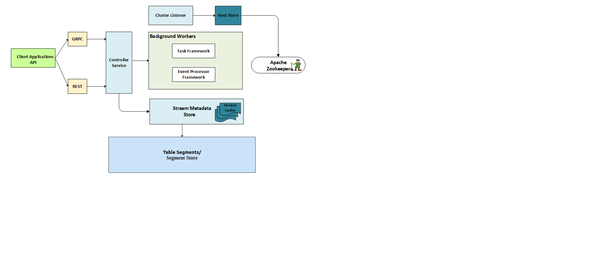
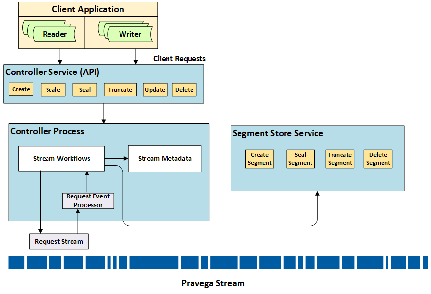
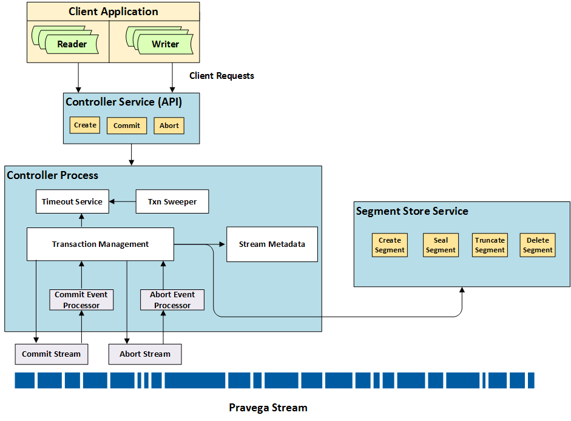

<!--
Copyright Pravega Authors.

Licensed under the Apache License, Version 2.0 (the "License");
you may not use this file except in compliance with the License.
You may obtain a copy of the License at

    http://www.apache.org/licenses/LICENSE-2.0

Unless required by applicable law or agreed to in writing, software
distributed under the License is distributed on an "AS IS" BASIS,
WITHOUT WARRANTIES OR CONDITIONS OF ANY KIND, either express or implied.
See the License for the specific language governing permissions and
limitations under the License.
-->
Pravega Controller Service
========================================================================================================================

*  [Introduction](#introduction)
*  [Architecture](#architecture)
    - [Stream Management](#stream-management)
    - [Key Value Tables Management](#key-value-tables-management)
    - [Cluster Management](#cluster-management)
* [System Diagram](#system-diagram)
* [Components](#components)
    - [Service Endpoints](#service-endpoints)
    - [Controller Service](#controller-service)
    - [Stream Metadata Store](#stream-metadata-store)
        - [Stream Metadata](#stream-metadata)
        - [Stream Store Caching](#stream-store-caching)
    - [Key Value Table Metadata Store](#key-value-table-metadata-store)
    - [Host Store](#host-store)
    - [Background workers](#background-workers)
	  - [Task Framework](#task-framework)
	  - [Event Processor Framework](#event-processor-framework)
      - [Periodic Background Job Framework](#periodic-background-job-framework)
      - [Controller Cluster Listener](#controller-cluster-listener)
* [Roles and Responsibilities](#roles-and-responsibilities)
    - [Stream Operations](#stream-operations)
        - [Stream State](#stream-state)
        - [Create Stream](#create-stream)
        - [Update Stream](#update-stream)
        - [Scale Stream](#scale-stream)
        - [Truncate Stream](#truncate-stream)
        - [Seal Stream](#seal-stream)
        - [Delete Stream](#delete-stream)
    - [Stream Policy Manager](#stream-policy-manager)
        - [Scaling Infrastructure](#scaling-infrastructure)
        - [Retention Infrastructure](#retention-infrastructure)
    - [Transaction Manager](#transaction-manager)
        - [Create Transaction](#create-transaction)
        - [Commit Transaction](#commit-transaction)
        - [Abort Transaction](#abort-transaction)
        - [Ping Transaction](#ping-transaction)
        - [Transaction Timeout Management](#transaction-timeout-management)
    - [Watermarks](#watermarks)
    - [KVT Operations](#kvt-operations)
      - [Create KVTable](#create-kvtable)
      - [Delete KVTable](#delete-kvtable)
      - [Readergroup Management](#readergroup-management)
* [Resources](#resources)

# Introduction

The Controller Service is a core component of Pravega that implements
the control plane. It acts as the central coordinator and manager for
various operations performed in the cluster, the major two
categories are: **Stream Management** and **Cluster Management**.

The Controller Service, referred to simply as **Controller** henceforth, is
responsible for providing the abstraction of a Pravega [Stream](pravega-concepts.md#streams), which is the main abstraction that Pravega exposes to applications. A Pravega Stream
comprises one or more Stream [Segments](pravega-concepts.md#stream-segments). Each Stream Segment is an append-only data
structure that stores a sequence of bytes. A Stream Segment on its own is
agnostic to the presence of other Stream Segments and is not aware of its logical
relationship with its peer Stream Segments. The Segment Store, which owns and
manages these Stream Segments, does not have any notion of a Stream.  A Stream is a logical view built by the Controller and consists of a dynamically changing set of Stream Segments that satisfy a predefined set of invariants. The Controller provides the Stream abstraction and
orchestrates all lifecycle operations on a Pravega Stream while ensuring its consistency.

The Controller plays a central role in the lifecycle of a Stream:
_creation_, _updation_, _truncation_, _sealing_, [_scaling_](pravega-concepts.md#elastic-streams-auto-scaling) and _deletion_.  To implement these operations, the Controller manages both a Stream's metadata and its associated Stream Segments. For example, as part of Stream’s
lifecycle, new Segments can be created and existing Segments can be sealed. The
Controller decides on performing these operations by ensuring the availability and consistency of the Streams for the clients accessing them.

# Architecture

The Controller Service is made up of one or more instances of
stateless worker nodes. Each new Controller instance can be invoked independently and becomes part of Pravega cluster by merely pointing to the same [Apache Zookeeper](https://zookeeper.apache.org/). For high availability, it is advised to have
more than one instance of Controller service per cluster.

Each Controller instance is capable of working independently and uses a
shared persistent store as the source of truth for all state-owned and
managed by Controller service. We use [Pravega KeyValue Tables](https://github.com/pravega/pravega/wiki/PDP-48-(Key-Value-Tables-Beta-2)) as the
store for persisting all metadata consistently. Controller stores metadata about Streams in Stream specific tables that it creates. Each Controller instance comprises
various subsystems responsible for performing specific
operations on different categories of metadata. These subsystems include
different *API endpoints, metadata store handles, policy managers* and
*background workers*.

Each Controller instance exposes two endpoints which can be used to interact with
it. The first port is for providing programmatic
access for Pravega clients and is implemented as an `RPC` using [gRPC](https://grpc.io/). The
other endpoint is for administrative operations and is implemented as a
`REST` endpoint.

## Stream Management

The Controller owns and manages the concept of Stream and is
responsible for maintaining "metadata" and "lifecycle" operations (_creating, updating, scaling,
truncating, sealing_ and _deleting Streams_) for each Pravega Stream.

The Stream management can be divided into the following categories:

  1. **Stream Abstraction**: A Stream can be viewed as a series of dynamically changing Segment sets
where the Stream transitions from one set of consistent Segments to the
next. The Controller is the place for creating and managing Stream abstraction.
The Controller decides when and how a Stream transitions from one state to another and is responsible
for performing these transitions by keeping the state of the Stream consistent and available.
These transitions are governed user-defined policies that the
Controller enforces. Consequently, as part of Stream management, the
Controller also performs roles of Policy Manager for policies like
retention and scaling.

  2. **Policy Management**: The Controller is responsible for storing and enforcing user-defined Stream policies by actively monitoring the state of the Stream. In Pravega we
have two policies that users can define, namely [**Scaling** **Policy**](https://github.com/pravega/pravega/blob/master/client/src/main/java/io/pravega/client/stream/ScalingPolicy.java) and
[**Retention** **Policy**](https://github.com/pravega/pravega/blob/master/client/src/main/java/io/pravega/client/stream/RetentionPolicy.java).

       - **Scaling policy** describes if and under what circumstances a Stream should automatically scale its number of Segments.  
       - **Retention policy** describes a policy about how much data to retain within a Stream based on **time** (*Time-based Retention*) and data **size** (*Size-based Retention*).

  3. **Tag Management**: The Controller is responsible for storing user-defined Tags for a given Stream.
     Tags are singleton labels that are useful to specify identifying attributes of a Stream, meaningful and relevant to users.
     The Controller indexes these Tags and provides APIs by which the user can organize and select a subset of Streams under a given Scope that share the same tag.

  4. [**Transaction**](pravega-concepts.md#transactions) **Management**: Implementing Transactions requires the manipulation of Stream Segments. With
each Transaction, Pravega creates a set of Transaction Segments, which
are later merged onto the Stream Segments upon commit or discarded upon
aborts. The Controller performs the role of Transaction manager and is
responsible for creating and committing Transactions on a given Stream.
Upon creating Transactions, Controller also tracks Transaction timeouts
and aborts transactions whose timeouts have elapsed. Details of
Transaction management can be found later in the [Transactions](#transaction-manager) section.

  4. [**Watermarks**](http://pravega.io/docs/latest/watermarking/): Watermarks are a data structure produced by Controller that refer to a unique position in the Stream and associates time information corresponding to that position. The watermark is computed by Controller by coordinating the time and position information reported by different writer applications and generating a time window. 

## Key-Value-Tables Management

Apart from Stream abstraction Controller is also the source of truth for the other storage primitive offered by Pravega - [Key Value Tables](https://github.com/pravega/pravega/wiki/PDP-48-(Key-Value-Tables-Beta-2)). Just like a Stream, a Key Value Table (KVT) is also distributed and paritioned using a Table Segment. A Table Segment has same properties as a Stream Segment, but with the data is formatted as keys and values and indexed on the keys. It provides APIs to perform CRUD operations on keys. Controller uses Table Segments to create a higher level abstraction which creates a distributed Key Value Table. Each Table is partitioned and the user data is distributed across different partitions using a hashing scheme.  
Controller maintains the metadata about the key value tables and is responsible for its lifecycle. Presently key value tables do not support any user defined policies like scaling or retention. So Controller's role is limited to provisioning Table Segments for the Table and managing its lifecycle which includes operations like create seal and delete tables.   

## Cluster Management

Controller is responsible for tracking the service instance nodes for both Controller and Segment Store service and in case of a node failure the work is properly failed over to surviving instances. Controller is responsible for distributing workload across different Segment Store instances by distributing Segment containers to availale Segment Store nodes.

### Segment Container to Host Mapping

The Controller is also responsible for the assignment of Segment Containers to
Segment Store nodes. The responsibility of maintaining this mapping
befalls a single Controller instance that is chosen via a leader
election using Zookeeper. This leader Controller monitors lifecycle of
Segment Store nodes as they are added to/removed from the cluster and
performs redistribution of Segment Containers across available Segment
Store nodes. This distribution mapping is stored in a dedicated Znode called [**SegmentContainerMapper**](https://github.com/pravega/pravega/blob/master/shared/protocol/src/main/java/io/pravega/shared/segment/SegmentToContainerMapper.java).
Each Segment Store watches this Znode to receive change notifications and
if changes to its own assignments are found, it shuts down and relinquishes containers it no
longer owns and attempts to acquire ownership of containers that are
assigned to it.

# System Diagram

The following diagram shows the main components of a Controller process.
The elements of the diagram are discussed in detail in the following sections.

 

_Controller Process Diagram_

# Components

## Service Endpoints

There are two ports exposed by Controller: **Client-Controller API** and
**Administration API**. The client Controller communication is implemented as `RPC` which
exposes API to perform all Stream related control plane operations.
Apart from this Controller also exposes an administrative API implemented as `REST`.

Each endpoint performs the appropriate call to the Pravega Controller Service *backend subsystem*
which has the actual implementation for various operations like create, read, update and
delete (CRUD) on entities owned and managed by Controller.

### gRPC  

Client Controller communication endpoint is implemented as a [`gRPC`](https://grpc.io/)
interface. Please check the complete list of [API](https://github.com/pravega/pravega/blob/master/shared/controller-api/src/main/proto/Controller.proto). This exposes API used by Pravega clients (Readers, Writers and Stream
Manager) and enables Stream management. Requests enabled by this API
include *creating, modifying,* and *deleting* Streams.
The underlying `gRPC` framework provides both **_synchronous_** and **_asynchronous_** programming models.
We use the asynchronous model in our client Controller interactions so that the client thread does not block on the response from the server.  

To be able to append to and read data from Streams, Writers and Readers
query Controller to get active Stream Segment sets, successor and predecessor
Stream Segments while working with a Stream. For Transactions, the client uses
specific API calls to request Controller to [_create_](#create-transaction), [_commit_](#commit-transaction), [_abort_](#abort-transaction) and [_ping_](#ping-transaction)
Transactions.

### REST  
For administration, the Controller implements and exposes a `REST`
interface. This includes API calls for Stream management as well as
other administration API primarily dealing with _creation_ and _deletion_ of
[**Scopes**](pravega-concepts.md#streams). We use [swagger](https://swagger.io) to describe our `REST` API. Please see, the swagger [`yaml`](https://github.com/pravega/pravega/tree/master/shared/controller-api/src/main/swagger) file.

## Pravega Controller Service 

This is the backend layer behind the Controller endpoints `gRPC` and
`REST`. All the business logic required to serve Controller API calls are
implemented here. This layer contains handles to all other subsystems like the various store implementations
([Stream store](#stream-metadata-store), [Host store](#host-store) and Checkpoint store) and background processing frameworks ([Task](#task-framework) and [Event Processor framework](#event-processor-framework)).
Stores are interfaces that provide access to various types of metadata managed by Controller. Background
processing frameworks are used to perform asynchronous processing that typically implements workflows involving metadata updates
and requests to Segment Store.

## Stream Metadata Store

A Stream is a dynamically changing sequence of Stream Segments, where regions of
the Routing Key space map to open Stream Segments. As the set of Segments of a
Stream changes, so do the mapping of the Routing Key space to Segments.

A set of Segments is consistent iff the union of key space ranges mapping
to Segments in the set covers the entire key space and the key space
ranges are disjoint.

For example, suppose a set **S** = {**S****1**, **S**2, **S****3**}, such that:

   -   Region \[0, 0.3) maps to Segment **S****1**.
   -   Region \[0.3, 0.6) maps to Segment **S****2**.
   -   Region \[0.6, 1.0) maps to Segment **S****3**.

**S** is a consistent Segment set.  

A Stream goes through transformations as it scales over time. A Stream
starts with an initial set of Segments that is determined by the Stream
configuration when created and it transitions to new sets of Segments as
scale operations are performed on the Stream. Each generation of
Segments that constitute the Stream at any given point in time are
considered to belong to an **epoch**. A Stream starts with initial epoch 0
and upon each transition, it moves ahead in its epochs
to describe the change in generation of Segments in the Stream.

The Controller maintains the Stream: it stores the information about all epochs that constitute a given Stream and also about their transitions. The metadata store is designed to persist the information pertaining to Stream Segments, and to enable queries over this information.

Apart from the epoch information, it keeps some additional metadata,
such as [state](#stream-state), its [policies](#stream-policy-manager), its Tags and ongoing Transactions on the Stream. Various sub-components of Controller access the stored metadata for each
Stream via a well-defined
[interface](https://github.com/pravega/pravega/blob/master/controller/src/main/java/io/pravega/controller/store/stream/StreamMetadataStore.java).
We currently have two concrete implementations of the Stream store
interface: _in-memory_ and _pravega_tables_ backed stores. 
The Pravega tables implementation is intended for production while in memory implementation is for demo and testing purposes and does not provide any durability. 
The Pravega tables store based implementation stores the Stream metadata in Pravega Table Segments as key value pairs and is retrieved by Stream metadata store and cached for efficient lookups. Pravega Table Segments will henceforth be refered to as tables. This should not be confused with KeyValue tables which is a higher level abstraction built over Table Segments. 

The Pravega tables based implementation relies on compare and swap conditional updates capability of Pravega tables and relies on optimistic concurrency to perform updates and handles conditional update failures. The metadata is organized in various tables starting with information about scopes and then dedicated tables for each Stream in a scope. For each Pravega Stream its metadata is organized into two classes of tables namely Stream metadata Table and Stream transactions tables. Stream metadata includes information about Stream configuration, state, epochs, Segments and information and information related to any ongoing workflows on the Stream. 

Queries
against this metadata include, but not limited to, querying Segment sets
that form the Stream at different points in time, Segment specific
information, Segment predecessors and successors and additional information about Segments like their whether they are open or sealed, whether they are hot or cold and the size of data when they were sealed. Refer to [Stream metadata](https://github.com/pravega/pravega/blob/master/controller/src/main/java/io/pravega/controller/store/stream/StreamMetadataStore.java) interface for details about API exposed by Stream metadata
store.

### Stream Metadata

Clients need information about what Segments constitute a Stream to start their processing and they obtain it from the epoch information the Controller stores in the Stream store. Clients need the ability to query and find Stream Segments at any of the three cases efficiently:

- A Reader client typically starts from the **head** of the Stream,
- But it might also choose to access the Stream starting from any arbitrarily interesting position.
- Writers on the other hand always append to the **tail** of the Stream.

To enable such queries, the Stream store provides API calls to get the initial set of Stream Segments, Segments at a specific time and current set of Segments.

As mentioned earlier, a Stream can transition from one set of Stream Segments
(epoch) to another set of Segments that constitute the Stream. A Stream
moves from one epoch to another if there is at least one Stream Segment that is
sealed and replaced by one or more set of Stream Segments that cover
precisely the key space of the sealed Segments. As clients work on
Streams, they may encounter the end of sealed Stream Segments and consequently
need to find new Segments to be able to move forward. To enable the
clients to query for the next Segments, the Stream store exposes via the
Controller Service efficient queries for finding immediate successors
and predecessors for any arbitrary Segment.  

To enable serving queries like those mentioned above, we need to efficiently store a time series of these Segment transitions and index them against time. We store this information about the current and historical state of a Stream Segments in a set of records which are designed to optimize on aforementioned queries. Apart from Segment-specific metadata record, the current state of Stream comprises of other metadata types that are described henceforth.

#### Records  

Stream time series is stored as a series of records where each record corresponds to an epoch. As Stream scales and transitions from one epoch to another, a new record is created that has complete information about Stream Segments that forms the epoch.

- **Epoch Records:**  
_Epoch: ⟨time, list-of-segments-in-epoch⟩_.
We store the series of _active_ Stream Segments as they transition from one epoch to another into individual epoch records. Each epoch record corresponds to an epoch which captures a logically consistent (as defined earlier) set of Stream Segments that form the Stream and are valid through the lifespan of the epoch. The epoch record is stored against the epoch number. This record is optimized to answer to query Segments from an epoch with a single call into the store that also enables retrieval of all Stream Segment records in the epoch in _O(1)_. This record is also used for fetching a Segment-specific record by first computing Stream Segment's creation epoch from Stream Segment ID and then retrieving the epoch record.

 - **Current Epoch:**
 A special epoch record called `currentEpoch`. This is the currently _active_ epoch in the Stream. At any time exactly one epoch is marked as the current epoch. Typically this is the latest epoch with the highest epoch number. However, during an ongoing Stream update workflow like _scale_ or _rolling Transaction_, the current epoch may not necessarily be the latest epoch. However, at the completion of these workflows, the current epoch is marked as the latest epoch in the Stream. The following are three most commonly used scenarios where we want to efficiently know the set of Segments that form the Stream:
   1. _Initial set of Stream Segments_: The **head** of the Stream computation is very efficient as it is typically either the first epoch record or the latest truncation record.
   2. _Current set of Stream Segments_: The **tail** of the Stream is identified by the current epoch record.
   3. _Successors of a particular Stream Segment_: The successor query results in two calls into the store to retrieve Stream Segment's sealed epoch and the corresponding epoch record. The successors are computed as the Stream Segments that overlap with the given Stream Segment.

- **Segment Records:**
_Segment-info: ⟨segmentid, time, keySpace-start, keySpace-end⟩_.
 The Controller stores Stream Segment information within each epoch record. The Stream Segment ID is composed of two parts and is encoded as a _64 bit_ number. The _high 32 bit_ identifies the creation epoch of the Stream Segment and the _low 32 bit_ uniquely identifies the Stream Segment.

**Note**: To retrieve Stream Segment record given a Stream Segment ID, we first need to extract the creation epoch and then retrieve the Stream Segment record from the epoch record.

#### Stream Configuration
 Stream configuration is stored against the StreamConfiguration key in the metadata table. The value against this key has the Stream configuration serialized and persisted. A
 Stream configuration contains Stream policies that need to be enforced and the Stream Tags associated with the Stream.
 [Scaling policy](https://github.com/pravega/pravega/blob/master/client/src/main/java/io/pravega/client/stream/ScalingPolicy.java) and [Retention policy](https://github.com/pravega/pravega/blob/master/client/src/main/java/io/pravega/client/stream/RetentionPolicy.java) are supplied by the application at the time of Stream creation and enforced by Controller by monitoring the rate and size of data in the Stream.
 The Stream Tags too can be specified by the application at the time of Stream creation.

   - The Scaling policy describes if and when to automatically scale is based on incoming traffic conditions into the Stream. The policy supports two
 flavors - _traffic as the rate of Events per second_ and _traffic as the rate of
 bytes per second_. The application specifies their desired traffic
 rates into each Segment by means of scaling policy and the supplied
 value is chosen to compute thresholds that determine when to scale a
 given Stream.

   - Retention Policy describes the amount of data that needs to be
 retained into Pravega cluster for this Stream. We support a _time-based_
 and a _size-based_ retention policy where applications can choose
 whether they want to retain data in the Stream by size or by time by
 choosing the appropriate policy and supplying their desired values.

#### Stream State
 The Stream state is saved as StateRecord in the metadata table. It describes the state of the Stream like active or sealed and whenever Stream goes through a transition in its lifecycle, the state also describes the transition. StateRecord has an enumerator with
 values from *creating, active, updating, scaling, truncating, sealing,*
 and *sealed* representating each of the various states and state transitions. Once _active_, a Stream transition between performing a
 specific operation and remains _active_ until it is sealed. A transition map is
 defined in the
 [State](https://github.com/pravega/pravega/blob/master/controller/src/main/java/io/pravega/controller/store/stream/State.java)
 class which allows and prohibits various state transitions.
 Stream State describes the _current state_ of the Stream. It transitions
 from _active_ to respective action based on the action being performed
 on the Stream. For example, during scaling the state of the Stream
 transitions from *active* to *scaling* and once scaling completes, it
 transitions back to *active*. Stream State is used as a barrier to
 ensure only one type of operation is being performed on a given Stream
 at any point in time. Only certain state transitions are allowed and
 are described in the state transition object. Only legitimate state
 transitions are allowed and any attempt for disallowed transition
 results in an appropriate exception.

#### Truncation Record

The Truncation Record captures the latest truncation point of the Stream which is identified by a `StreamCut`. The truncation `StreamCut` logically represents the head of the Stream and all the data before this position has been purged completely. For example, let there be _**n**_ active Segments **S1**, **S2**, ...,**Sn** in a Stream. If we truncate this Stream at a `StreamCut` **SC = {S1/O1, S2/O2,...,Sn/On}**, then all data before the given `StreamCut` could be removed from the durable store. This translates to all the data in Segments that are predecessor Segments of **Si** for **i ={ 1 to n }**; and all the data in Segments **Si** till offset **Oi**. So we could delete all such predecessor Segments from the Stream and purge all the data before respective offsets from the Segments in `StreamCut`.

#### Sealed Segments Maps
Once the Stream Segments are sealed, the Controller needs to store additional information about the Stream Segment. Presently, we have two types of information:

 - Epoch, the Stream Segment was sealed in.
 - Size of the Stream Segment at the time of sealing.

 These records have two different characteristics and are used in different types of queries. For example;

 1. Sealing epoch is important for querying successor Stream Segments. For each Stream Segment, we store its sealing epoch directly in the metadata store.
 2. Stream Segment sizes are used during truncation workflows. For sealed sizes, we store it in a map of Segment to size at the time of sealing.
 3. Successor queries are performed on a single Stream Segment whereas truncation workflows work on a group of Stream Segments.

 This ensures that during truncation we are able to retrieve sealed sizes for multiple Stream Segments with a minimal number of calls into the underlying metadata store. Since we could have an arbitrarily large number of Stream Segments that have been sealed away, we cannot store all of the information in a single map and hence we shard the map and store it. The sharding function we use is to hash the creation epoch and get the shard number.

The following are the Transaction Related metadata records:

   - **Active Transactions**: Each new Transaction is created in the a transactions table created for each epoch in the Stream. The metadata
 for each Transaction is stored in an object called *Active Transaction Record*. Once a
 Transaction is completed, it is moved to a global
 table for _Completed Transaction_ and its active transaction record is removed.

   - **Completed Transactions**: All completed transactions for all Streams are moved under a separate global table upon completion (via either commit or abort paths). The completion status of Transaction is recorded under this record. To avoid proliferation of stale Transaction records, we provide a cluster level configuration to specify the duration for which a completed Transaction's record should be preserved. Controller periodically garbage collects all Transactions that were completed before the aforesaid configured duration.

#### Retention Set

 Controller periodically generates the tail [_StreamCut_](https://pravega.io/docs/nightly/terminology/) on the Stream and stores them as a chronological time series in the Stream metadata called retention set. This retention set is stored in the metadata table. These StreamCuts are used to identify truncation points for application of retention policy for the Stream. 

#### Writer Marks
 Writers report their positions and times in the form of writer marks to Controller service which are then stored in the metadata table. One of the Controller instances then looks at these marks and consolidates them to produce watermarks. 

#### Subscribers
 As part of 0.9, a new experimental feature called [Consumption Based Retention](https://github.com/pravega/pravega/wiki/PDP-47:-Pravega-Streams:-Consumption-Based-Retention) has been included in Pravega to keep track of subscriber readergroups and the Stream automatically purges the data only after it has been consumed by all subscribers. To achieve this, readergroups report their positions to Controller and Controller stores their subscriber StreamCuts in subscriber metadata for the Stream. It then consolidates these StreamCuts to compute a lower bound and truncate at such a lowerbound. 
Users explicitly have to opt in for subscription and the default mode of using Pravega Streams do not enable a subscription. 

### Stream Store Caching

#### In-memory Cache
Since there could be multiple concurrent requests for a given Stream
being processed by the same Controller instance, it is suboptimal to read
the value by querying Pravega Table Segments every time. So we have introduced an
**in-memory cache** that each Stream store maintains. It caches retrieved
metadata per Stream so that there is maximum one copy of the data per
Stream in the cache. There are two in-memory caches:

- _A cache of multiple Stream objects in the store_
- _Cache properties of a Stream in the Stream object_.

The cache can contain both mutable and immutable records. Immutable records, by definition are not a problem. For mutable values, we have introduced a notion of [Operation Context](#operation-context) and for each new operation, which ensures that during an operation we lazily load latest value of entities into the cache and then use them for all computations within that [Operation's context](#operation-context).

#### Operation Context
 At the start of any new operation, we create a context for this operation. The creation of a new operation context invalidates all mutable cached entities for a Stream and each entity is lazily retrieved from the store whenever requested. If a
value is updated during the course of the operation, it is again
invalidated in the cache so that other concurrent read/update operations
on the Stream get the new value for their subsequent steps.  

### Key Value Table Metadata Store
Just like Stream metadata store, Pravega Key Value Tables have (KVT) their own metadata which is accessed using Key Value Table metadata store (kvt metadata store). Although KVT  presently only support static partitioning, we have defined the metadata schema which can support scaling in future. This means we maintain KVT Epoch Records which include KVT Segments. All of this is stored in dedicated metadata tables (Table Segments) per key value table.

- **KVT Epoch Records:**  
_KVTEpoch: ⟨time, list-of-segments-in-epoch⟩_.
We store the series of _active_ Table Segments as they transition from one epoch to another. Presently there is only one epoch record for each KVT. 

- **KVT Segment Records:**
_KVT Segment-info: ⟨segmentid, time, keySpace-start, keySpace-end⟩_.
 Each KVT Segment refers to a Table Segment in Segment Store. The Controller stores KVT Segment information within each epoch record. The additional metadata about each Table Segment that Controller maintains with KVT Segment includes keySpace-start and keySpace-end which is used for paritioning keys across different KVT Segments. 

- **KVT State:**
_KVT State_ is an enum that describes various states in the lifecycle of KV table. It ranges from CREATING, ACTIVE, DELETING. 
 
## Host Store

The implementation of the Host store interface is used to store _Segment Container_ to _Segment Store_
node mapping. It exposes API like `getHostForSegment` where it computes a
consistent hash of Segment ID to compute the owner Segment Container.
Then based on the container-host mapping, it returns the appropriate URI
to the caller.

## Background Workers

Controller process has two different mechanisms or frameworks for
processing background work. These background works typically entail
multiple steps and updates to metadata under a specific metadata root
entity and potential interactions with one or more Segment Stores.

We initially started with a simple task framework that gave us the ability to run tasks that take exclusive rights over
a given resource (typically a Stream) and allowed for tasks to _failover_ from one Controller instance to another.
However, this model was limiting in scope and locking semantics, and had no inherent notion of task ordering as
multiple tasks could race to acquire working rights (lock) on a resource concurrently. To overcome this limitation we
came up with a new infrastructure called [**Event Processor**](#event-processor-framework). It is built using Pravega Streams and provides a clear
mechanism to ensure **_mutually exclusive_** and **_ordered processing_**.

### Task Framework

The Task Framework is designed to run exclusive background processing per
resource such that in case of Controller instance failure, the work can
easily _failover_ to another Controller instance and brought to
completion. The framework, on its own, does not guarantee idempotent
processing and the author of a task has to handle it if required. The
model of tasks is defined to work on a given resource exclusively, which
means no other task can run concurrently on the same resource. This is
implemented by way of a persisted distributed lock implemented on
Zookeeper. The _failover_ of a task is achieved by following a scheme of
indexing the work a given process is performing. So if a process fails,
another process will sweep all outstanding work and attempt to transfer
ownership to itself.

Note that, upon failure of a Controller process, multiple surviving Controller processes can concurrently attempt sweeping of orphaned tasks. Each of them will index the task in their
host-index but exactly one of them will be able to successfully acquire
the lock on the resource and hence permission to process the task. The
parameters for executing a task are serialized and stored under the
resource.

Currently, we use the Task Framework only to create Stream tasks. All the
other background processing is done using the Event Processor Framework.

### Event Processor Framework

Event processors Framework is a background worker subsystem which reads
Events from an internal Stream and processes it, hence the name Event
Processor. In Pravega all Event Processors provides **at least once
processing** guarantee. And in its basic flavor, the framework also
provides strong ordering guarantees. The Event Processor framework on its own does not guarantee idempotent execution and it is the responsibility of the individual workflows implemented to ensure that the processing is idempotent and safe across multiple executions.
 In Pravega, there exist different subtypes of Event Processors which allow concurrent processing.

We create different Event Processors for different kinds of work.
In Pravega, there are _three_ different Event Processors:

- Committing Transaction,
- Aborting Transactions,
- Processing Stream specific requests (scale, update, seal, etc).

Each Controller instance has one Event Processor of each type. The Event Processor Framework
allows for multiple Readers to be created per Event Processor. All
Readers for a specific Event Processor across Controller instances share
the same Reader Group, which guarantees mutually exclusive distribution
of work across Controller instances. Each Reader gets a dedicated thread
where it reads the Event, calls for its processing and upon completion
of processing, updates its **Checkpoint**. Events are posted in the Event
Processor-specific Stream and are routed to specific Stream Segments using scoped Stream name as the Routing Key.

#### Serial Event Processor
It essentially reads an Event and initiates its processing and waits on it to complete before moving on to the next Event. This provides strong ordering guarantees in processing. And it
Checkpoints after processing each Event. [Commit Transaction](#commit-transaction) is
implemented using this Serial Event Processor. The degree of
parallelism for processing these Events is upper bounded by the number of
Stream Segments in the internal Stream and lower bounded by the number of Readers.
Multiple Events from across different Streams could land up in the same
Stream Segment due to Serial processing. Serial processing has
a drawback that, processing stalls or flooding of Events from one
Stream could adversely impact latencies for unrelated Streams.

#### Concurrent Event Processor
To overcome the drawbacks of Serial Event Processor, in Pravega we designed **Concurrent Event Processor**. Concurrent Event Processor, as the name implies, allows us to process multiple Events concurrently. Here the Reader thread, reads an Event, schedules it’s asynchronous processing and
returns to read the next event. There is a ceiling on the number of Events
that are concurrently processed at any point in time and as the processing
of some Event completes, newer Events are allowed to be fetched. The
Checkpoint scheme here becomes slightly more involved to ensure the guarantee _at least once processing_.

However, with concurrent processing the ordering guarantees get broken. But, it is important to note that only ordering guarantees are needed for processing Events from a Stream and not across Streams. In order to satisfy ordering guarantee, we overlay Concurrent Event processor with **Serialized Request Handler**, which queues up Events from the same Stream in the _in-memory queue_ and processes them in order.

  - [**Commit Transaction**](#commit-transaction) processing is implemented on a dedicated Serial Event
Processor because strong commit ordering is required by ensuring that
commit does not interfere with processing of other kinds of requests on
the Stream.

  - **Abort Transaction** processing is implemented on a dedicated Concurrent
Event Processor which performs abort processing on Transactions from
across Streams concurrently.

All other requests for Streams are implemented on a Serialized Request
Handler which ensures exactly one request per Stream is being processed
at any given time and there is ordering guarantee within request
processing. However, it allows for concurrent requests from across
Streams to go on concurrently. Workflows like _scale, truncation, seal,
update_ and _delete Stream_ are implemented for processing on the request
Event Processor.

## Periodic Background job framework 

To enable some scenarios, we may need the background workers to
periodically work on each of the Streams in our cluster to perform
some specific action on them. We have built a periodic job framework for this purpose which relies on Zookeeper which makes use of something called a Stream Bucket which is used to
distribute this periodic background work across all available
Controller instances.  
The unit of load distribution is a bucket which is a Znode with a fixed bucket number. Controller instances map all available Streams in the system into buckets and these buckets are distributed amongst themselves. Hence, all the long-running background work can be uniformly distributed across multiple Controller instances.

**Note**: Number of buckets is a configuration for a cluster which is fixed for
the lifetime of a cluster.

Each bucket corresponds to a unique Znode in
Zookeeper. A qualified scoped Stream name is used to compute a
hash value to assign the Stream to a bucket. All Controller instances, upon
startup, attempt to take ownership of buckets. Upon _failover_, ownerships
are transferred, as surviving nodes compete to acquire ownership of
orphaned buckets. The Controller instance which owns a bucket is
responsible for all long running scheduled background work corresponding
to all nodes under the bucket. Presently this entails running periodic
workflows to capture `StreamCut`(s) (called Retention-Set) for each Stream at desired frequencies.

## Controller Cluster Listener

Each node in Pravega Cluster registers itself under a cluster Znode as
an ephemeral node. This includes both Controller and Segment Store
nodes. All Segment stores register under a child Znode called hosts while all controllers register under a child Znode called controllers. 
Controller Cluster Listener is the component that monitors the cluster of controllers and is chiefly responsible for ensuring that any partially
completed work from a failed Controller instance is completed by surviving Controller instances. To achieve this each Controller instance registers a watch on the Controller cluster Znode
to listen for cluster change notifications. These notify about the added and removed nodes.

All Controller instances listen for Controller node change
notifications. Each Controller instance has multiple sub components that
implement the _failover sweeper_ interface. The purpose of failover sweeper is to sweep any unfinished ongoing tasks from the failed Controller instance. 
Any Controller sub-component that wishes to implement a failover logic should implement the FailoverSweeper interface. 
Presently there are three components that implement _failover_ sweeper interface namely:

- `TaskSweeper`
- `EventProcessors`
- `TransactionSweeper`

Whenever a Controller instance is identified to have been removed from the cluster,
the cluster listener invokes all registered _failover sweepers_ to
optimistically try to sweep all the orphaned work previously owned by
the failed Controller host.

TaskSweeper is for the task framework which allows running background workflows on a resource (typically a Stream) by acquiring a Zookeeper based distributed lock for mutual exclusion. 
All ongoing tasks that a Controller wishes to acquire, it first adds an entry into its index about it before attempting to acquire the distributed lock. Upon successful acquisition, the workflow is performed, else the indexed entry is removed. The indexed entry is only an indicator that this Controller may attempt to do the said work. The truth of acquisition is on the distributed lock. If the Controller fails with an indexed entry then any other Controller attempting to sweep its tasks would look at all the indexed entries and check the ownership for those tasks by the failed Controller. If the failed Controller did indeed own those tasks, then the new Controller will attempt to first create an index and then acquire the lock. 

Just like task sweeper and request sweepers also rely on creating an index in Zookeeper to indicate an intent to atomically update a metadata record and post an event into the respective Event Processor Stream. If the Controller fails after updating the metadata but without posting an event into the Event Processor Stream, then the new Controller will sweep all such indexed tasks from Zookeeper and post the events for them. 

# Roles and Responsibilities

## Stream Operations

The Controller is the source of truth for all Stream related metadata.
Pravega clients (e.g., `EventStreamReaders` and `EventStreamWriters`), in
conjunction with the Controller, ensure that Stream invariants are
satisfied and honored as they work on Streams. The Controller maintains
the metadata of Streams, including the entire history of Stream Segments.
The Client accessing a Stream need to contact the Controller to obtain
information about Stream Segments.

Clients query Controller in order to know how to navigate Streams. For
this purpose Controller exposes appropriate API to get _active_ Stream Segments,
successors, predecessors and URIs. These queries
are served using metadata stored and accessed via Stream store
interface.

The Controller also provides workflows to modify the state and behavior of the
Stream. These workflows include _create, scale, truncation, update, seal,_
and _delete_. These workflows are invoked both via direct API and in some
cases as applicable via background policy manager ([Auto Scaling](https://github.com/pravega/pravega/blob/master/client/src/main/java/io/pravega/client/stream/ScalingPolicy.java) and [Retention](https://github.com/pravega/pravega/blob/master/client/src/main/java/io/pravega/client/stream/RetentionPolicy.java)).

_Request Processing Flow Diagram_

### Create Stream

The Create Stream is implemented as a task on **Task Framework**.

 - The Create Stream workflow first sets the initial Stream set to *Creating*.

 - Next, it identifies the Segment Containers that should create and own the new Segments for this Stream, and calls `CreateSegment()` concurrently for all Segments. Once all `CreateSegment()`(s) return, the `createStream()` task completes its execution and change the Stream state to *Active*. In the case of recoverable failures, the operations are retried.

 - However, if it is unable to complete any step, the Stream is left dangling in *Creating* state.

### Update Stream

Update Stream is implemented as a task on **Serialized Request
Handler** over Concurrent Event Processor Framework.

1. Update Stream is invoked by an explicit API `updateStream()` call into Controller.
2. It first posts an _Update Request_ Event into request Stream.
3. Following that it tries to create a temporary update property. If it fails to create the temporary update property, the request is failed and the caller is notified of the failure to update a Stream due to conflict with another ongoing update.
4. The Event is picked by **Request Event Processor**. When the processing
starts, the update Stream task expects to find the temporary update
Stream property to be present. If it does not find the property, the
update processing is delayed by pushing Event the back in the in-memory
queue until it deems the Event expired. If it finds the property to be
updated during this period, before the expiry, the Event is processed
and `updateStream()` operation is performed.

- Once the update Stream processing starts, it first sets the Stream state to *Updating*.
- Then, the Stream configuration is updated in the metadata store followed by notifying
Segment Stores for all _active_ Stream Segments of the Stream, about the change in
policy. Any Tag related changes causes the Tag indexes (a reverse index of a Tag to Stream for a Scope) to be updated. Now the state is reset to *Active*.

### Scale Stream

The Scale can be invoked either by explicit API call (referred to as manual
scale) or performed automatically based on scale policy (referred to as
[Auto-scaling](pravega-concepts.md#elastic-streams-auto-scaling)).

We first write the Event followed by updating the metadata store to capture our intent to scale a Stream. This step is idempotent and ensures that if an existing ongoing scale operation is in progress, then this attempt to start a new scale is ignored. Also, if there is an ongoing scale operation with a conflicting request input parameter, then the new request is rejected. Which essentially guarantees that there can be exactly one scale operation that can be performed at any given point in time.

The start of processing is similar to the mechanism followed in _update_ Stream. If metadata is updated, the Event processes and proceeds with executing the task. If the metadata is not updated within the desired time frame, the Event is discarded.

- Once scale processing starts, it first sets the Stream State to *Scaling*.
- Then creates new Stream Segments in Segment Store. The workflow is as follows:

     1. After  successfully creating new Segments, it creates a new epoch record in the
      metadata store.
     2. The created new epoch record corresponds to a new epoch which contains the list of Stream Segments as they would appear post scale.
     3. Each new epoch creation also creates a new root epoch node under which the metadata for all transactions from that epoch resides.
     4. After creating requisite metadata records, scale workflow attempts to seal the old Stream Segments in the Segment Store.

- After the old Stream Segments are sealed, we can safely mark the new epoch as the currently _active_ epoch and reset state to _Active_.

### Truncate Stream

Truncating a Stream follows a similar mechanism to update and has a temporary
Stream property for truncation that is used to supply input for truncate Stream.

- Once the truncate workflow process starts, the Stream State is set to *Truncating*.
- Truncate workflow then looks at the requested `StreamCut`, and checks if it is greater than or equal to the existing truncation point, only then is it a valid input for truncation
and the workflow commences.
- The truncation workflow takes the requested `StreamCut` and computes all Stream Segments that are to be deleted as part of this truncation request.
- Then calls into respective Segment Stores to delete identified Stream Segments. Post deletion, we call truncate on Stream Segments that are described in the `StreamCut` at the offsets as described in the `Streamcut`.
- Following this, the truncation record is updated with the new
truncation point and deleted Stream Segments.  The state is reset to *Active*.

### Seal Stream

Seal Stream can be requested via an explicit API call into Controller.
It first posts a seal Stream Event into request Stream.

- Once the Seal Stream process starts, the Stream State is set to *Sealing*.
- If the event is picked and does not find the Stream to be in the desired state, it postpones the
seal Stream processing by reposting it at the back of in-memory queue.
- Once the Stream is set to sealing state, all _active_ Stream Segments for the
Stream are sealed by calling into Segment Store.
- After this, the Stream is marked as *Sealed* in the Stream metadata.

### Delete Stream

Delete Stream can be requested via an explicit API call into Controller.
The request first verifies if the Stream is in *Sealed* state.
- Only sealed Streams can be deleted and an event to this effect is posted in the request
Stream.
- When the event is picked for processing, it verifies the Stream state again and then proceeds to delete all Stream Segments that belong to this Stream from its inception by calling into Segment Store.
- Once all Stream Segments are deleted successfully, the Stream metadata corresponding to
this Stream is cleaned up.

## Stream Policy Manager

As described earlier, there are two types of user-defined policies that Controller is responsible for enforcing, namely _Automatic Scaling_ and _Automatic Retention_.
The Controller is not just the store for Stream policy but it actively enforces those user-defined policies for their Streams.

### Scaling Infrastructure

Scaling infrastructure is built in conjunction with Segment Stores. As the Controller creates new Stream Segments in Segment Stores, it passes user-defined scaling policies to Segment Stores. The Segment Store then
monitors traffic for the said Stream Segment and reports to Controller if some
thresholds, as determined from policy, are breached. The Controller receives
these notifications via Events posted in dedicated internal Streams.
There are two types of traffic reports that can be received for
Segments.

- It identifies if a Stream Segment should be **scaled up** (Split).
- It identifies if a Stream Segment should be **scaled down** (Merge).

For Stream Segments eligible for scale up, the Controller immediately posts the request for
Stream Segment scale up in the request Stream for Request Event Processor to
process. However, for scale down, the Controller needs to wait for at least
two neighboring Stream Segments to become eligible for scale down. For this
purpose, it marks the Stream Segment as **cold** in the metadata store. The Controller consolidates the neighboring Stream Segments that are marked as cold and posts a scale down the request for them.
The scale requests processing is then performed asynchronously on the
Request Event Processor.   

### Retention Infrastructure

The retention policy defines how much data should be retained for a
given Stream. This can be defined as _time-based_ or _size-based_. To apply
this policy, Controller periodically collects `StreamCut`(s) for the Stream
and opportunistically performs truncation on previously collected `StreamCut`(s) if policy dictates it. Since this is a periodic background work that needs to be performed for all Streams that have a retention policy defined, there is an imperative need to fairly distribute this workload
across all available Controller instances. To achieve this we rely on
bucketing Streams into predefined sets and distributing these sets
across Controller instances. This is done by using Zookeeper to store
this distribution. Each Controller instance, during bootstrap, attempts
to acquire ownership of buckets. All Streams under a bucket are
monitored for retention opportunities by the owning Controller. At each
period, Controller collects a new `StreamCut` and adds it to a
retention set for the said Stream. Post this it looks for the candidate
`StreamCut`(s) stored in retention set which are eligible for truncation
based on the defined retention policy. For example, in time-based
retention, the latest `StreamCut` older than the specified retention period
is chosen as the truncation point.

## Transaction Manager

Another important role played by the Controller is that of the Transaction manager. It is responsible for the beginning and
ending Transactions. The Controller plays an active role in providing guarantees for Transactions from the time
they are created until the time they are committed or aborted. The Controller tracks each Transaction for their
specified timeouts, and automatically aborts the Transaction if the timeout exceeds.
The Controller is responsible for ensuring that the Transaction and a
potential concurrent scale operation play well with each other and
ensure all promises made with respect to either are honored and
enforced.

_Transaction Management Diagram_

Client calls into Controller process to _create, ping commit_ or _abort
transactions_. Each of these requests is received on Controller and handled by the Transaction Management module which
implements the business logic for processing each request.

### Create Transaction

Writers interact with Controller to create new Transactions. Controller Service passes the create transaction request to Transaction Management module.

The create Transaction function in the module performs the following steps:

1. Generates a unique UUID for the Transaction.
2. It fetches the current _active_ set of Stream Segments for the Stream from metadata store and its corresponding epoch identifier from the history.
3. It creates a new Transaction record in the Zookeeper using the metadata store interface.
4. It then requests Segment Store to create special Transaction Segments that are inherently linked to the parent _active_ Stream Segments.

The Controller creates shadow Stream Segments for current _active_ Segments by associating Transaction ID to compute unique shadow Stream Segment identifiers. The lifecycle of shadow Stream Segments are not linked to original Stream Segments and original Stream Segments can be sealed, truncated or deleted without affecting the lifecycle of shadow Stream Segment.

### Commit Transaction

Upon receiving the request to commit a Transaction, Controller Service passes the request to Transaction Management module. This module first tries to mark the Transaction for commit in the Transaction specific metadata record via metadata store.

Following this, it posts a commit Event in the internal Commit Stream. The commit event only captures the epoch in which the Transaction has to be committed. Commit Transaction workflow is implemented on commit Event processor and thereby processed asynchronously.

- When commit workflow starts, it opportunistically collects all available Transactions that have been marked for commit in the given epoch and proceeds to commit them in order and one Transaction at a time.
- A Transaction commit entails merging the Transaction Segment into its parent Segment. This works perfectly in absence of scale.
     - However, because of scaling of a Stream, some of the parent Segments for Transaction's shadow Stream Segments could have been sealed away.
     - In such instance, when we attempt to commit a Transactions we may not have parent Segments in which Transaction Segments could be merged into.
     - One approach to mitigate this could have been to prevent scaling operation while there were ongoing Transactions. However, this could stall scaling for an arbitrarily large period of time and would be detrimental. Instead, Controller decouples scale and Transactions and allows either to occur concurrently without impacting workings of the other. This is achieved by using a scheme called **Rolling Transactions**.

#### Rolling Transactions

This is achieved by using a scheme (Rolling Transactions) where Controller allows Transaction Segments to outlive their parent Segments and whenever their commits are issued, at a logical level Controller elevates the Transaction Segments as first class Segments and includes them in a new epoch in the epoch time series of the Stream.

1. Transactions are created in an older epoch and when they are attempted to be committed, the latest epoch is sealed, Transactions are rolled over and included and then a duplicate of the latest epoch is created for Stream to restore its previous state before rolling of Transactions.
2. This ensures that Transactions could be created at any time and then be committed at any time without interfering with any other Stream processing.
3. The commit workflow on the Controller guarantees that once started it will attempt to commit each of the identified Transactions with indefinite retries until they all succeed.
4. Once a Transaction is committed successfully, the record for the Transaction is removed from under its epoch root.

### Abort Transaction

Abort, like commit, can be requested explicitly by the application. However, abort can also be initiated automatically if the Transaction’s timeout elapses.

1. The Controller tracks the timeout for each and every Transaction in the system and whenever timeout elapses, or upon explicit user request, Transaction Management module marks the Transaction for abort in its respective metadata.
2. After this, the Event is picked for processing by abort Event Processor and the Transactions abort is immediately attempted.
3. There is no ordering requirement for abort Transaction and hence it is
performed concurrently and across Streams.

### Ping Transaction

Since Controller has no visibility into data path with respect to data
being written to Segments in a Transaction, Controller is unaware if a
Transaction is being actively worked upon or not and if the timeout
elapses it may attempt to abort the Transaction. To enable applications
to control the destiny of a Transaction, Controller exposes an API to
allow applications to renew Transaction timeout period. This mechanism
is called ping and whenever application pings a Transaction, Controller
resets its timer for respective transaction.

### Transaction Timeout Management

Controllers track each Transaction for their timeouts. This is
implemented as *timer wheel service*. Each Transaction, upon creation gets
registered into the timer service on the Controller where it is created.
Subsequent pings for the Transaction could be received on different
Controller instances and timer management is transferred to the latest
Controller instance based on ownership mechanism implemented via
Zookeeper. Upon timeout expiry, an automatic abort is attempted and if
it is able to successfully set Transaction status to abort, the abort
workflow is initiated.

Each Transaction that a Controller is monitoring for timeouts is added
to this processes index. If such a Controller instance fails or crashes,
other Controller instances will receive node failed notification and
attempt to sweep all outstanding Transactions from the failed instance
and monitor their timeouts from that point onward.

### Watermarks

Controller instantiates periodic background jobs for computing watermarks for Streams for which writers are regularly reporting the times and positions. The watermark computation for different Streams is distributed across multiple Controller instances using the bucket service. Controller service receives request to record positions and times reported by _Event Stream Writers_ using the note time api and stores them in the metadata table. Then the Controller instance which is the owner for the bucket where the Stream resides runs the watermark computation workflow periodically (every 10 seconds). The writer marks (position and time) are retrieved from the store, consolidated and reduced into a watermark artifact. A watermark is a datastructure that contains a StreamCut which is the upper bound on positions reported by all writers. It also contains max and min bounds on the times reported by different writers. The watermarks are emitted into a special revisioned Stream which is created along with the user Stream. The lifecycle of this Stream is closely bound to the user Stream and its created and deleted along with user Streams. 

## KVT Operations

Just as for Streams, Controller also runs all control plane operations for Key Value tables. This includes provisoning, sealing and deleting key value tables. These operations are also performed on the asynchronous event processing framework. A dedicated instance of EventProcessor is brought up for processing KV table requests which uses a new internal _table-request-stream_. Requests on this Stream are distributed across different Controller instances using kv table name as the routing key and each partition is spread across different Controller instances. 

### Create KVTable

Create KVTable is modeled as a task on the Event Processor. When a request from user is received, a new event is posted into _kvt-request-stream_ and picked asynchronously for  processing. As part of create KV table, the task creates the number of Table Segments specified in the KeyValueTablesConfiguration.numberOfPartitions and sets the state of the table as Active. 

### Delete KVTable
Delete KVTable is also modeled as a task on the Event Processor. When a request from user to delete the KV table is received, a new event is posted into kvt-request-stream and picked asynchronously for processing. As part of delete KV table, the task removes all Table Segments and all metadata that was created for the KV table. 

### Readergroup Management
With 0.9.0 we also introduced a concept of managing reader group configuration on Controller. 
A Pravega Reader Group is a group of readers that collectively read events from a Stream. A single Segment in the Stream is assigned to exactly one reader in the ReaderGroup.
A Reader Group has a configuration that describes the Streams it reads from and decides its checkpointing related behaviour. Controller service participates in readergroup's lifecycle from creation to resets to deletes where applications record changes to Stream configuration with Controller. Controller stores and manages the readergroup configuration and assigns versioning of readergroup config by introducing a new property called generation. Everytime readergroup is reset with a new configuration, this is recorded with Controller and Controller runs an asynchronous job to update the subscription status for Streams that were added to or removed from the readergroup.
To achieve this Controller has workflows for create, update and delete readergroups which are implemented on Event Processor framework and are reponsible for handling the subscription changes.  

In addition Controller also exposes apis using which readergroups can report their positions to Controller.  The Controller maintains "read" positions for Reader-Groups that express the intention to retain unread data. The Controller service computes a common lowest Stream-Cut across multiple such Reader Groups and factors it while truncating the Stream.

# Resources

- [Pravega](https://pravega.io/)
- [Code](https://github.com/pravega/pravega/tree/master/controller)

