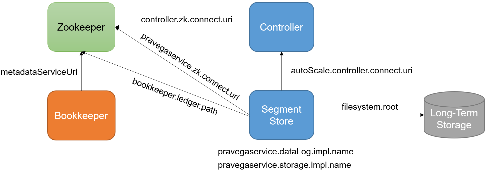

# Pravega Configuration and Provisioning Guide

This document summarizes the most important aspects to consider for configuring and provisioning a
production Pravega Cluster in an infrastructure-agnostic way. Note that this document does not cover all the 
parameters in the configuration of Pravega as they are [already documented](/config.properties). Similarly,
this is not a guide to [deploy Pravega on Kubernetes](https://github.com/pravega/pravega-operator).

* [Configuring Cluster Service Dependencies](#configuring-cluster-service-dependencies)
* [Number of Segment Containers](#number-of-segment-containers)
* [Segment Store Cache Size and Memory Settings](#segment-store-cache-size-and-memory-settings)
* [Durable Log Configuration: Bookkeeper](#durable-log-configuration-bookkeeper)
* [Right-Sizing Long-Term Storage](#right-sizing-long-term-storage)

## Configuring Cluster Service Dependencies

A Pravega Cluster consists of a set of services (Zookeeper, Bookkeeper, Segment Store, Controller and Long-Term Storage)
that interact among them. Understanding such dependencies and the parameters that express them is key. Next, we describe
such dependencies and the main parameters in this regard with a practical example: to configure a Pravega Cluster with
Zookeeper and Bookkeeper using NFS as Long-Term Storage.

Relevant configuration parameters:
 
- **`pravegaservice.zk.connect.uri`, `controller.zk.connect.uri`**: Full URL (host:port) where to find a ZooKeeper that 
can be used for coordinating this Pravega Cluster. 
_Type_: `String`. _Default_: `localhost:2181`. _Update-mode_: `read-only`.

- **`pravegaservice.dataLog.impl.name`**: DataLog implementation for Durable Data Log Storage. Valid values: BOOKKEEPER, 
INMEMORY.
_Type_: `String`. _Default_: `BOOKKEEPER`. _Update-mode_: `read-only`.

- **`pravegaservice.storage.impl.name`**: Storage implementation for Long-Term Storage. Valid values: HDFS, FILESYSTEM, 
EXTENDEDS3, INMEMORY.
_Type_: `String`. _Default_: `HDFS`. _Update-mode_: `read-only`.

- **`autoScale.controller.connect.uri`**: URI for the Pravega Controller.
_Type_: `String`. _Default_: `pravega://localhost:9090`. _Update-mode_: `cluster-wide`.

- **`bookkeeper.zk.connect.uri`**: Endpoint address (hostname:port) where the ZooKeeper controlling BookKeeper for this 
cluster can be found at. This value must be the same for all Pravega SegmentStore instances in this cluster.
_Type_: `String`. _Default_: `localhost:2181`. _Update-mode_: `read-only`.

- **`bookkeeper.ledger.path`**: Default root path for BookKeeper Ledger metadata. This property tells the BookKeeper 
client where to look up Ledger Metadata for the BookKeeper cluster it is connecting to. If this property isn't uncommented, 
then the default value for the path is the Pravega cluster namespace (`/pravega/<cluster-name>/`) with "ledgers" appended:
`/pravega/<cluster-name>/ledgers`. Otherwise, it will take the value specified below. 
_Type_: `String`. _Default_: `/pravega/bookkeeper/ledgers`. _Update-mode_: `read-only`.

- **`filesystem.root`**: Root path where NFS shared directory needs to be mounted before segmentstore starts execution.
_Type_: `String`. _Default_: ` `. _Update-mode_: `read-only`.

- **`metadataServiceUri`** (BOOKKEEPER): Metadata service uri in Bookkeeper that is used for loading corresponding 
metadata driver and resolving its metadata service location.
_Type_: `String`. _Default_: `zk+hierarchical://localhost:2181/ledgers`. _Update-mode_: `read-only`.

The above parameters express the dependencies within a Pravega cluster as follows:

 

Following with the proposed example, we need to configure the above parameters as follows. First, assuming that our
Zookeeper cluster is up and running at `zookeeper-service:2181` (no dependencies here), the first step is to deploy 
Bookkeeper. The most important parameter to configure in Bookkeeper is `metadataServiceUri`, as dictates the metadata 
location of Bookkeeper Ledgers, which is required by Pravega. Thus, in our cluster we need to configure 
`metadataServiceUri` as: 
- `metadataServiceUri=zk+hierarchical://zookeeper-service:2181/<bookkeeper.ledger.path>`

The value assigned to the `metadataServiceUri` ensures that Bookkeeper will store the metadata of ledgers in the location
that Pravega expects (i.e., `bookkeeper.ledger.path`). If you want to use an existing Bookkeeper cluster for Pravega,
then you will need to set `bookkeeper.ledger.path` withthe value where that Bookkeeper cluster is already storing the
metadata of ledgers.

With Bookkeeper up and running, we need to configure the rest of parameters in Pravega. First, both the Controller and
the Segment Store should point to the Zookeeper service:  
- `[pravegaservice.zk.connect.uri|controller.zk.connect.uri]=zookeeper-service:2181`

Note that both properties should be configured given that Pravega currently separates the configuration for Controller
and Segment Store. In addition to that, and assuming that our Controller service has a service endpoint or DNS name
(e.g., `controller-service:9090`), we need to point the Segment Store to that endpoint in order to properly configure
the [Stream auto-scaling feedback loop](http://pravega.io/docs/latest/pravega-concepts/#elastic-streams-auto-scaling):
- `autoScale.controller.connect.uri=pravega://controller-service:9090`

Finally, we just need to configure the storage side of the Segment Store. On the one hand, the parameter 
`pravegaservice.dataLog.impl.name` can be left with its default value (`BOOKKEEPER`), given that we use Bookkeeper as
a durable log for Pravega. On the other hand, we need to configure `pravegaservice.storage.impl.name` to use a NFS
service and pointing to the right mount point (e.g., `/pravega-data`):
- `pravegaservice.storage.impl.name=FILESYSTEM`
- `filesystem.root=/pravega-data`

With this, we would be able to run our Pravega Cluster with Bookkeeper/Zookeeper and store data in the long term to a
NFS service. 

## Number of Segment Containers

Defining the number of [Segment Containers](http://pravega.io/docs/latest/segment-containers/) in a Pravega Cluster 
is a relevant decision for one key reason: _it cannot be changed_ once the Pravega Cluster has been initialized. 
Therefore, we need to think twice before setting this parameter in a production environment. The relevant parameters
to reason about this topic are the following:

- **`pravegaservice.container.count`, `controller.container.count`**: Number of Segment Containers in the system. 
This value must be the same across all SegmentStore instances in this cluster. This value cannot be changed dynamically, 
it will require special administrative tasks when changing. See documentation for details. Valid values: Positive integer.
_Type_: `Integer`. _Default_: `4`. _Update-mode_: `read-only`.

- **`pravegaservice.threadPool.core.size`**: Maximum number of threads in the Core SegmentStore Thread Pool. This pool 
is used for all SegmentStore-related activities, except Netty-related tasks and Long Term Storage activities. Examples 
include: handling inbound requests, processing reads, background maintenance operations and background operation processing.
Valid values: Positive integer.
_Type_: `Integer`. _Default_: `30`. _Update-mode_: `per-server`.

A Segment Container defines the unit of IO parallelism in the system. Inherently, this yields to consider two main
aspects when choosing the number of Segment Containers: 

- _Compute resources per Segment Store_: Each Segment Container runs a set of services that consume CPU power. 
This means that the number of Segment Containers in the system is limited by the available compute power in the cluster.
As a rule of thumb, we can define a number of Segment Containers per Segment Store according to the number of cores
per instance (e.g., 1 or 2 Segment Containers per core, depending on the core power). Similarly, the size of the thread
pool (`pravegaservice.threadPool.core.size`) should be sized according to the number of segment containers 
(e.g., 2-4 threads per Segment Container, with a minimum number of 20 threads). Note that setting a value of Segment
Containers and/or threads higher than necessary may lead to performance degradation due to CPU contention.

- _Initial number of Segment Stores_: This deployment decision plays a central role when it comes to define the number 
of Segment Containers in the system and may vary depending on the deployment scenario. On the one hand, an on-premise 
environment we may have a fixed amount of hardware available to run Pravega, in which case the number of Segment Store 
instance may be known. On the other hand, in a cloud environment a reasonable approach would be to right-size the initial 
number of Segment Store instances based on the expected load. We have published performance analysis that can help users 
to understand the load that a Pravega Cluster can sustain, as well as the associated latency numbers 
[[1]](https://blog.pravega.io/2020/10/01/when-speeding-makes-sense-fast-consistent-durable-and-scalable-streaming-data-with-pravega/), 
[[2]](https://blog.pravega.io/2021/03/10/when-speed-meets-parallelism-pravega-performance-under-parallel-streaming-workloads/). 
In addition to that, we also provide benchmark tools that can help users to generate loads that resemble that of users
to infer the right number of Segment Store instance that can reasonably absorb a given workload
(e.g., [Pravega Benchmark](https://github.com/pravega/pravega-benchmark), 
[OpenMessagin Benchmark Pravega Driver](https://github.com/pravega/openmessaging-benchmark)). We also have developed
a [provisioner tool for Pravega](https://github.com/pravega/pravega-tools/tree/master/pravega-provisioner) to help you 
reason about these aspects.

With the previous points in mind, we can define the number of Segment Containers in the system 
(i.e., `pravegaservice.container.count`, `controller.container.count`) by just multiplying the number of Segment Containers 
per instance by the number of initial instances. Let's see a practical example. Image that we want to deploy a Pravega 
Cluster using AWS EKS instances with 8 vCPUs and 16GB of RAM for running Segment Stores. If we consider the normal load
in the system to be 50MBps (1KB events), then we can safely assume that 3 Segment Stores may be enough to absorb it.
Given that, we could suggest a configuration as follows:

- `[pravegaservice.container.count|controller.container.count]=24`. The instances in our example have 8 vCPUs. Then,
we defined to use 1 vCPU Segment Container and we multiplied this by the initial number of Segment Stores (3 instances).
With this, the total number of Segment Containers in the system is set to 24.

- `pravegaservice.threadPool.core.size=20`. In a Kubernetes environment, we do not expect cores to be as powerful as in 
plain VMs or bare metal environments (e.g., additional levels of virtualization, many services sharing the same 
virtual/physical resources). For this reason, we can assume that having 2 threads per container may be enough,
and given that 8 Segment Containers per Segment Store x 2 threads per Segment Container is lower than the minimum
number of threads recommended (i.e., 20 threads), we just keep this setting to 20.

There is one final aspect to consider in a production Pravega Cluster: _scalability_. In our example above, we have 
mentioned that the expected workload was 50MBps and 3 Segment Stores may be enough to handle it. However, workloads may 
grow unexpectedly, and we need our cluster to be able to keep up. The number of Segment Containers in the system sets an
upper bound to the maximum usable size of the Pravega Cluster. That is, with 24 Segment Containers in the system, we
would be able to scale from 3 Segment Stores (running 8 Segment Containers each) to 24 Segment Stores (running 1
Segment Container each). Clearly, this would greatly increase the IO capacity of our Pravega Cluster for absorbing a 
load peak, and then srink the cluster when the burst is over. Still, is important to note that adding Segment Stores
beyond 24 instances would be useless, as these extra instances would not have any Segment Container assigned to run, 
which means that they would not be able to run IO. Therefore, we need to conside that the  parameter
`[pravegaservice.container.count|controller.container.count]` is also imposing a limit on the maximum usable size of 
the Pravega Cluster.   

## Segment Store Cache Size and Memory Settings

In a Pravega Cluster, the Segment Store is perhaps the component that requires more effort in terms of memory configuration.
A production-like cluster requires the memory settings to be defined correctly, or otherwise we could induce unnecessary
instability in the system. In this section, the main configuration parameters we overview are the following:

- **`pravegaservice.cache.size.max`**: Maximum size (in bytes) for the Local Shared Cache (shared by all Segment 
Containers on this Segment Store instance). Valid values: Positive integer. Recommended values: Multiples of 1GB, 
but less than XX:MaxDirectMemorySize. Choosing a lower size will conserve memory at the expense of a lot of cache misses 
(resulting in Long Term Storage reads and possibly high latencies). Choosing a higher size will keep data in the cache 
for longer, but at the expense of memory. The Segment Store uses a Direct Memory Cache backed by direct ByteBuffers, so 
if XX:MaxDirectMemorySize is not set to a value higher than this one, the process will# eventually crash with an 
OutOfMemoryError.

- **`-Xmx`** (JVM SETTING): Defines the maximum heap memory size for the JVM. 

- **`-XX:MaxDirectMemorySize`** (JVM SETTING): Defines the maximum amount of direct memory for the JVMXX
When configuring the memory settings for the Segment Store, we need to take into account three points: the host
machine available memory, the Segment Store heap memory, and the Segment Store direct memory usage. The diagram
below illustrates these elements:

 

The guidelines to configure the memory settings in the Segment Store are as follows:

- _Host memory_: The host (e.g., server, VM, pod) running the Segment Store has a defined memory capacity. We need to
be fully aware of it to define the rest of memory settings.

- _JVM Heap (`-Xmx`)_: In production, we recommend setting a JVM Heap size of at least 4GB for the Segment Store. The
Segment Store process may create a significant amount of objects under small event workloads, so we need to ensure that
there is enough heap memory to do not induce constant GC activity.

-_JVM Direct Memory (`-XX:MaxDirectMemorySize`): In general, we should provision the Segment Store with more direct 
memory than Heap memory. The reason is that the Segment Store read cache, Netty and the Bookkeeper client make a
significant use of direct memory as a result of an IO workload. As a rule of thumb, we should reserve at least 1GB or 
2GB for Netty and Bookkeeper client in the Segment Store, and assign the rest of direct memory to the read cache.

- Segment Store read cache size (`pravegaservice.cache.size.max`): As mentioned before, all the available direct memory
(`-XX:MaxDirectMemorySize`) not used by Netty/Bookkeeper client should be contributed to the read cache. A larger 
read cache improves performance for read workloads, especially if we consider mixed read patterns.

As a final note, we need to ensure that the sum of JVM Heap and JVM Direct Memory is strictly lower than the host
memory (e.g., 0.5GB-1GB). Otherwise, during high load situations the host instance/machine can crash due to lack of
memory resources.

To conclude this section, let's use an example. Assume that we are running our Segment Store instances on Kubernetes
pods with 16GB of memory defined as a limit. In this case, a valid configuration for our Segment Store could be:
`-Xmx=4g` and `-XX:MaxDirectMemorySize=11g`. As you can see, the sum of both JVM Heap and JVM Direct Memory is 15GB, so
1GB is left to do not reach the maximum capacity of the pod. Then, we can define the read cache size as 
`pravegaservice.cache.size.max=9663676416` (9GB), which leaves 2GB of direct memory for Netty/Bookkeeper. We have 
developed a [provisioner tool for Pravega](https://github.com/pravega/pravega-tools/tree/master/pravega-provisioner) 
to help you reason about these aspects.

## Durable Log Configuration: Bookkeeper

## Right-Sizing Long-Term Storage

