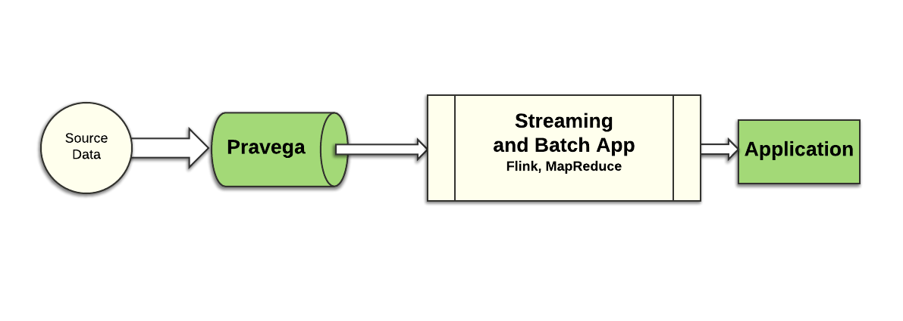
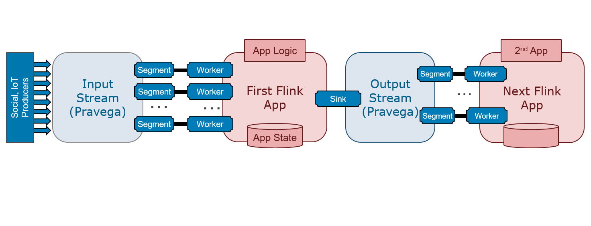
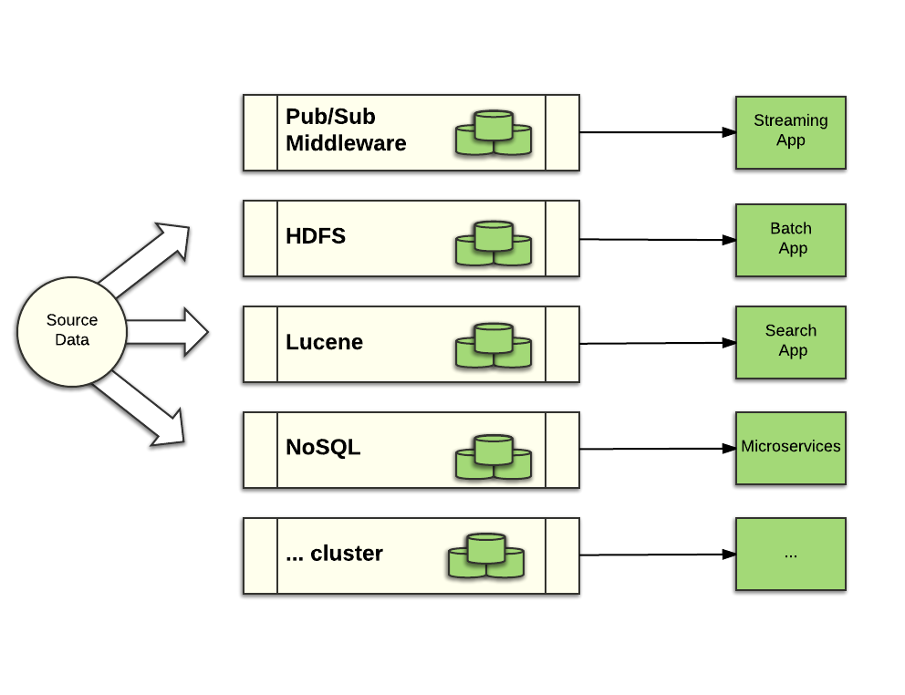
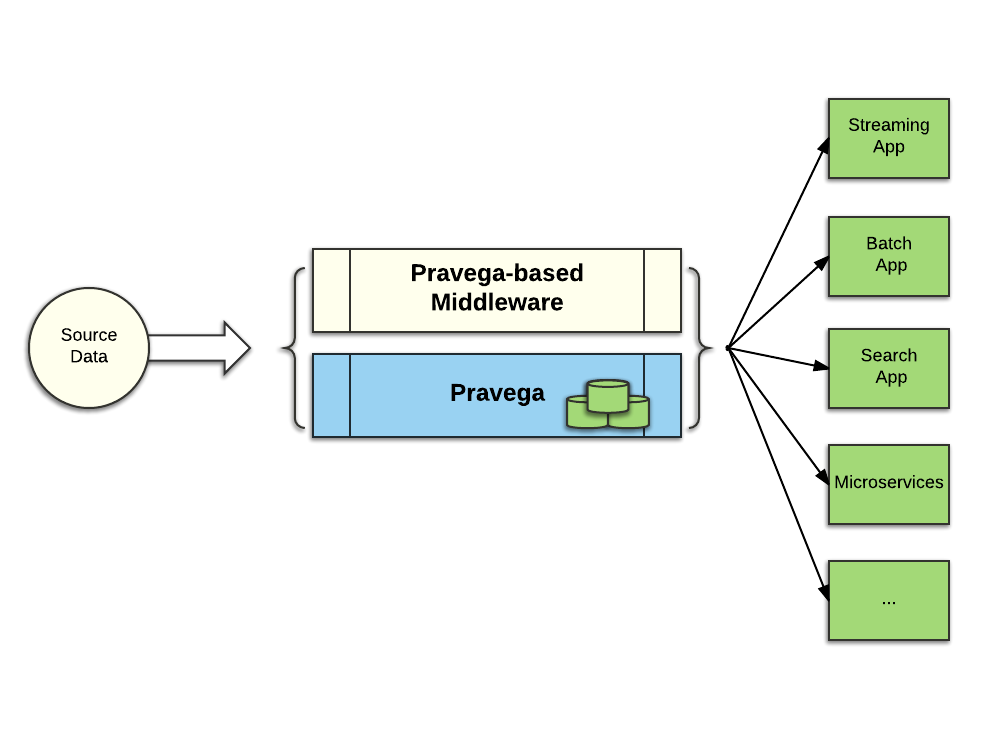

<!--
Copyright Pravega Authors.

Licensed under the Apache License, Version 2.0 (the "License");
you may not use this file except in compliance with the License.
You may obtain a copy of the License at

    http://www.apache.org/licenses/LICENSE-2.0

Unless required by applicable law or agreed to in writing, software
distributed under the License is distributed on an "AS IS" BASIS,
WITHOUT WARRANTIES OR CONDITIONS OF ANY KIND, either express or implied.
See the License for the specific language governing permissions and
limitations under the License.
-->
# Pravega Key Features

This document explains some of the key features of Pravega.  It may be
advantageous if you are already familiar with the core [Pravega Concepts](pravega-concepts.md).

## Pravega Design Principles

Pravega was designed to support the new generation of streaming applications.
Applications that deal with a large amount of data arriving continuously that
needs to generate an accurate analysis of that data by considering the factors like:

- Delayed data,
- Data arriving out of order,
- Failure conditions.

There are several Open Source tools to enable developers to build such applications,
including [Apache Flink](https://flink.apache.org/), [Apache Beam](https://beam.apache.org/), [Spark Streaming](https://spark.apache.org/docs/2.2.0/streaming-programming-guide.html), etc.
These applications uses the following systems to ingest and store data: [Apache Kafka](https://kafka.apache.org/), [Apache ActiveMQ](http://activemq.apache.org/), [RabbitMQ](https://www.rabbitmq.com/), [Apache Cassandra](http://cassandra.apache.org/), [Apache HDFS](https://hadoop.apache.org/).

Pravega focuses on both ingesting and storing Stream data. Pravega approaches streaming applications from a storage perspective. It enables applications to ingest Stream data continuously and stores it permanently. Such Stream data can be accessed with low latency (order of milliseconds) and also analyzes historical data.

The design of Pravega incorporates lessons learned from using the [**Lambda Architecture**](https://en.wikipedia.org/wiki/Lambda_architecture)
to build streaming applications and the challenges to deploy streaming applications
at scale that consistently deliver accurate results in a fault tolerant manner.
The Pravega Architecture provides strong durability and consistency guarantees,
delivering a rock solid foundation to build streaming applications upon.

With the Lambda Architecture, the developer uses a complex combination of middleware
tools that include batch style middleware mainly influenced by **Hadoop** and
continuous processing tools like **Storm, Samza, Kafka** and others.

In this architecture, batch processing is used to deliver accurate, but potentially
out of date analysis of data. The second path processes data as it is ingested, and
in principle the results are inaccurate, which justifies the first
batch path. The programming models of the speed layer are different than those used in the
batch layer. An implementation of the Lambda Architecture can be difficult to maintain
and manage in production. This style of big data application design consequently has
been losing traction. A different kind of architecture has been gaining traction recently
that does not rely on a batch processing data path. This architecture is called [**Kappa**](http://milinda.pathirage.org/kappa-architecture.com/).

The Kappa Architecture style is a reaction to the complexity of the Lambda Architecture
and relies on components that are designed for streaming, supporting stronger
semantics and delivering both fast and accurate data analysis. The Kappa
Architecture provides a simpler approach:

There is only one data path to execute, and one implementation of the application logic
to maintain. With the right tools, built for the demands of processing
streaming data in a fast and accurate fashion, it becomes simpler to design
and run applications in the space of IoT:(connected cars, finance, risk management, online
services, etc.). Using the right tools, it is possible to build such pipelines and serve
applications that present high volume and demand low latency.

Applications often require more than one stage of processing. Any practical system for stream
analytics must be able to accommodate the composition of stages in the form of data pipelines:

With data pipelines, it is important to think of guarantees end-to-end rather than on a
per component basis. Our goal in Pravega is to enable the design and implementation of data pipelines with strong guarantees end-to-end.

## Pravega: Storage Reimagined for a Streaming World

Pravega introduces a new storage primitive, a Stream, that matches
continuous processing of unbounded data.  In Pravega, a Stream is a named,
durable, append-only and unbounded sequence of bytes.  With this primitive, and
the key features discussed in this document, Pravega is an ideal component to
combine with Stream processing engines such as [Flink](https://flink.apache.org/) to build streaming
applications. Because of Pravega's key features, we imagine that it will be the
fundamental storage primitive for a new generation of streaming-oriented
middleware.

Let's examine the key features of Pravega:

## Exactly Once Semantics

By exactly once semantics we mean that Pravega ensures that data is not duplicated
and no event is missed despite failures. Of course, this statement comes with a
number of caveats, like any other system that promises exactly-once semantics, but
let's not dive into the gory details here. An important consideration is that
exactly-once semantics is a natural part of Pravega and has been a goal and part
of the design from day zero.

To achieve exactly once semantics, Pravega [Streams](pravega-concepts.md#streams) are durable, ordered,
consistent and [transactional](pravega-concepts.md#transactions). We discuss durable and transactional in separate sections below.

### Pravega Streams are Ordered

By ordering, we mean that data is observed by Readers in the order it is written.
In Pravega, data is written along with an application-defined Routing Key.  
Pravega makes [ordering guarantees](pravega-concepts.md#ordering-guarantees) in terms of Routing Keys. For example, two Events with the same Routing Key will always be read by a Reader in the order they were
written. Pravega's ordering guarantees allow data reads to be replayed (e.g.
when applications crash) and the results of replaying the reads will be the
same.

By consistency, we mean all Readers see the same ordered view of data for a
given Routing Key, even in the face of failure. Systems that are "mostly
consistent" are not sufficient for building accurate data processing.

Systems that provide **"at least once"** semantics might present duplication. In
such systems, a data producer might write the same data twice in some scenarios.
In Pravega, writes are idempotent, rewrites done as a result of reconnection
don't result in data duplication. Note that we make no guarantee when the data
coming from the source already contains duplicates. Written data is opaque to
Pravega and it makes no attempt to remove existing duplicates.

Pravega has not limited the focus to exactly-once semantics for writing, however.
We also provide, and are actively working on extending the features, that enable
exactly-once end-to-end for a data pipeline. The strong consistency guarantees
that the Pravega store provides along with the semantics of a data analytics
engine like Flink enables such end-to-end guarantees.

## Auto Scaling

Unlike systems with static partitioning, Pravega can automatically scale
individual data streams to accommodate changes in data ingestion rate.

Imagine an IoT application with millions of devices feeding thousands of data
streams with information about those devices. Imagine a pipeline of Flink jobs
that process those Streams to derive business value from all that raw IoT data:

 - Predicting device failures,
 - Optimizing service delivery through those devices,
 - Tailoring a customer's experience when interacting with those devices.

Building such an application at scale is difficult without having the
components be able to scale automatically as the rate of data increases and
decreases.

With Pravega, it is easy to elastically and independently scale data ingestion,
storage and processing – orchestrating the scaling of every component in a data
pipeline.

Pravega's support of [Auto Scaling](pravega-concepts.md#elastic-streams-auto-scaling) starts with the idea that Streams are partitioned into Stream Segments. A Stream may have one or more Stream Segments; recall that a Stream Segment is a partition of the Stream associated with a range of Routing Keys.  
Any data written into the Stream is written to the Stream Segment associated with the
data's Routing Key. Writers use domain specific meaningful Routing Keys (like
customer ID, Timestamp, Machine ID, etc.) to group similar together.  

A Stream Segment is the fundamental unit of parallelism in Pravega Streams. 

- **Parallel Writes:** A Stream with multiple Stream Segments can support more parallelism of data
writes; multiple Writers writing data into the different Stream Segments
potentially involving all the Pravega Servers in the cluster.

- **Parallel reads:** On the Reader side, the number of Stream Segments represents the maximum degree of read parallelism possible. If a Stream has _N_ Stream Segments, then a Reader Group
with _N_ Readers can consume from the Stream in parallel. Increase the number of
Stream Segments, you can increase the number of Readers in the Reader Group to
increase the scale of processing the data from that Stream. And of course if
the number of Stream Segments decreases, it would be a good idea to reduce the
number of Readers.

A Stream can be configured to grow the number of Stream Segments as more data is
written to the Stream, and to shrink when data volume drops off.  We refer to
this configuration as the Stream's Service Level Objective or SLO.  Pravega
monitors the rate of data input to the Stream and uses the SLO to add or remove
Stream Segments from a Stream.  Segments are added by splitting a Segment.
 Segments are removed by merging two Segments. See [Auto Scaling](pravega-concepts.md#elastic-streams-auto-scaling) for more detail on how Pravega manages Stream Segments.

It is possible to coordinate the Auto Scaling of Streams in Pravega with
application scale out (in the works). Using metadata available from Pravega,
applications can configure the scaling of their application components; for
example, to drive the number of instances of a Flink job. Alternatively, you
could use software such as [Cloud Foundry](https://www.cloudfoundry.org/), [Mesos/Marathon](https://github.com/mesosphere/marathon), [Kubernetes](https://kubernetes.io/) or the
[Docker stack](https://www.docker.com/) to deploy new instances of an application to react to increased
parallelism at the Pravega level, or to terminate instances as Pravega scales
down in response to reduced rate of data ingestion.

## Distributed Computing Primitive

Pravega is great for distributed applications, such as microservices; it can be
used as a data storage mechanism, for messaging between microservices and for
other distributed computing services such as leader election. 

State Synchronizer, a part of the Pravega API, is the basis of sharing state
across a cluster with consistency and optimistic concurrency. State Synchronizer is based on a fundamental conditional write operation in Pravega,
so that data is written only if it would appear at a given position in the
Stream. If a conditional write operation cannot meet the condition, it fails.

State Synchronizer is therefore a strong synchronization primitive that can be
used for shared state in a cluster, membership management, leader election and
other distributed computing scenarios.

For more information, refer to [State Synchronizer](state-synchronizer.md).

## Write Efficiency

Pravega write latency is of the order of milliseconds. It seamlessly scales
to handle high throughput reads and writes from thousands of concurrent
clients, making it ideal for IoT and other time sensitive applications.

Streams are light weight, Pravega can support millions of Streams, this frees
the application from worrying about static configuration of Streams and preallocating
a small fixed number of Streams and limiting Stream resource.

Write operations in Pravega are low latency, under _10ms_ to return an
acknowledgment is returned to a Writer. Furthermore, writes are optimized so
that I/O throughput is limited by network bandwidth;  the persistence mechanism
is not the bottleneck. Pravega uses Apache BookKeeper to persist all write
operations. BookKeeper persists and protects the data very efficiently.
Because data is protected before the write operation is acknowledged to the
Writer, data is always durable. As we discuss below, data durability is a
fundamental characteristic of a storage primitive. To add further efficiency,
writes to BookKeeper often involve data from multiple Stream Segments, so the
cost of persisting data to disk can be amortized over several write operations.

There is no durability performance trade-off with Pravega.

## Read Efficiency

A Reader can read from a Stream either at the **tail** of
the Stream or at any part of the Stream's history.  Unlike some log-based
systems that use the same kind of storage for tail reads and writes as well as
reads to historical data, Pravega uses two types of storage.  

- The tail of the Stream is in so-called [Tier 1 storage](pravega-concepts.md#a-note-on-tiered-storage).
- The historical part of the Stream is in [Tier 2 Storage](pravega-concepts.md#a-note-on-tiered-storage).

Pravega uses efficient in-memory read ahead cache, taking advantage of the fact
that Streams are usually read in large contiguous chunks and that HDFS is well
suited for those sort of large, high-throughput reads. It is also worth noting
that tail reads do not impact the performance of writes.

## Unlimited Retention

Data in Streams can be retained based on the application needs. It is constrained to the amount of data available, which is unbounded given the use
of cloud storage in Tier 2. Pravega provides one convenient API to
access both **real-time** and **historical data**. With Pravega, batch and real-time
applications can both be handled efficiently; _yet another reason why Pravega is
a great storage primitive for Kappa architectures_.

If there is a value to retain old data, why not keep it around? For example,
in a machine learning example, you may want to periodically change the model and
train the new version of the model against as much historical data as possible
to enhance and yield more accurate predictive power of the model. With Pravega
auto-tiering, retaining lots of historical data does not affect the performance of
tail reads and writes. 

Size of a stream is not limited by the storage capacity of a single server, but
rather, it is limited only by the storage capacity of your storage cluster or cloud
provider. As cost of storage decreases, the economic incentive to delete data
goes away.

## Storage Efficiency 

Use Pravega to build pipelines of data processing, combining batch, real-time
and other applications without duplicating data for every step of the pipeline.

Consider the following data processing environment:

- **Real time** processing using Spark, Flink, and or Storm
- **Batch** processing using Hadoop
- **Full text search** can be performed using Lucene-based or Search mechanism like Elastic Search.
- **Micro-services** apps can be supported using one (or several) NoSQL databases.

Using traditional approaches, one set of source data, for example, sensor data
from an IoT app, would be ingested and replicated separately by each system.
You would end up with three replicas of the data protected in the pub/sub system, three
copies in HDFS, three copies in Lucene and three copies in the NoSQL database.  When we
consider the source data is measured in TB, the cost of data replication
separated by middleware category becomes prohibitively expensive.

Consider the same pipeline using Pravega and middleware adapted to use Pravega
for its storage:

With Pravega, the data is ingested and protected in one place; Pravega provides
the single source of truth for the entire pipeline. Furthermore, with the bulk
of the data being stored in Tier 2 enabled with erasure coding to efficiently
protect the data, the storage cost of the data is substantially reduced.

# Durability

With Pravega, you don't  face a compromise between performance, durability and
consistency. Pravega provides durable storage of streaming data with strong
consistency, ordering guarantees and great performance.

Durability is a fundamental storage primitive requirement.  Storage that could
lose data is not reliable storage.  Systems based on such storage are not
production quality.

Once a write operation is acknowledged, the data will never be lost, even when
failures occur. This is because Pravega always saves data in protected,
persistent storage before the write operation returns to the Writer.

With Pravega, data in the Stream is protected. A Stream can be treated as a
system of record, just as you would treat data stored in databases or files.

# Transaction Support

A developer uses a Pravega Transaction to ensure that a set of events are
written to a Stream atomically.

A Pravega Transaction is part of Pravega's Writer API. Data can be written to a
Stream directly through the API, or an application can write data through a
Transaction.  With Transactions, a Writer can persist data now, and later
decide whether the data should be appended to a Stream or abandoned.

Using a Transaction, data is written to the Stream only when the Transaction is
committed. When the Transaction is committed, all data written to the
Transaction is atomically appended to the Stream. Because Transactions are
implemented in the same way as Stream Segments, data written to a Transaction is
just as durable as data written directly to a Stream. If a Transaction is
abandoned (e.g. if the Writer crashes) the Transaction is aborted and all data
is discarded. Of course, an application can choose to abort the Transaction
through the API if a condition occurs that suggests the Writer should discard
the data. 

Transactions are key to chaining Flink jobs together.  When a Flink job uses
Pravega as a sink, it can begin a Transaction, and if it successfully finishes
processing, commit the Transaction, writing the data into its Pravega based
sink.  If the job fails for some reason, the Transaction times out and data is
not written.  When the job is restarted, there is no "partial result" in the
sink that would need to be managed or cleaned up.

Combining Transactions and other key features of Pravega, it is possible to
chain Flink jobs together, having one job's Pravega based sink be the source for
a downstream Flink job. This provides the ability for an entire pipeline of
Flink jobs to have end-to-end exactly once, guaranteed ordering of data processing.

Of course, it is possible for Transactions across multiple Streams be
coordinated with Transactions, so that a Flink job can use two or more
Pravega based sinks to provide source input to downstream Flink jobs.  In
addition, it is possible for application logic to coordinate Pravega
Transactions with external databases such as Flink's checkpoint store. For more information, see [Transaction](transactions.md) section.
