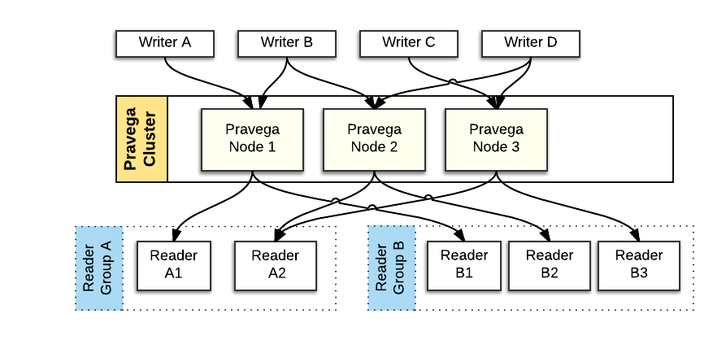
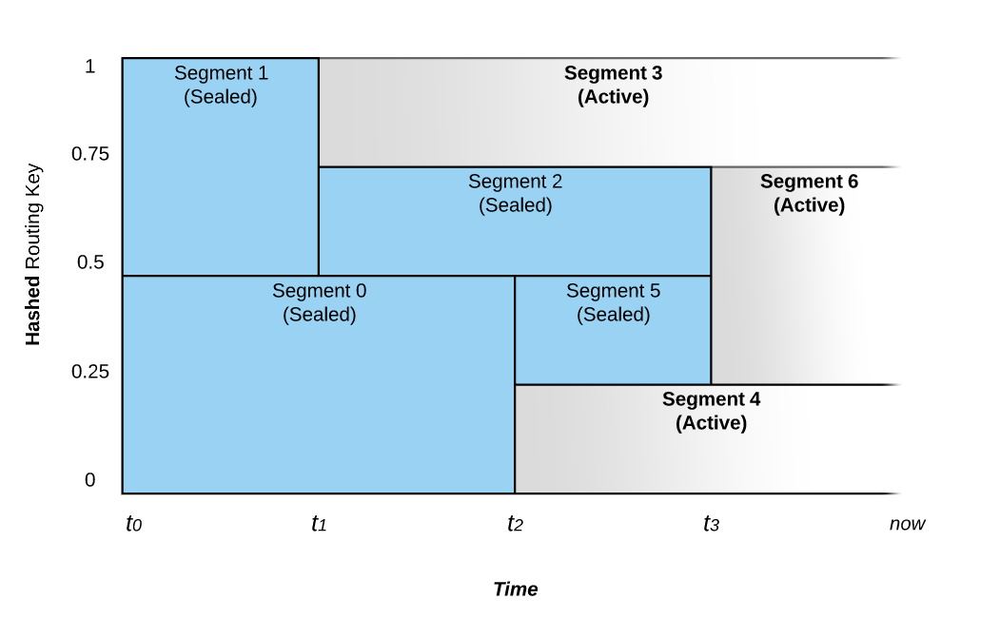
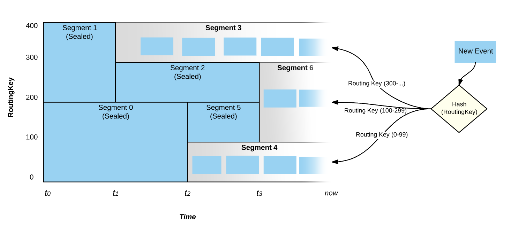
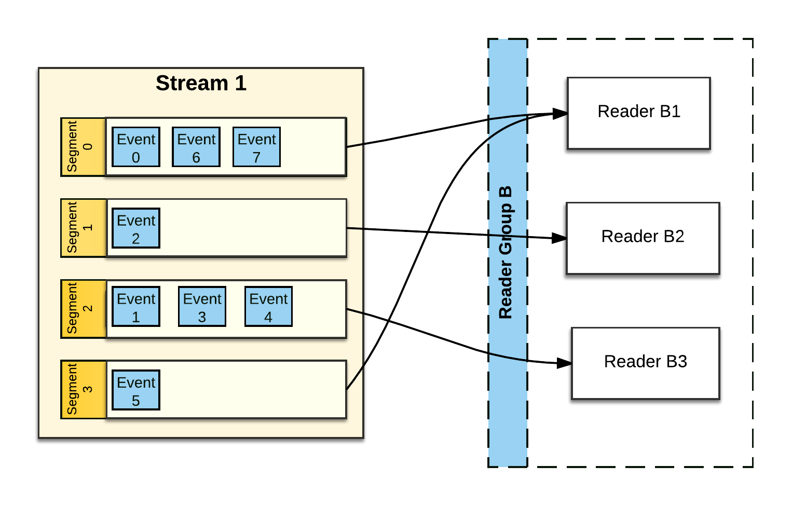
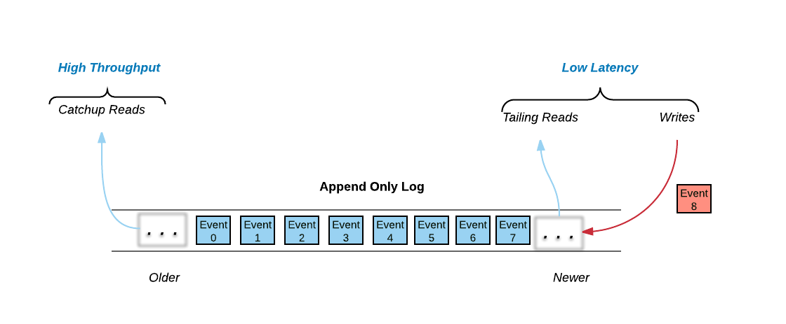

<!--
Copyright (c) 2017 Dell Inc., or its subsidiaries. All Rights Reserved.

Licensed under the Apache License, Version 2.0 (the "License");
you may not use this file except in compliance with the License.
You may obtain a copy of the License at

    http://www.apache.org/licenses/LICENSE-2.0
-->
# Pravega Concepts

Pravega is an open source storage primitive implementing **Streams** for continuous and unbounded data.

Next, we overview the key concepts in Pravega. For a concise definition of key terms of Pravega concepts, please see [Terminology](terminology.md).

## Streams

Pravega organizes data into Streams. A Stream is a durable, elastic, append-only, unbounded sequence of bytes having good performance and strong consistency.  A Pravega Stream is
similar to but more flexible than a "topic" in popular message oriented middleware such as [RabbitMQ](https://www.rabbitmq.com/) or [Apache Kafka](https://kafka.apache.org/).

Pravega Streams are based on an append-only log data structure. By using append-only logs, Pravega rapidly ingests data into durable storage. It supports a large variety of application use cases:

- Stream processing with frameworks like [Flink](https://flink.apache.org).
- Publish/subscribe messaging.
- NoSQL databases like Time Series Database (TSDB).
- Workflow engines.
- Event-oriented applications, etc. 

When a developer creates a Stream in Pravega, s/he gives the Stream a meaningful name such as "IoTSensorData" or "WebApplicationLog20170330" to inform about the type of data it stores. A Scope acts as a namespace for Stream names; all Stream names are unique within their Scope. Therefore, a Stream is uniquely identified by the combination of its name and Scope. Developers can also define meaningful Scope names, such as "FactoryMachines" or "HRWebsitelogs", to effectively organize collections of Streams. For example, Scopes can be used to classify Streams by tenant (in a multi tenant environment), by department in an organization or by geographic location.

A Stream is unbounded in size – Pravega itself does not impose any limits on how many [**Events**](#events) (i.e., bytes) are stored in a Stream. Pravega’s design horizontally scales from few machines to a whole datacenter’s capacity.

Pravega Streams are divided into **Stream Segments**, to handle a large volume of data within a Stream. A Stream Segment is a shard, or partition of the data within a Stream. For more information, please see [Stream Segments](#stream-segments) section.

Applications, such as a Java program reading from an IoT sensor, write data to the tail (front) of the Stream. Analytics applications, such as a [Flink](https://flink.apache.org) or [Hadoop](https://hadoop.apache.org/) jobs, can read from any point in the Stream. Many applications can read and write the same Stream in parallel. Elasticity, scalability, support for large volume of Stream data and applications are the highlights of Pravega's design. More information on read and write operations in the Streams will be discussed in the [Readers and Writers](#writers-readers-reader-groups) section.

## Events

Pravega's client API allows applications to write and read data to/from Pravega in the form of **Events**. An Event is represented as a set of bytes within a Stream. For example, an Event could be as simple as a small number of bytes containing a temperature reading from an IoT sensor composed of
a timestamp, a metric identifier and a value. An Event could also be a web log data
associated with a user click on a website. Applications make sense of Events using
standard Java **serializers** and **deserializers**, allowing them to read and write
objects in Pravega similarly to reading and writing objects from
files.

Every Event has a **Routing Key**. A Routing Key is a string used by developers to group similar Events. A Routing Key is often derived from data naturally occurring in the Event,
like "customer-id" or "machine-id" or a declared/user-defined string. For example, a Routing Key could be a date (to group Events together by time) or it could be a IoT sensor id (to group Events by
machine). A Routing Key is important in defining the read and write semantics that Pravega guarantees.

## Writers, Readers, Reader Groups

Pravega provides a client library, written in Java, that implements a convenient
API for Writer and Reader applications.  The Pravega Java Client Library
encapsulates the Wire Protocol used to communicate Pravega clients and
servers.

- **Writer:** An application that creates Events and writes them into a Stream.
All data is written by appending to the tail (front) of a Stream.

- **Reader:** An application that reads Events from a Stream.  Readers can read
from any point in the Stream.  Many Readers will be reading Events from the tail
of the Stream. Tail reads corresponding to recently written Events are immediately delivered to readers.
Some Readers will read from earlier parts of the Stream (called **catch-up reads**). The application developer has control over the Reader's start position in the Stream.

- **Position:** Abstraction that represents where in a Stream a Reader is currently located. The Position object can be used as a recovery
mechanism by replacing the failed Reader by a new Reader starting at the last saved successful read Position. Using this pattern of persisting position objects, applications can be built guaranteeing exactly once Event processing in the presence of Reader failures.

- **Reader Groups:** Readers are organized into Reader Groups. A Reader Group is a named collection of
Readers, which together perform parallel reads from a given Stream. When a
Reader is created through the Pravega data plane API, the developer includes the
name of the Reader Group associated with it. Pravega guarantees that each Event published
to a Stream is sent to exactly one Reader within the Reader Group. There could
be one or more Readers in the Reader Group and there could be many different Reader Groups simultaneously reading from any given Stream.

A Reader Group can be considered as a "composite Reader" or "distributed
Reader", that allows a distributed application to read and process Stream data
in parallel. A large amount of Stream data can be consumed by a coordinated group of Readers in a Reader Group.  For example, a collection of Flink tasks processing Stream data in parallel using Reader Group.

For more details on the basics of working with Pravega Readers and Writers, please see [Working with Pravega: Basic Reader and
Writer](basic-reader-and-writer.md#working-with-pravega-basic-reader-and-writer).

## Stream Segments

A Stream is split into a set of shards or partitions generally referred as **Stream Segments**.

 

### Events in a Stream Segment

The Stream Segments acts as a container for Events within the Stream. When an
Event is written into a Stream, it is stored in one of the Stream Segments based
on the Event's Routing Key. Pravega uses consistent hashing to assign Events to
Stream Segments. Event Routing Keys are hashed to form a "key space". The key
space is then divided into a number of partitions, corresponding to the number
of Stream Segments. Consistent hashing determines of Events to Stream Segments.

### Elastic Streams: Auto Scaling

A unique feature of Pravega is that the number of parallel Stream Segments in a Stream can automatically **grow** and **shrink** over time based on the I/O load it receives. This feature is known as **Auto Scaling**.

Consider the following figure that shows the relationship between Routing Keys
and time.

 

- A Stream starts at time **t0** with a configurable number of Stream Segments.  If the
rate of data written to the Stream is constant, there will be no change in the number of Segments. 

- At time **t1**, the system noted an increase in the ingestion rate and splits **Segment 1** into two parts. This process is referred as **Scale-Up** Event.

- Before **t1**, Events with a Routing Key that hashes to the upper part of the key
space (i.e., values ranging from **200-399**) would be placed in **Segment 1** and those that hash into the
lower part of the key space (i.e., values ranging from **0-199**) would be placed in **Segment 0**.

- After **t1**, **Segment 1** is split into **Segment 2** and **Segment 3**. The **Segment 1** is sealed and stops accepting writes.  At this point in time, Events with Routing Key **300** and _above_ are written to **Segment 3** and those between **200** and **299** would be written into **Segment 2**.

- **Segment 0** continues accepting the same range of Events as before **t1**.  

- Another scale-up Event occurs at time **t2**, as **Segment 0**’s range of Routing
Key is split into **Segment 5** and **Segment 4**. Also at this time, **Segment 0** is sealed
and allows no further writes.

- Segments covering a contiguous range of the key space can also be merged. At
time **t3**, **Segment 2**’s range and **Segment 5**’s range are merged to **Segment 6** to
accommodate a decrease in the load on the Stream.

When a Stream is created, it is configured with a **Scaling Policy** that
determines how a Stream handles the varying changes in its load. Pravega has three kinds of Scaling Policy:

1.  **Fixed**:  The number of Stream Segments does not vary with load.

2.  **Data-based**: Pravega splits a Stream Segment into multiple ones (i.e., Scale-up Event) if the number of bytes per second written to that Stream Segment increases beyond a defined threshold. Similarly, Pravega merges two adjacent Stream Segments (i.e., Scale-down Event) if the number of bytes written to them fall below a defined threshold.

Note that, even if the load for a Stream Segment reaches the defined threshold, Pravega does not immediately trigger a Scale-up/down Event. Instead, the load should be satisfying the scaling policy threshold for a [sufficient amount of time](https://github.com/pravega/pravega/blob/master/client/src/main/java/io/pravega/client/stream/ScalingPolicy.java).

3.  **Event-based**:  to the data-based scaling policy, but it uses number of Events instead of bytes.

### Events, Stream Segments and AutoScaling

As mentioned earlier in this section, that an Event is written into one of the Stream Segments. By considering Auto Scaling, Stream Segments performs bucketing of Events based on Routing Key and time. It is obvious that, at any given time, Events published to a Stream with a given value of Routing Key will appear in the same Stream Segment.

 

It is also worth emphasizing that Events are written only on the active Stream
Segments. Segments that are sealed do not accept writes. In the figure above,
at time **now**, only Stream **Segments 3**, **6** and **4** are active and the entire key space is covered between those three Stream Segments.  

### Stream Segments and Reader Groups

Stream Segments play a major role in understanding the way Reader Groups work.

 

Pravega assigns _zero_ _or_ _more_ Stream Segments to each Reader in a Reader Group. Pravega tries to balances the number of Stream Segments assigned to each Reader. In the figure above, **Reader B1** reads from two Stream Segments (**Segment 0** and **Segment 3**), while the other Reader Group (**Reader B2**, **Reader B3**) have only only one Stream Segment to read from. Pravega makes sure that each Stream Segment is read exactly by one Reader in any Reader Group configured with that Stream. Irrespective of  Readers being added to the Reader Group or removed from the Reader Group due to crash, Pravega reassigns Stream Segments to maintain balance amongst the Readers.

The number of Stream Segments in a Stream determines the upper bound of
parallelism of readers within a Reader Group. If there are more Stream Segments, different Reader Groups and many parallel sets of Readers can effectively consume the Stream. In the
above figure, **Stream 1** has four Stream Segments. The largest effective Reader Group would contain four Readers. **Reader Group B** in the above figure is not quite optimal. If one more Reader was added to the Reader Group, each Reader would have one Stream Segment to process, thus maximizing read
parallelism. However, the number of Readers in the Reader Group increases beyond
4, at least one of the Readers will not be assigned a Stream Segment.

If **Stream 1** in the figure above experienced a **Scale-Down** event, by reducing the
number of Stream Segments to three, then the **Reader Group B**  will have an
ideal number of Readers.

The number of Stream Segments can chnage over time by using the Pravega's Auto Scaling feature as we discussed in the [Auto Scaling](#elastic-streams-auto-scaling) section. The size of any Stream is determined by the storage capacity of the Pravega cluster. More Streams can be obtained by increasing the storage of the Pravega cluster.

Applications can react to changes in the number of Segments in a Stream by adjusting the number of Readers within a Reader Group to maintain optimal read parallelism. As a cool use case, Pravega may allow Flink to increase or decrease the number of task instances that are processing a Stream in parallel.

### Ordering Guarantees

A Stream comprises a set of Segments that can change over time. Segments that overlap in their area of key space have a defined order.

An Event written to a Stream is written to a single Segment, and is ordered with respect to the Events of that Segment. The existence and position of an Event within a Segment is strongly consistent.

Readers can be assigned multiple parallel Segments (from different parts of key space). A Reader reading from multiple Segments will interleave the Events of the Segments, but the order of Events per Segment is retained. Specifically, if **s** is a Segment, and **s** contains two Events _i.e.,_ **s** **=** {**e~1**,**e~2**} where **e~1** precedes **e~2**. Thus when a Reader tries to read both the Events (**e~1** and **e~2**) the read order is guaranteed by assuring that, the Reader is allowed to read **e~1** before **e~2**.

This results in the following ordering guarantees:

- Events with the same Routing Key are consumed in the order they were written.

- Events with different Routing Keys are sent to a specific Segment and will always be
    read in the same order even if the Reader performs backs up and re-reads.

- If an Event has been acknowledged to its Writer or has been read by a Reader, it is guaranteed that  it will continue to exist in the same location or position for all subsequent reads until it is deleted.

- If there are multiple Readers reading a Stream and they all back up to any given point, they will never see any reordering with respect to that point. (It will never be the case that an event that they read before the chosen point now comes after or vice versa).

## Reader Group Checkpoints

Pravega provides the ability for an application to initiate a **Checkpoint** on a
Reader Group.  The idea with a Checkpoint is to create a consistent "point in
time" persistence of the state of each Reader in the Reader Group, by using a
specialized Event (_Checkpoint Event_) to signal each Reader to preserve its
state. Once a Checkpoint has been completed, the application can use the
Checkpoint to reset all the Readers in the Reader Group to the known consistent
state represented by the Checkpoint.

For more details on working with Reader Groups, Please see [Reader Group Basics](basic-reader-and-writer.md#readergroup-basics).

## Transactions

Pravega supports Transactions. The idea of a Transaction is that a Writer can
"batch" up a bunch of Events and commit them as a unit into a Stream. This is
useful, for example, in Flink jobs, using Pravega as a sink. The Flink job
can continuously produce results for some data processing and use the Transaction
to durably accumulate the results of the processing. For example, at the end of some sort of
time window, the Flink job can commit the Transaction and therefore
make the results of the processing available for downstream processing, or in
the case of an error, the Transaction is aborted and the results disappear.

A key difference between Pravega's Transactions and similar approaches (Kafka's producer-side batching) vary with the feature durability. Events added to a Transaction are durable when the Event is acknowledged back to the Writer. However, the Events in the Transaction are _not_ visible to Readers until the Transaction is committed by the Writer. A Transaction is a similar to a Stream and is  associated with multiple Stream Segments.  When an Event is published into a
Transaction, the Event itself is appended to a Stream Segment of the
Transaction. 

For example, a Stream has five Segments, when a Transaction is created on that
Stream, conceptually that Transaction also has five Segments. When an Event is
published into the Transaction, it is routed and assigned to the same numbered Segment similar to Stream (i.e., Event assigned to **Segment 3** in the Stream will be assigned to **Segment 3** in the Transaction). Once the Transaction is committed, is committed, all the Transaction Segments are automatically appended to their corresponding Segment in the Stream. If the Transaction is aborted, the Transaction, all its Segments and all the Events published into the Transaction are removed from Pravega.

 

Events published into a Transaction are visible to the Reader only after the Transaction is committed.

For more details on working with Transactions, please see [Working with Pravega:
Transactions](transactions.md).

## State Synchronizers

Pravega is a Streaming storage primitive and which can coordinate processes in a distributed computing environment. A **State Synchronizer** uses a Pravega Stream to provide a synchronization
mechanism for state shared between multiple processes running in a cluster and making it easier to build distributed applications.  With State Synchronizer, an application developer can use Pravega to read and make changes to shared state consistently and perform optimistic locking. 

 

State Synchronizer could be used to maintain a single, shared copy of an
application's configuration property across all instances of that application in
a cloud.  State Synchronizer could also be used to store one piece of data or a
map with thousands of different key value pairs. In Pravega, managing the state of Reader Groups and distribution of Readers throughout the network is implemented using State Synchronizer.

An application developer creates a State Synchronizer on a Stream similar to the creation of Writer. The State Synchronizer keeps a local copy of the shared state and allows faster access to the data in the application. State Synchronizer keeps track of all the changes happening in the shred state and responsible for performing any modification to the shared state in the Stream. Each application instance uses the State Synchronizer, to remain updated with the
changes by pulling updates to the shared state and modifies the local copy of the
data. Consistency is maintained through a conditional append style of updates
to the shared state through the State Synchronizer, making sure that updates are
made only to the most recent version of the shared state.

The State Synchronizer can occasionally be "compacted" by compressing and removing older updates, while retaining only the most recent version of the state in the backing Stream. This feature assures the application developers, that the shared state does not grow unchecked.

State Synchronizer works effectively when most updates to shared state are small in
comparison to the total data size being stored. This can be achieved by allowing them to be written as
small deltas. As with any optimistic concurrency system, State Synchronizer is
not at its best when many processes attempt for simultaneous updates on the same piece of data.

For more details on working with State Synchronizers, please see [Working with Pravega:
State Synchronizer](state-synchronizer.md).

## Architecture

The following figure depicts the components deployed by Pravega:

Pravega is deployed as a distributed system – a cluster of servers and storage
coordinated to run Pravega called a **Pravega cluster**.  

Pravega presents a software-defined storage (SDS) architecture formed by **Controller** instances
(_control plane_) and Pravega Servers (_data plane_).The set of Pravega Servers is collectively known as the **Segment Store**. 

The set of Controller instances together forms the control plane of Pravega, providing
functionality to _create, update_ and _delete_ Streams. Further, it extends the functionality to retrieve information about the Streams, monitor the health of the Pravega cluster, gather metrics, etc.  There
are usually multiple (recommended at least 3) Controller instances running in a running in a cluster for high availability.  

The [Segment Store](Segment-store-service.md) implements the Pravega data plane.
Pravega Servers provide the API to read and write data in Streams. Data storage is comprised of two tiers:
- **Tier 1:** It provides short term, low-latency, data storage, guaranteeing the durability of data written to Streams. Pravega uses [Apache Bookkeeper](http://bookkeeper.apache.org/) to implement
Tier 1 Storage.
- **Tier 2:** It provides long term storage for Stream data. Pravega uses HDFS, Dell EMC's Isilon or Dell EMC's Elastic Cloud Storage (ECS) to implement Tier 2 Storage.

Tier 1 Storage typically runs _within_ the Pravega cluster. Tier 2 Storage is normally deployed _outside_ the Pravega cluster. Tiering storage is important to deliver the combination of fast access to Stream
data and also allows large data storage for Streams. Tier 1 storage
persists on the most recently written Stream data. As data in Tier 1 Storage ages,
it is moved into Tier 2 Storage.

Pravega uses [Apache Zookeeper](https://zookeeper.apache.org/) as the
coordination mechanism for the components in the Pravega cluster.  

Pravega is built as a data storage primitive first and foremost. Pravega is
carefully designed to take advantage of software-defined storage, so that, the
amount of data stored in Pravega is limited only by the total storage capacity
of the data center. Once an Event is written to Pravega, it is durably stored and replicated so it can survive permanent crashes of datacenter nodes.

Pravega provides a **Java Client Library**, for building client-side
applications such as analytics applications using Flink. The Pravega Java Client
Library manages the interaction between the application code and Pravega via a
custom TCP Wire Protocol.

## Putting the Concepts Together

The concepts in Pravega are depicted in the following figure:

 

-   Pravega clients are Writers and Readers.  Writers write Events into a
    Stream. Readers read Events from a Stream. Readers are grouped into
    Reader Groups to read from a Stream in parallel.

-   The Controller is a server-side component that manages the control plane of
    Pravega.  Streams are created, updated and listed using the Controller API.

-   The Pravega Server is a server-side component that implements reads, writes
    and other data plane operations.

-   Streams are the fundamental storage primitive in Pravega.  Streams contain a
    set of data elements called Events.  Events are appended to the “tail” of
    the Stream by Writers.  Readers can read Events from anywhere in the Stream.

-   A Stream is partitioned into a set of Stream Segments. The number of Stream
    Segments in a Stream can change over time.  Events are written into exactly
    one of the Stream Segments based on Routing Key.  For any Reader Group reading a Stream, each Stream Segment is assigned to one Reader in that
    Reader Group. 

-   Each Stream Segment is stored in a combination of Tier 1 and Tier 2 storage. 
    The tail of the Segment is stored in Tier 1 providing low latency reads and
    writes. The rest of the Segment is stored in Tier 2, providing high
    throughput read access with horizontal scalability and low cost. 

## A Note on Tiered Storage

To deliver an efficient implementation of Streams, Pravega is based on a tiered
storage model.  Events are persisted in low latency/high IOPS storage (Tier 1
Storage, write-ahead log) and higher throughput Tier 2 storage (e.g., file system, object store). Writers and Readers are oblivious to the tiered storage model from an API perspective. 

In Pravega, Tier 1 is based on an append-only **Log** data structure.  As Leigh Stewart
[observed](https://blog.twitter.com/2015/building-distributedlog-twitter-s-high-performance-replicated-log-service),
there are really three data access mechanisms in a Log:

 

All of the write activity, and much of the read activity happens at the tail of
the log.  Writes are appended to the log and many clients try to read data immediately as it is written to the log. These two data access mechanisms are dominated by the need for low latency – low latency writes by Writers and near real time access to the published data by Readers.

Please note that, not all Readers read from the tail of the log. Some Readers read
by starting at some arbitrary position in the log.  These reads are known as
**catch-up reads**.  Access to historical data traditionally was done by batch
analytics jobs, often using HDFS and Map/Reduce.  However with new streaming
applications, we can access historical data as well as current data by just
accessing the log.  One approach would be to store all the historical data in
SSDs similar to tail data operations, but that leads to an expensive task and force
customers to economize by deleting historical data.

Pravega offers a mechanism that allows customers to use cost-effective, highly-scalable, high-throughput
storage for the historical part of the log, that way they won’t have to decide on
when to delete historical data.  Basically, if storage is cheap enough, why not
keep all of the history?

Tier 1 Storage aids in faster writes to the Streams by assuring durability and makes reading from the tail of a Stream much quicker. Tier 1 Storage is based on the open source Apache BookKeeper Project. Though not essential, we presume that the Tier 1 Storage will be typically implemented on faster SSDs or
even non-volatile RAM.

Tier 2 Storage provides a highly-scalable, high-throughput cost-effective
storage. We expect this Tier 2 to be typically deployed on spinning disks. Pravega
asynchronously migrates Events from Tier 1 to Tier 2 to reflect the different
access patterns to Stream data. Tier 2 Storage is based on an HDFS model. 
