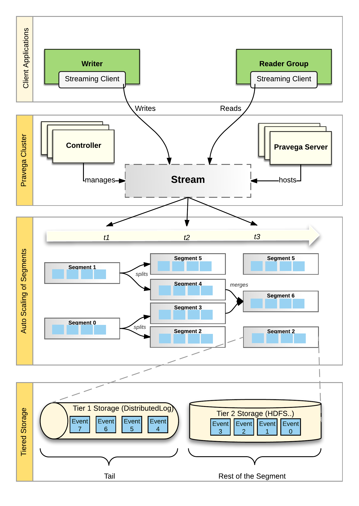

<!--
Copyright (c) 2017 Dell Inc., or its subsidiaries. All Rights Reserved.

Licensed under the Apache License, Version 2.0 (the "License");
you may not use this file except in compliance with the License.
You may obtain a copy of the License at

    http://www.apache.org/licenses/LICENSE-2.0
-->
# Pravega Concepts

Pravega is an open source storage primitive implementing **Streams** for continuous and unbounded data.

An overview of the key concepts of Pravega is discussed. Please, see [Terminology](terminology.md) for a concise definition of key terms of Pravega concepts.

## Streams

Pravega organizes data into **Streams**.  A Stream is a durable, elastic, append-only, unbounded sequence of bytes having good performance and strong consistency.  A Pravega Stream is
similar to but more flexible than a "topic" in popular message oriented middleware such as [RabbitMQ](https://www.rabbitmq.com/) or [Apache Kafka](https://kafka.apache.org/).

Pravega Streams are based on an append-only log data structure. By using the
append-only logs, Pravega rapidly ingest data into durable storage. It supports a large variety of application use cases as follows:

- Supports Stream processing by using frameworks like [Flink](https://flink.apache.org).
- Publish/subscribe messaging.
- NoSQL databases like Time Series.
- Database (TSDB).
- Workflow engines.
- Event-oriented applications, etc., 

In Pravega, during the creation of the Stream the developers assigns a meaningful
name to the Stream like "IoTSensorData" or "WebApplicationLog20170330" to provide
more information on the type of data stored in the Stream. The Pravega Stream names are organized
within a **Scope**.  A scope is a string containing meaningful informations like "FactoryMachines" or "HRWebsitelogs" to aid in better understanding for the developers. A scope acts as a
namespace for Stream names, all Stream names are unique within a scope.

A Stream is uniquely identified by its combination of the **Stream name**
and **scope**. Scope can be used to classify names by tenant (in a multi tenant
environment) or by department in an organization or by geographic location or any
other categorization desired by the developer.

A Stream is unbounded in size. Pravega does not impose any limits on the occurrence of number of Events in the Stream or on the number of total bytes that are stored in a Stream.
Pravega’s design architecture scales up horizontally from few machines into a datacenter.

Pravega Streams are divided into **Stream Segments**, to handle the large volume of data within a Stream. A Stream Segment is a shard, or partition of the data within a Stream. For more information, please see [Stream Segments](#stream-segments) section.

The data from the IoT sensor is extracted or read by a variety of applications (_e.g.,_ Java applications) and writes the read or fetched data to the tail (front) of the Stream. Applications, such as a [Flink](https://flink.apache.org), can read from any point in the Stream. Many applications can read and write the same Stream in parallel. Elasticity, scalability, support for large volume of
Stream data and applications are the highlights of Pravega's design. More information on read and write operations in the Streams will be discussed in the [Readers and Writers](#writer) section.

## Events

Pravega's client API allows applications to read and write data in Pravega using **Events**.  An Event is represented as a set of bytes within a Stream. For example, an Event could be as simple as a small number of bytes containing a temperature reading from an IoT sensor composed of
a timestamp, a metric identifier and a value or an Event could be web log data
associated with a user click on a website. Applications make sense of Events using
standard Java **Serializers** and **Deserializers**, allowing them to read and write
objects in Pravega similar to reading and writing objects from
files.

Every Event has a **Routing Key**. A Routing Key is a string used by developers to group similar Events. A Routing Key is often derived from data naturally occurring in the Event,
like "customer-id" or "machine-id" or a declared/user-defined string. For example, a Routing Key could be a date (to group Events together by time) or it could be a IoT sensor id (to group Events by
machine). A Routing Key is important in defining the read and write semantics that Pravega guarantees.

## Writers, Readers, ReaderGroups 

Pravega provides a Client Library, written in Java, that implements a convenient
API for Writer and Reader applications.  The Pravega Java Client Library
encapsulates the wire protocol used for communication between Pravega clients and
Pravega.

- **Writer:** An application that creates Events and writes them into a Stream.
All data is written by appending to the tail (front) of a Stream.

- **Reader:** An application that reads Events from a Stream.  Readers can read
from any point in the Stream.  Many Readers will be reading Events from the tail
of the Stream. The tail reads correspond to reading bytes that have been recently written and will be delivered to Readers immediately. Some Readers will read from earlier parts or history of the Stream (called **catch-up reads** or **history reads**). The application developer has control over the Reader's start position in the Stream.

- **Position:** A concept in Pravega, that represents where in a Stream a
Reader is currently located. The position object can be used as a recovery
mechanism by replacing the failed Reader by a new Reader by restoring the last saved successful read position. Using this pattern of persisting position objects, applications can be built guaranteeing exactly once Event processing by handling the Reader failure.

- **Reader Groups:** Readers are organized into Reader Groups. A Reader Group is a named collection of
Readers, which together performs parallel read Events in a given Stream. When a
Reader is created through the Pravega data plane API, the developer includes the
name of the Reader Group associated with it. Pravega guarantees that each Event published
to a Stream is sent to exactly one Reader within the Reader Group. There could
be one or more Reader in the Reader Group and there could be many different Reader Groups simultaneously reading from any given Stream.

A Reader Group can be considered as a "composite Reader" or "distributed
Reader", that allows a distributed application to read and process Stream data
in parallel. A large amount of Stream data can be consumed by a coordinated fleet of Readers in a Reader Group.  For example, a collection of Flink tasks processing Stream data in parallel using Reader Group.

For more details on the basics of working with Pravega Readers and Writers, please see [Working with Pravega: Basic Reader and
Writer](basic-Reader-and-Writer.md#working-with-pravega-basic-Reader-and-Writer).

## Stream Segments

A Stream is decomposed into a set of Segments generally referred as **Stream Segments**; a Stream Segment is a shard or partition of a Stream.

 

### Event in a Stream Segment

The Stream Segments acts as containers for Events within the Stream. When an
Event is written into a Stream, it is stored in one of the Stream Segments based
on the Event's Routing Key. Pravega uses consistent hashing to assign Events to
Stream Segments. Event Routing Keys are hashed to form a "key space". The key
space is then divided into a number of partitions, corresponding to the number
of Stream Segments. Consistent hashing determines the allotment of the specific Segment to an Event.

### Auto Scaling

Varying the number of Stream Segments over time is referred as **Auto Scaling**. The number of Stream Segments in a Stream can *grow* and *shrink* over time based on the variation in the I/O
load on the Stream.

Consider the following figure that shows the relationship between Routing Keys
and time.

 

- A Stream starts at time **_t0_** with a configurable number of Segments.  If the
rate of data written to the Stream is constant, there will be no change in the number of Segments. 

- At time **_t1_**, the system noted an increase in the ingestion rate and splits **_Segment 1_** into two parts. This process is referred as **Scale-up** Event.

- Before **_t1_**, Events with a Routing Key that hashes to the upper part of the key
space (i.e., values ranging from **200-399**) would be placed in **_Segment 1_** and those that hash into the
lower part of the key space (i.e., values ranging from **0-199**) would be placed in **_Segment 0_**.

- After **_t1_**, **_Segment 1_** is split into **_Segment 2_** and **_Segment 3_**. The **_Segment 1_** is sealed and stops accepting writes.  At this point in time, Events with Routing Key **_300_** and _above_ are written to **_Segment 3_** and those between **_200_** and **_299_** would be written into **_Segment 2_**.

- **_Segment 0_** continues accepting the same range of Events as before **_t1_**.  

- Another scale-up Event occurs at time **_t2_**, as **_Segment 0_**’s range of routing
key is split into **_Segment 5_** and **_Segment 4_**. Also at this time, **_Segment 0_** is sealed
and allows no further writes.

- Segments covering a contiguous range of the key space can also be merged. At
time **_t3_**, **_Segment 2_**’s range and **_Segment 5_**’s range are merged to **_Segment 6_** to
accommodate a decrease in the load on the Stream.

When a Stream is created, it is configured with a **Scaling Policy** that
determines, how a Stream handles the varying changes in its load? In the present scenario, Pravega has three kinds of scaling policy:

1.  **Fixed**:  The number of Stream Segments does not vary with load.

2.  **Size-based**:  A target rate is set, to decide on increasing or decreasing the number of Stream Segments. If the number of bytes of data per second written to the Stream increases beyond the threshold or target rate, the number of Stream Segments is
    increased otherwise, if it falls below the target rate then the number of Stream
    Segments are reduced.

3.  **Event-based**:  It is similar to the size-based scaling policy, but it uses number of Events instead of bytes.

### Events, Stream Segments and AutoScaling

As it was mentioned in the earlier part of the section, that an Event is written into one of the Stream Segments. By considering auto scaling, Stream Segments performs bucketing of Events based on Routing Key and time. It is obvious that, at any given time, Events published to a Stream with a given value of Routing Key will appear in the same Stream Segment.

 

It is also worth emphasizing that Events are written only on the active Stream
Segments. Segments that are sealed do not accept writes. In the figure above,
at time **_now_**, only Stream **_Segments 3_**, **_6_** and **_4_** are active and the entire key space is covered between those three Stream Segments.  

### Stream Segments and ReaderGroups

Stream Segments play a major role in understanding the way Reader Groups work.

 

Pravega assigns _zero_ or more Stream Segments to each Reader in a Reader Group. Pravega tries to balances the number of Stream Segments assigned to each Reader. In the figure above, **_Reader B1_** reads from two Stream Segments (**_Segment 0_** and **_Segment 3_**), while the other Reader Group (**_Reader B2_**, **_Reader B3_**) have only only one Stream Segment to read from. Pravega makes sure that each Stream Segment is read exactly by one Reader in any Reader Group configured with that Stream. Irrespective of  Readers being added to the Reader Group or removed from the Reader Group due to crash, Pravega reassigns Stream Segments to maintain balance amongst the Readers.

The number of Stream Segments in a Stream determines the upper bound of
parallelism of Readers within a Reader Group. If there are more Stream Segments, different Reader Groups and many parallel sets of Readers can effectively consume the Stream. In the
above figure, **_Stream 1_** has four Stream Segments. The largest effective Reader Group would contain four Readers. **_Reader Group B_** in the above figure is not quite optimal. If one more Reader was added to the Reader Group, each Reader would have one Stream Segment to process, and maximizes the read
parallelism. But, if the number of Readers in the Reader Group increases beyond four, there arises a possibility that at least one of the Readers will have unassigned Stream Segment.

If **_Stream 1_** in the figure above experienced a **Scale-Down** Event, by reducing the
number of Stream Segments to three, then the **_Reader Group B_**  will have an
ideal number of Readers.

The number of Stream Segments can be varied dynamically by using the Pravega's auto scaling feature as we discussed in the [Auto Scaling](#auto-scaling) section. The size of any Stream is determined by the storage capacity of the Pravega cluster. More Streams can be obtained by increasing the storage of the Pravega cluster.

Applications can react to changes in the number of Segments in a Stream by adjusting the number of Readers within a Reader Group, to maintain optimal read parallelism. Flink application is the best example for this scenario as it allows Flink to increase or decrease the number of task instances that are processing a Stream in parallel.

### Ordering Guarantees

A Stream comprises a set of Segments that can change over time. Segments that overlap in their area of key space have a defined order.

An Event written to a Stream is written to a single Segment, and is ordered with respect to the Events of that Segment. The existence and position of an Event within a Segment maintains consistency.

Readers can be assigned multiple parallel Segments (from different parts of key space). A Reader reading from multiple Segments will interleave the Events of the Segments, but the order of Events per Segment is retained. Specifically, if **_s_** is a Segment, and **_s_** contains two Events _i.e.,_ **_s_ _=_ {_e~1_,_e~2_}_** where **_e~1_** precedes **_e~2_**. Thus when a Reader tries to read both the Events (**_e~1_** and **_e~2_**) the read order is guaranteed by assuring that, the Reader is allowed to read **_e~1_** before **_e~2_**.

This results in the following ordering guarantees:

- Events with the same Routing Key are consumed in the order they were written.

- Events with different Routing Keys are sent to a specific Segment and will always be
    read in the same order even if the Reader performs backs up and re-reads.

- If an Event has been acknowledged to its Writer or has been read by a Reader, it is guaranteed that  it will continue to exist in the same location or position for all subsequent reads until it is deleted.

- If multiple Readers are reading a Stream and backs up for a while and then again when it performs re-reads, it is assured that no reordering would have happened.

## Reader Group Checkpoints

Pravega provides the ability for an application to initiate a **Checkpoint** on a
Reader Group.  The idea with a checkpoint is to create a consistent "point in
time" persistence of the state of each Reader in the Reader Group, by using a
specialized Event (_Checkpoint Event_) to signal each Reader to preserve its
state. Once a checkpoint has been completed, the application can use the
checkpoint to reset all the Readers in the Reader Group to the known consistent
state represented by the checkpoint.

For more details on working with Reader Groups, Please see [ReaderGroup Basics](basic-Reader-and-Writer.md#Readergroup-basics).

## Transactions

Pravega supports Transactions. The idea of a transaction is that a Writer can
"batch" up a bunch of Events and commit them as a unit into a Stream. This is
useful, for example, in Flink jobs, Pravega is used as a sink.  The Flink job
can continuously produce results for some data processing and use the transaction
to durably accumulate the results of the processing. For example, at the end of some sort of
time window, the Flink job can commit the transaction and therefore
make the results of the processing available for downStream processing, or in
the case of an error, the transaction is aborted and the results disappear.

A key difference between Pravega's transactions and similar approaches (Kafka's producer-side batching) vary with the feature durability. Events added to a transaction are durable when the Event is acknowledged back to the Writer. However, the Events in the transaction are **not** visible to Readers until the transaction is committed by the Writer. A transaction is a similar to a Stream and is  associated with multiple Stream Segments.  When an Event is published into a
transaction, the Event itself is appended to a Stream Segment of the
transaction. 

For example, a Stream has five Segments, when a transaction is created on that
Stream, conceptually that transaction also has five Segments. When an Event is
published into the transaction, it is routed and assigned to the same numbered Segment similar to Stream (i.e., Event assigned to _Segment 3_ in the Stream will be assigned to _Segment 3_ in the transaction). Once the transaction is committed, each of the transaction's
Segments is automatically appended to the corresponding Segment in the Stream. If the Stream is aborted, the transaction, all its Segments and all the Events published into the transaction are removed from Pravega.

 

Events published into a transaction are visible to the Reader only after the transaction is committed.

For more details on working with transactions, Please see [Working with Pravega:
Transactions](transactions.md).

## State Synchronizers

Pravega is a Streaming storage primitive and which can coordinate processes in a distributed computing environment. A **State Synchronizer** uses a Pravega Stream to provide a synchronization
mechanism for state shared between multiple processes running in a cluster and making it easier to build distributed applications.  With State Synchronizer, an application developer can use Pravega to read and make changes to shared state consistently and perform optimistic locking. 

 

State Synchronizer could be used to maintain a single, shared copy of an
application's configuration property across all instances of that application in
a cloud.  State Synchronizer could also be used to store one piece of data or a
map with thousands of different key value pairs. In Pravega, managing the state of Reader Groups and distribution of Readers throughout the network is implemented using State Synchronizer.

An application developer creates a State Synchronizer on a Stream similar to the creation of Writer. The State Synchronizer keeps a local copy of the shared state and allows faster access to the data in the application. State Synchronizer keeps track of all the changes happening in the shred state and responsible for performing any modification to the shared state in the Stream. Each application instance uses the State Synchronizer, to remain updated with the
changes by pulling updates to the shared state and modifies the local copy of the
data. Consistency is maintained through a conditional append style of updates
to the shared state through the State Synchronizer, making sure that updates are
made only to the most recent version of the shared state.

The State Synchronizer can occasionally be "compacted", by compressing and removing
older updates and retains only the recent version of the state in the backing Stream. This feature assures the application developers, that the shared state does not grow unchecked.

State Synchronizer works effectively when most updates to shared state are small in
comparison to the total data size being stored. This can be achieved by allowing them to be written as
small deltas. As with any optimistic concurrency system, State Synchronizer is
not at its best when many processes attempts for simultaneous updates on the same piece of data.

For more details on working with State Synchronizers, please see [Working with Pravega:
State Synchronizer](state-synchronizer.md).

## Architecture

The following figure depicts the components deployed by Pravega:

Pravega is deployed as a distributed system – a cluster of servers and storage
coordinated to run Pravega called a **Pravega cluster**.  

Pravega presents a software-defined storage (SDS) architecture formed by **Controller** instances
(_control plane_) and Pravega Servers (_data plane_).The set of Pravega Servers is collectively known as the **Segment Store**. 

The set of Controller instances together forms the control plane of Pravega, providing
functionality to _create, update_ and _delete_ _Streams_. Further, it extends the functionality to retrieve information about the Streams, monitor the health of the Pravega cluster, gather metrics, etc.,. A minimum requirement of three or multiple Controller instances are allowed to be running in a
cluster for high availability.  

The [Segment Store](Segment-store-service.md) implements the Pravega data plane.
Pravega servers provide the API to read and write data in Streams. Data storage is comprised of two tiers:
- **Tier 1:** It provides short term, low-latency, data storage, guaranteeing the durability of data written to Streams. Pravega uses [Apache Bookkeeper](http://bookkeeper.apache.org/) to implement
Tier 1 Storage.
- **Tier 2:** It provides long term storage for Stream data. Pravega uses HDFS, Dell EMC's Isilon or Dell EMC's Elastic Cloud Storage (ECS) to implement Tier 2 Storage.

Tier 1 Storage typically runs _within_ the Pravega cluster. Tier 2 Storage is normally deployed _outside_ the Pravega cluster. Tiering storage is important to deliver the combination of fast access to Stream
data and also allows large data storage for Streams. Tier 1 storage
persists on the most recently written Stream data. As data in Tier 1 Storage ages,
it is moved into Tier 2 Storage.

Pravega uses [Apache Zookeeper](https://zookeeper.apache.org/) as the
coordination mechanism for the components in the Pravega cluster.  

Pravega is built as a data storage primitive first and foremost. Pravega is
carefully designed to take advantage of software defined storage, so that, the
amount of data stored in Pravega is limited only by the total storage capacity
of the data center. Once the data is written to Pravega it is durably stored.  Short of a disaster, that
permanently destroys a large portion of a data center, but data stored in Pravega is never
lost.

Pravega provides a **Java Client Library**, for building client-side
applications such as analytics applications using Flink. The Pravega Java client
library manages the interaction between the application code and Pravega via a
custom TCP wire protocol.

## Putting the Concepts Together

The concepts in Pravega are depicted in the following figure:

 

-   Pravega clients are **Writers** and **Readers**.  Writers write Events into a
    Stream. Readers read Events from a Stream. Readers are grouped into
    **Reader Groups** to read from a Stream in parallel.

-   The **Controller** is a server-side component that manages the control plane of
    Pravega.  Streams are created, updated and listed using the Controller API.

-   The **Pravega Server** is a server-side component that implements reads, writes
    and other data plane operations.

-   **Streams** are the fundamental storage primitive in Pravega.  Streams contain a
    set of data elements called Events.  Events are appended to the “tail” of
    the Stream by Writers.  Readers can read Events from anywhere in the Stream.

-   A Stream is partitioned into a set of **Stream Segments**. The number of Stream
    Segments in a Stream can change over time.  Events are written into exactly
    one of the Stream Segments based on **Routing Key**.  For any Reader Group reading a Stream, each Stream Segment is assigned to one Reader in that
    Reader Group. 

-   Each Stream Segment is stored in a combination of **Tier 1** and **Tier 2** storage. 
    The tail of the Segment is stored in Tier 1 providing low latency reads and
    writes. The rest of the Segment is stored in Tier 2, providing high
    throughput read access with horizontal scalability and low cost. 

## A Note on Tiered Storage

To deliver an efficient implementation of Streams, Pravega is based on a tiered
storage model.  Events are persisted in low latency/high IOPS storage (Tier 1
Storage) and higher throughput storage (Tier 2 Storage). Writers and Readers are
oblivious to the tiered storage model from an API perspective. 

Pravega is based on an append-only **log** data structure.  As Leigh Stewart
[observed](https://blog.twitter.com/2015/building-distributedlog-twitter-s-high-performance-replicated-log-service),
there are really three data access mechanisms in a log:

 

All of the write activity, and much of the read activity happens at the tail of
the log.  Writes are appended to the log and many clients tries to read data immediately as it arrives in the log.  These two data access mechanisms are dominated
by the need for low-latency. The low latency writes by Writers provides real time
access to the published data by Readers. 

Please note that, not all Readers read from the tail of the log, some Readers reads
by starting at some arbitrary position in the log.  These reads are known as
**catch-up reads**.  Access to historical data traditionally was done by batch
analytics jobs, often using HDFS and Map/Reduce.  However with new Streaming
applications, we can access historical data as well as current data by just
accessing the log.  One approach would be to store all the historical data in
SSDs similar to tail data operations, but that leads to an expensive task and force
customers to economize by deleting historical data.

Pravega offers a mechanism that allows customers to use cost-effective, highly-scalable, high-throughput
storage for the historical part of the log, that way they won’t have to decide on
when to delete historical data.  Basically, if storage is cheap enough, why not
keep all of the history?

Tier 1 Storage aids in faster writes to the Streams by assuring durability and makes reading from the tail of a Stream much quicker. Tier 1 Storage is based on the open source Apache BookKeeper Project. Though not essential, we presume that the Tier 1 Storage will be typically implemented on faster SSDs or
even non-volatile RAM.

Tier 2 Storage provides a highly-scalable, high-throughput cost-effective
storage. We expect this Tier 2 to be typically deployed on spinning disks. Pravega
asynchronously migrates Events from Tier 1 to Tier 2 to reflect the different
access patterns to Stream data. Tier 2 Storage is based on an HDFS model. 
