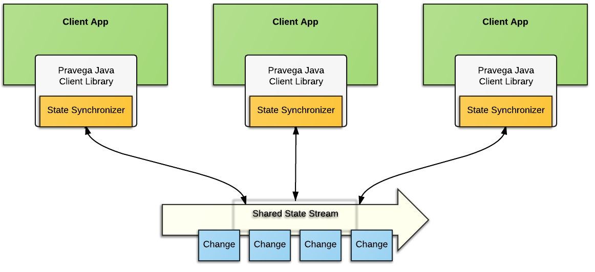
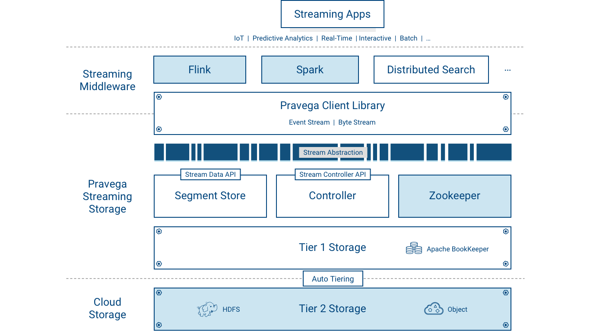

<!--
Copyright (c) 2017 Dell Inc., or its subsidiaries. All Rights Reserved.

Licensed under the Apache License, Version 2.0 (the "License");
you may not use this file except in compliance with the License.
You may obtain a copy of the License at

    http://www.apache.org/licenses/LICENSE-2.0
-->
# Pravega Concepts

Pravega is an open source storage primitive implementing **Streams** for continuous and unbounded data.

This page is an overview of the key concepts in Pravega.
 See [Terminology](terminology.md) for a concise definition for many
Pravega concepts.

## Streams

Pravega organizes data into Streams.  A Stream is a durable, elastic, append-only, unbounded sequence of bytes that has good performance and strong consistency.  A Pravega Stream is
similar to but more flexible than a "topic" in popular message-oriented middleware such as [RabbitMQ](https://www.rabbitmq.com/) or [Apache Kafka](https://kafka.apache.org/). 

Pravega Streams are based on an append-only log data structure. By using
append-only logs, Pravega can rapidly ingest data into durable storage,
and support a large variety of application use cases such as stream processing using frameworks like [Flink](https://flink.apache.org), publish/subscribe
messaging, NoSQL databases such as a Time Series
Database (TSDB), workflow engines, event-oriented applications and many other
kinds of applications. 

When a developer creates a Stream in Pravega, s/he gives the Stream a meaningful
name such as "IoTSensorData" or "WebApplicationLog20170330".  The
Stream's name helps other developers understand the kind of data that is stored
in the Stream.  It is also worth noting that Pravega Stream names are organized
within a Scope.  A Scope is a string and should convey some sort of meaning to
developers such as "FactoryMachines" or "HRWebsitelogs".  A Scope acts as a
namespace for Stream names – all Stream names are unique within a Scope.
 Therefore a Stream is uniquely identified by the combination of its Stream name
and Scope.  Scope can be used to segregate names by tenant (in a multi tenant
environment), by department in an organization, by geographic location or any
other categorization the developer chooses.

A Stream is unbounded in size – Pravega itself does not impose any limits on how
many Events can be in a Stream or how many total bytes are stored in a Stream.
Pravega’s design horizontally scales from few machines to a whole datacenter’s capacity.

To deal with a potentially large amount of data within a Stream, Pravega Streams
are divided into Stream Segments.  A Stream Segment is a shard, or partition of
the data within a Stream.  We go into a lot more detail on Stream Segments a bit
later in this document.  Stream Segments are an important concept, but we need
to introduce a few more things before we can dive into Stream Segments.

Applications, such as a Java program reading from an IoT sensor, write data to
the tail (front) of the Stream.  Applications, such as a [Flink](https://flink.apache.org) analytics job,
can read from any point in the Stream. Lots of applications can read and write
the same Stream in parallel.  Elastic, scalable support for a large volume of
Streams, data and applications is at the heart of Pravega's design.  We will
get into more details about how applications read and write Streams a bit later
in this document when we detail Readers and Writers.

## Events

Pravega's client API allows applications to read and write data in Pravega in terms of an Event.  An Event is a
set of bytes within a Stream.  An Event could be as simple as a small
number of bytes containing a temperature reading from an IoT sensor composed of
a timestamp, a metric identifier and a value.  An Event could be web log data
associated with a user click on a website.  Events can be anything you can
represent as a set of bytes.  Applications make sense of Events using
standard Java serializers and deserializers, allowing them to read and write
objects in Pravega using similar techniques to reading and writing objects from
files.

Every Event has a Routing Key.  A Routing Key allows Pravega
and application developers to reason about which Events are related.   A Routing
Key is just a string that developers use to group similar Events together. A
Routing Key is often derived from data naturally occurring in the Event,
something like "customer-id" or "machine-id", but it could also be some
artificial String. A
Routing Key could be something like a date (to group Events together by
time) or perhaps a Routing Key could be a IoT sensor id (to group Events by
machine).  A Routing Key is important to defining the precise read and write
semantics that Pravega guarantees, we will get into that detail a bit later,
after we have introduced a few more key concepts.

## Writers, Readers, ReaderGroups

Pravega provides a client library, written in Java, that implements a convenient
API for Writer and Reader applications to use.  The Pravega Java Client Library
encapsulates the wire protocol used to communicate between Pravega clients and
Pravega.

A Writer is an application that creates Events and writes them into a Stream.
All data is written by appending to the tail (front) of a Stream.

A Reader is an application that reads Events from a Stream.  Readers can read
from any point in the Stream.  Many Readers will be reading Events from the tail
of the Stream.  These Events will be delivered to Readers as quickly as possible.  Some Readers will read
from earlier parts of the Stream (called catch-up reads).  The application
developer has control over where in the Stream the Reader starts reading.
 Pravega has the concept of a Position, that represents where in a Stream a
Reader is currently located.  The Position object can be used as a recovery
mechanism – applications that persist the last Position a Reader has
successfully processed can use that information to initialize a replacement
Reader to pickup where a failed Reader left off.  Using this pattern of
persisting Position objects, applications can be built that guarantee exactly
once Event processing in the face of Reader failure.

Readers are organized into ReaderGroups.  A ReaderGroup is a named collection of
Readers that together, in parallel, read Events from a given Stream. When a
Reader is created through the Pravega data plane API, the developer includes the
name of the ReaderGroup it is part of.  We guarantee that each Event published
to a Stream is sent to exactly one Reader within the ReaderGroup.  There could
be 1 Reader in the ReaderGroup, there could be many.  There could be many
different ReaderGroups simultaneously reading from any given Stream.

You can think of a ReaderGroup as a "composite Reader" or a "distributed
Reader", that allows a distributed application to read and process Stream data
in parallel, such that a massive amount of Stream data can be consumed by a
coordinated fleet of Readers in a ReaderGroup.  A collection of Flink tasks
processing Stream data in parallel is a good example use of a ReaderGroup.

For more details on the basics of working with Pravega Readers and Writers,
see [Working with Pravega: Basic Reader and
Writer](basic-reader-and-writer.md#working-with-pravega-basic-reader-and-writer).

We need to talk in more detail about the relationship between Readers,
ReaderGroups and Streams and the ordering guarantees provided by Pravega.  But
first, we need to describe what a Stream Segment is.

## Stream Segments

A Stream is decomposed into a set of Stream Segments; a Stream Segment is a
shard or partition of a Stream.

 

### An Event is Stored within a Stream Segment

The Stream Segment is the container for Events within the Stream.   When an
Event is written into a Stream, it is stored in one of the Stream Segments based
on the Event's Routing Key.  Pravega uses consistent hashing to assign Events to
Stream Segments. Event Routing Keys are hashed to form a "key space" .  The key
space is then divided into a number of partitions, corresponding to the number
of Stream Segments. Consistent hashing determines which Segment an Event is
assigned to.

### Auto-scaling: Varying the number of Stream Segments over time

The number of Stream Segments in a Stream can grow *and shrink* over time as I/O
load on the Stream increases and decreases.   We refer to this feature as
AutoScaling.

Consider the following figure that shows the relationship between Routing Keys
and time.

 

A Stream starts out at time t0 with a configurable number of Segments.  If the
rate of data written to the Stream is constant, the number of Segments won’t
change.  However at time t1, the system noted an increase in the ingestion rate
and chose to split Segment 1 into two parts.  We call this a Scale-up event.
 Before t1, Events with a Routing Key that hashes to the upper part of the key
space (values 200-399) would be placed in Segment 1 and those that hash into the
lower part of the key space (values 0-199) would be placed in Segment 0. After
t1, Segment 1 is split into Segment 2 and Segment 3.  Segment 1 is sealed and it
no longer accepts writes.  At this point in time, Events with Routing Key
300 and above are written to Segment 3 and those between 200 and 299 would be
written into Segment 2.  Segment 0 still keeps accepting the same range of
Events as before t1.  

We also see another Scale-up event at time t2, as Segment 0’s range of Routing
Key is split into Segment 5 & Segment 4.  Also at this time, Segment 0 is sealed
off so that it accepts no further writes.

Segments covering a contiguous range of the key space can also be merged.  At
time t3, Segment 2’s range and Segment 5’s range are merged into Segment 6 to
accommodate a decrease in load on the Stream.

When a Stream is created, it is configured with an Scaling Policy that
determines how a Stream reacts to changes in its load.  Currently there are
three kinds of Scaling Policy:

1.  Fixed.  The number of Stream Segments does not vary with load

2.  Size-based.  As the number of bytes of data per second written to the Stream
    increases past a certain target rate, the number of Stream Segments is
    increased.  If it falls below a certain level, decrease the number of Stream
    Segments.

3.  Event-based.  Similar to Size-based Scaling Policy, except it uses the
    number of Events instead of the number of bytes.

### Events, Stream Segments and AutoScaling

We mentioned previously that an Event is written into one of the Stream's
Segments.  Taking into account AutoScaling, you should think of Stream Segments
as a bucketing of Events based on Routing Key and time.  At any given time,
Events published to a Stream within a given value of Routing Key will all appear
in the same Stream Segment.

 

It is also worth emphasizing that Events are written into only the active Stream
Segments.  Segments that are sealed do not accept writes.  In the figure above,
at time "now", only Stream Segments 3, 6 and 4 are active and between those
three Stream Segments the entire key space is covered.  

### Stream Segments and ReaderGroups

Stream Segments are important to understanding the way Reader Groups work.

 

Pravega assigns each Reader in a ReaderGroup zero or more Stream Segments to
read from.  Pravega tries to balance out the number of Stream Segments each
Reader is assigned.  In the figure above, Reader B1 reads from 2 Stream Segments
while each of the other Readers in the Reader Group have only 1 Stream Segment
to read from.  Pravega makes sure that each Stream Segment is read by exactly
one Reader in any ReaderGroup configured to read from that Stream. As Readers
are added to the ReaderGroup, or Readers crash and are removed from the
ReaderGroup, Pravega reassigns Stream Segments so that Stream Segments are
balanced amongst the Readers.

The number of Stream Segments in a Stream determines the upper bound of
parallelism of readers within a ReaderGroup – the more Stream Segments, the more
separate, parallel sets of Readers we can have consuming the Stream. In the
above figure, Stream1 has 4 Stream Segments.  That means that the largest
effective Reader Group would contain 4 Readers.  Reader Group named "B" in the
above figure is not quite optimal.  If one more Reader was added to the
ReaderGroup, each Reader would have 1 Stream Segment to process, maximizing read
parallelism.  However, the number of Readers in the ReaderGroup increases beyond
4, at least one of the Readers will not be assigned a Stream Segment.

If Stream1 in the figure above experienced a Scale-Down event, reducing the
number of Stream Segments to 3, then Reader Group B as depicted would have an
ideal number of Readers.

With the AutoScaling feature, Pravega developers don't have to configure their
Streams with a fixed, pre-determined number of Stream Segments – Pravega can
dynamically determine the right number.  With this feature, Pravega Streams can
grow and shrink to match the behavior of the data input.  The size of any Stream
is limited only by the total storage capacity made available to the Pravega
cluster; if you need bigger streams, simply add more storage to your cluster.

Applications can react to changes
in the number of Segments in a Stream, adjusting the number of Readers within a
ReaderGroup, to maintain optimal read parallelism if resources allow.  This is
useful, for example in a Flink application, to allow Flink to increase or
decrease the number of task instances that are processing a Stream in parallel,
as scale events occur over time.

### Ordering Guarantees

A stream comprises a set of segments that can change over time. Segments that overlap in their area of keyspace have a defined order.

An event written to a stream is written to a single segment and it is totally ordered with respect to the events of that segment. The existance and position of an event within a segment is strongly consistent.

Readers can be assigned multiple parallel segments (from different parts of keyspace). A reader reading from multiple segments will interleave the events of the segments, but the order of events per segment respects the one of the segment. Specifically, if s is a segment, events e~1 and e~2 of s are such that e~1 precedes e~2, and a reader reads both e~1 and e~2, then the reader will read e~1 before e~2.

This results in the following ordering guarantees:

1.  Events with the same Routing Key are consumed in the order they were written.

2.  Events with different Routing Keys sent to a specific segment will always be
    seen in the same order even if the Reader backs up and re-reads them.

3.  If an event has been acked to its writer or has been read by a reader it is guaranteed that it will continue to exist in the same place for all subsequent reads until it is deleted.

4.  If there are multiple Readers reading a Stream and they all back up to any given point, they will never see any reordering with respect to that point. (It will never be the case that an event that they read before the chosen point now comes after or vice versa.)

## ReaderGroup Checkpoints

Pravega provides the ability for an application to initiate a Checkpoint on a
ReaderGroup.  The idea with a Checkpoint is to create a consistent "point in
time" persistence of the state of each Reader in the ReaderGroup, by using a
specialized Event (a Checkpoint Event) to signal each Reader to preserve its
state.  Once a Checkpoint has been completed, the application can use the
Checkpoint to reset all the Readers in the ReaderGroup to the known consistent
state represented by the Checkpoint.

For more details on working with ReaderGroups, 
see [ReaderGroup Basics](basic-reader-and-writer.md#readergroup-basics).

## Transactions

Pravega supports Transactions.  The idea of a Transaction is that a Writer can
"batch" up a bunch of Events and commit them as a unit into a Stream.  This is
useful, for example, with Flink jobs, using Pravega as a sink.  The Flink job
can continuously produce results of some data processing and use the Transaction
to durably accumulate the results of the processing.  At the end of some sort of
time window (for example) the Flink job can commit the Transaction and therefore
make the results of the processing available for downstream processing, or in
the case of an error, abort the Transaction and the results disappear.

A key difference between Pravega's Transactions and similar approaches (such as
Kafka's producer-side batching) is related to durability.  Events added to a
Transaction are durable when the Event is ack'd back to the Writer.  However,
the Events in the Transaction are NOT visible to readers until the Transaction
is committed by the Writer.  A Transaction is a lot like a Stream; a Transaction
is associated with multiple Stream Segments.  When an Event is published into a
Transaction, the Event itself is appended to a Stream Segment of the
Transaction.  Say a Stream had 5 Segments, when a Transaction is created on that
Stream, conceptually that Transaction also has 5 Segments.  When an Event is
published into the Transaction, it is routed to the same numbered Segment as if
it were published to the Stream itself (if the Event would have been placed in
Segment 3 in the "real" Stream, then it will appear in Segment 3 of the
Transaction).  When the Transaction is committed, each of the Transaction's
Segments is automatically appended to the corresponding Segment in the real
Stream.  If the Stream is aborted, the Transaction, all its Segments and all the
Events published into the Transaction are removed from Pravega.

 

Events published into a Transaction are never visible to the Reader until that
Transaction is committed.

For more details on working with Transactions, see [Working with Pravega:
Transactions](transactions.md).

## State Synchronizers

Pravega is a streaming storage primitive; it can also be thought of as a
mechanism to coordinate processes in a distributed computing environment.  The
State Synchronizer feature of Pravega falls into the latter category.

A State Synchronizer uses a Pravega Stream to provide a synchronization
mechanism for state shared between multiple processes running in a cluster,
making it easier to build distributed applications.  With State Synchronizer, an
app developer can use Pravega to read and make changes to shared state with
consistency and optimistic locking. 

 

State Synchronizer could be used to maintain a single, shared copy of an
application's configuration property across all instances of that application in
a cloud.  State Synchronizer could also be used to store one piece of data or a
map with thousands of different key value pairs.  In fact, Pravega itself uses
State Synchronizer internally, to manage the state of ReaderGroups and Readers
distributed throughout the network.

An app developer creates a State Synchronizer on a Stream in a fashion similar
to how s/he creates a Writer.  The State Synchronizer keeps a local copy
of the shared state to make access to the data really fast for the application.
 Any changes to shared state are written through the StateSynchronizer to the
Stream keeping track of all changes to the shared state.
 Each application instance uses the State Synchronizer to stay up to date with
changes by pulling updates to shared state and modifying the local copy of the
data.  Consistency is maintained through a conditional append style of updates
to the shared state through the State Synchronizer, making sure that updates are
made only to the most recent version of the shared state.

The State Synchronizer can occasionally be "compacted", compressing and removing
old state updates so that only the most recent version of the state is kept in
the backing stream.  This feature helps app developers make sure that shared
state does not grow unchecked.

 

State Synchronizer works best when most updates to shared state are small in
comparison to the total data size being stored, allowing them to be written as
small deltas. As with any optimistic concurrency system, State Synchronizer is
not at its best when many processes are all attempting to simultaneously update
the same piece of data.

For more details on working with State Synchronizers, see [Working with Pravega:
State Synchronizer](state-synchronizer.md).

## Architecture

The following figure depicts the components deployed by Pravega:

Pravega is deployed as a distributed system – a cluster of servers and storage
coordinated to run Pravega called a "Pravega cluster".  

Pravega presents a software-defined storage (SDS) architecture formed by Controller instances 
(control plane) and Pravega Servers (data plane).The set of Pravega Servers is known collectively as the Segment Store. 

The set of Controller instances make up the control plane of Pravega, providing
functionality to create, update and delete Streams, retrieve information about
Streams, monitor the health of the Pravega cluster, gather metrics etc.  There
are usually multiple (recommended at least 3) Controller instances running in a
cluster for high availability.  

The [Segment Store](segment-store-service.md) implements the Pravega data plane.
 Pravega Servers provide the API to read and write data in Streams.  Data
storage is comprised of two tiers: Tier 1 Storage, which provides short term,
low-latency, data storage,  guaranteeing the durability of data written to
Streams and Tier 2 Storage providing longer term storage of Stream data.
 Pravega uses [Apache Bookkeeper](http://bookkeeper.apache.org/) to implement
Tier 1 Storage and uses HDFS, Dell EMC's Isilon or Dell EMC's Elastic Cloud
Storage (ECS) to implement Tier 2 Storage.  Tier 1 Storage typically runs within
the Pravega cluster.  Tier 2 Storage is normally deployed outside the Pravega
cluster.

Tiering storage is important to deliver the combination of fast access to Stream
data but also allow Streams to store a vast amount of data.  Tier 1 storage
persists the most recently written Stream data.  As data in Tier 1 Storage ages,
it is moved into Tier 2 Storage.

Pravega uses [Apache Zookeeper](https://zookeeper.apache.org/) as the
coordination mechanism for the components in the Pravega cluster.  

Pravega is built as a data storage primitive first and foremost.  Pravega is
carefully designed to take advantage of software defined storage so that the
amount of data stored in Pravega is limited only by the total storage capacity
of your data center.  And like you would expect from a storage primitive, once
data is written to Pravega it is durably stored.  Short of a disaster that
permanently destroys a large portion of a data center, data stored in Pravega is never
lost.

Pravega provides a client library, written in Java, for building client-side
applications such as analytics applications using Flink. The Pravega Java Client
Library manages the interaction between application code and Pravega via a
custom TCP wire protocol.

## Putting the Concepts Together

The concepts in Pravega are summarized in the following figure:

 

-   Pravega clients are Writers and Readers.  Writers write Events into a
    Stream.  Readers read Events from a Stream.  Readers are grouped into
    ReaderGroups to read from a Stream in parallel.

-   The Controller is a server-side component that manages the control plane of
    Pravega.  Streams are created, updated and listed using the Controller API.

-   The Pravega Server is a server-side component that implements read, write
    and other data plane operations.

-   Streams are the fundamental storage primitive in Pravega.  Streams contain a
    set of data elements called Events.  Events are appended to the “tail” of
    the Stream by Writers.  Readers can read Events from anywhere in the Stream.

-   A Stream is partitioned into a set of Stream Segments. The number of Stream
    Segments in a Stream can change over time.  Events are written into exactly
    one of the Stream Segments based on Routing Key.  For any ReaderGroup
    reading a Stream, each Stream Segment is assigned to one Reader in that
    ReaderGroup. 

-   Each Stream Segment is stored in a combination of Tier1 and Tier2 storage. 
    The tail of the Segment is stored in Tier1 providing low latency reads and
    writes.  The rest of the Segment is stored in Tier2, providing high
    throughput read access with horizontal scalibility and low cost. 

## A Note on Tiered Storage

To deliver an efficient implementation of Streams, Pravega is based on a tiered
storage model.  Events are persisted in low latency/high IOPS storage  (Tier 1
Storage) and higher throughput storage (Tier 2 Storage). Writers and Readers are
oblivious to the tiered storage model from an API perspective. 

Pravega is based on an append-only Log data structure.  As Leigh Stewart
[observed](https://blog.twitter.com/2015/building-distributedlog-twitter-s-high-performance-replicated-log-service),
there are really three data access mechanisms in a Log:

 

All of the write activity, and much of the read activity happens at the tail of
the log.  Writes are appended to the log and many clients want to read data as
fast as it arrives in the log.  These two data access mechanisms are dominated
by the need for low-latency – low latency writes by Writers and near real time
access to the published data by Readers. 

Not all Readers read from the tail of the log; some Readers want to read
starting at some arbitrary position in the log.  These reads are known as
*catch-up reads*.  Access to historical data traditionally was done by batch
analytics jobs, often using HDFS and Map/Reduce.  However with new streaming
applications, you can access historical data as well as current data by just
accessing the log.  One approach would be to store all the historical data in
SSDs like we do with the tail data, but that can get very expensive and force
customers to economize by deleting historical data.  Pravega offers a mechanism
that allows customers to use cost-effective, highly-scalable, high-throughput
storage for the historical part of the log, that way they won’t have to decide
when to delete historical data.  Basically, if storage is cheap enough, why not
keep all of the history?

Tier 1 Storage is used to make writing to Streams fast and durable and to make
sure reading from the tail of a Stream is as fast as possible.  Tier 1 Storage
is based on the open source Apache BookKeeper Project. Though not essential, we
presume that the Tier 1 Storage will be typically implemented on faster SSDs or
even non-volatile RAM.

Tier 2 Storage provides a highly-scalable, high-throughput cost-effective
storage. We expect this tier to be typically deployed on spinning disks. Pravega
asynchronously migrates Events from Tier 1 to Tier 2 to reflect the different
access patterns to Stream data.  Tier 2 Storage is based on an HDFS model. 
