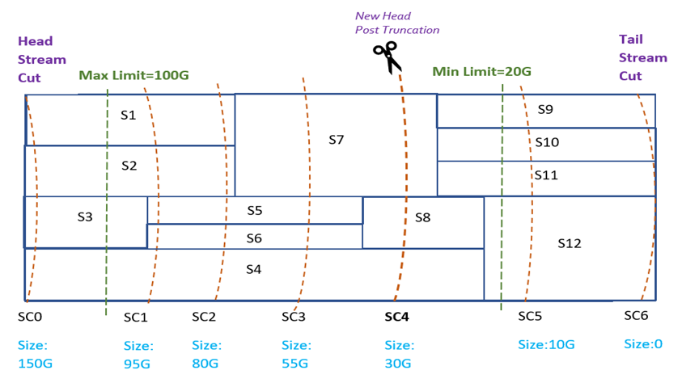
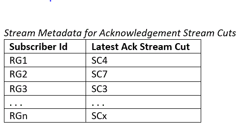
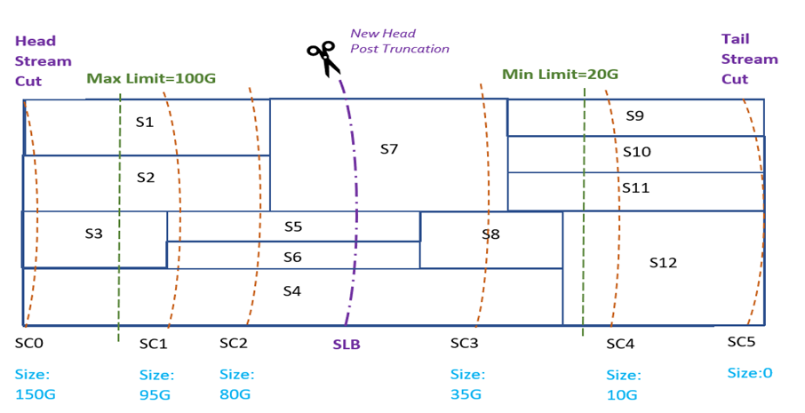
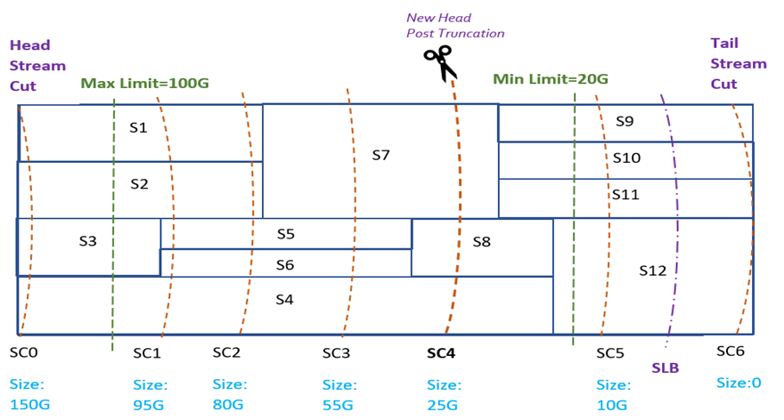
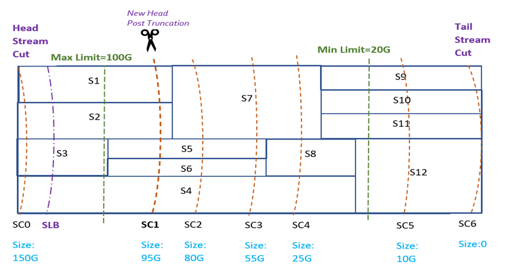
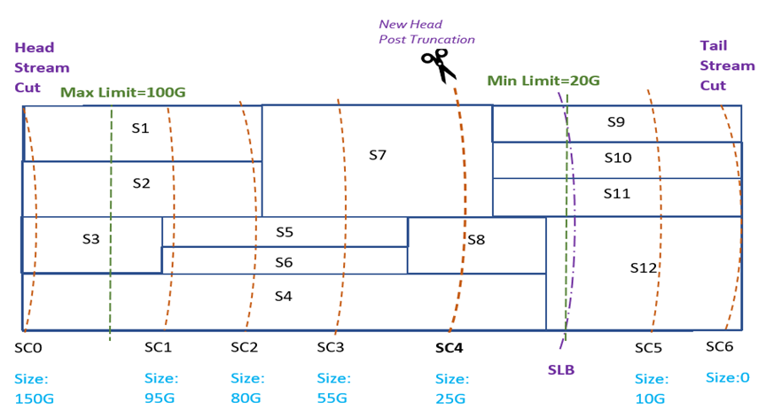
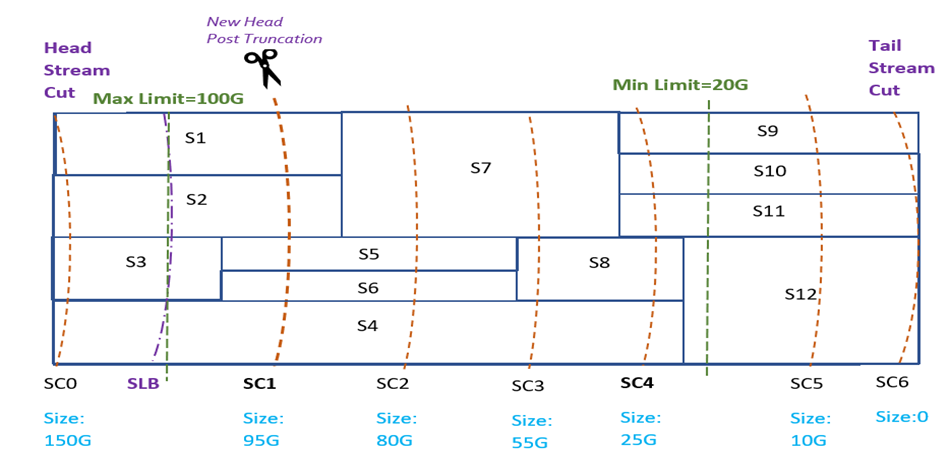
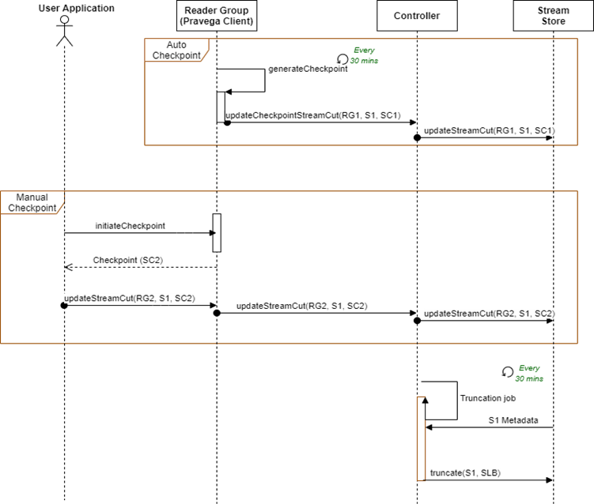

<!--
Copyright Pravega Authors.

Licensed under the Apache License, Version 2.0 (the "License");
you may not use this file except in compliance with the License.
You may obtain a copy of the License at

    http://www.apache.org/licenses/LICENSE-2.0

Unless required by applicable law or agreed to in writing, software
distributed under the License is distributed on an "AS IS" BASIS,
WITHOUT WARRANTIES OR CONDITIONS OF ANY KIND, either express or implied.
See the License for the specific language governing permissions and
limitations under the License.
-->
# Pravega Stream Retention

## Motivation
Retention is an integral part of any data system. It is important to enable the application to remove their data for at least three reasons:
   - To reclaim storage space
   - To comply with legislation
   - To comply with user requests

We envision in Pravega two broad ways to implement retention:
- Manual: The client API provides a call to truncate the data of a Stream at a given point. This point is given by an abstraction that we call a Stream Cut. A Stream Cut instance is an opaque object that internally contains a mapping of segments to offsets.
- Automated: A Stream can be configured to be truncated automatically based on either time or size.

## How Retention is handled by Pravega
The Controller is responsible for managing retention of data in a Stream. 
It does this by periodically truncating a Stream at a specific Stream Cut. 
The choice of a Stream Cut depends on the retention policy set for the Stream.

### Retention Policy - Size & Time Based

The retention policy for a Pravega Stream specifies whether truncation happens based on size or time. 
It contains a minimum limit (min limit) and a maximum limit (max limit) such that the Controller truncates data respecting those limits.
For example, a size-based policy specifies the amount of data to retain, so if a retention policy specifies a minimum limit = 20 GB and a maximum limit = 100 GB, then the truncation cycle ensures that the Stream has at least 20 GB and not more than 100 GB.

### Retention Set
The Controller on every truncation cycle generates a Stream Cut at the tail end of the Stream. It stores this Stream Cut in an ordered set of active Stream Cuts called the Retention Set inside Stream metadata. 
A Stream Cut from the retention set is chosen to truncate the Stream.

### Retention Service
A retention service runs a retention job periodically (default 30 mins) on the Controller, to check if a Stream needs to be truncated as per the retention policy. 
When attempting to truncate a Stream, the Controller chooses a Stream Cut `SC` from the Retention Set and the Stream is truncated at this Stream Cut. 
Stream truncation results in the Stream having a new head Stream Cut which is the same as the Stream Cut chosen for truncation.

The retention workflow performs the following for each Stream `S`: 
 - If `S` has a retention policy set, consider it for truncation.
 - Generate a Tail Stream Cut, `TSC` near the tail end of the Stream where writers could still be appending data.
 - Add `TSC` to the Retention Set for the Stream.
 - Compute the current size of the Stream from Head Stream Cut `HSC` to `TSC`.
 - Based on size of the Stream, arrive at a truncation Stream Cut using the following algorithm:
   - If the size of `S` is less than min limit, then do nothing.
   - If size of `S` is greater than min limit and max limit is not set, find a Stream Cut `SC` closest to but greater than the min limit, such that truncating at `SC` leaves more data in `S` than min limit.
   - If a max limit is set, and the size of `S` is greater than the max limit, find a Stream Cut `SC` in the retention set closest to but smaller than the max limit, such that truncating at `SC` leaves less data than the max limit but more data than the min limit in `S`.
   - If there is a max limit set and the size of `S` is between the max and the min limits, then attempt to truncate `S` at a Stream Cut `SC` closest to its min limit.

     

Stream `S` with Segments `S1` to `S12` and Stream Cuts `SC1`, `SC2`, `SC3`, `SC4`, `SC5`, `SC6`.

### Consumption Based Retention

#### Need

Size and time based retention policies are suitable for applications that need to store data over the longer term (archival). 
In some scenarios, however, streaming data is transient (short-lived), or storage space is at a premium. Consequently, reclaiming storage space as soon as applications no longer need the data is highly desirable in such scenarios.
Use cases that require such space reclamation include but are not limited to the following:
1. A message queue - When using a Pravega Stream as a message queue, events in the queue can be deleted after consumption by all subscribers.
2. Deployments with limited storage capacity - The storage available on small-footprint environments like edge devices (gateways) is typically constrained. Once data is no longer needed, perhaps because it has moved out of the edge to a core data center or to the cloud, it can be deleted to create space for more incoming data.
   
#### Terminology
- Subscriber Reader Group - A Subscriber Reader Group is a Reader Group whose read positions are considered for computing the truncation point for a Stream with Consumption Based Retention. When such a Subscribing Reader Group goes down, the system will truncate the Stream based on last published position of this Reader Group and will not truncate any data _not_ read by this Reader Group.
- Non-Subscriber Reader Group - A Non-Subscriber Reader Group (default) is the one that wants to read from a Stream, but does not want the consumption to impact Stream truncation. When this Reader Group goes down and comes back up, it may have lost some messages in the Stream because those were deleted while it was away.
- Stream-Cut - A StreamCut represents a consistent position in the Stream. It contains a set of Segment and offset pairs for a single Stream which represents the complete keyspace at a given point in time. The offset always points to the event boundary and hence there will be no offset pointing to an incomplete Event.
- Checkpoint - A system event that causes all Readers in a Reader Group to persist their current read positions to State Synchronizer. A Checkpoint is necessary for a Reader Group to be able to resume reading from the Stream after it goes down. With Event Stream Reader, check-pointing is also a prerequisite for assignment of unassigned segments in the Stream. For a Reader Group, checkpoints can be generated automatically or explicitly on user request. Automated check-pointing is enabled by default. The lastCheckpoint is stored in ReaderGroupState.

#### How it works
Consumption-Based Retention aims to reclaim space occupied by consumed data in a Stream. 
It retains data for as long as at least one consuming application has not consumed it. 
Like the other two retention policies, it relies on Stream cuts to determine positions at which to truncate the Stream.

For a given Stream `S`, each application consuming data from `S` regularly publishes a Stream Cut `SC` corresponding to its consumed position to the Controller. 
The Stream Cut `SC` serves as an acknowledgement that all data prior to this position in the Stream has been consumed and the application no longer needs that data. We call `SC` an acknowledgement Stream Cut. Upon receiving published Stream cuts, the Controller stores them with the metadata of `S`. The controller periodically runs a workflow to find streams that are eligible for truncation. When running this workflow, if the metadata of `S` has an acknowledgement Stream Cut from at least one application, the workflow truncates this Stream according to consumption. Otherwise, it falls back to any configured space or time-based policy.

The acknowledgement Stream Cut for each subscriber Reader Group is stored with the Stream metadata. The Controller stores only the most recent Stream Cut for each Subscriber.

  

When the retention workflow runs, and a Stream `S` has a retention policy set, we first check if the metadata table for `S` has any subscriber Stream Cuts.
1. If no entries are found, the Stream is truncated based on space or time limits, depending on the retention policy configuration for the Stream.
2. If only a single subscriber Stream Cut is present, we consider this Stream Cut as the subscriber lower bound Stream Cut.
3. If Stream Cuts for multiple subscribers are present, we compute a subscriber lower bound Stream Cut based on Stream Cuts of all subscribers. 
   The subscriber lower bound is computed such that truncating at this Stream Cut ensures that no subscriber loses any unconsumed data.
   The algorithm for arriving at a subscriber lower bound Stream Cut is out of scope for this document.
   On Controller, we compute a subscriber lower bound Stream Cut, using acknowledgement Stream cuts of all consuming applications. The Stream is then truncated based on the following:
    i. Subscriber lower bound Stream Cut is within min & max limits: If truncating at the subscriber lower bound Stream Cut leaves more data in the Stream than the configured minimum limit, but less data than the configured maximum limit, as per the Stream retention policy, we choose to truncate the Stream at the subscriber lower bound Stream Cut.
         
         

   ii. Subscriber lower bound is less than Min Limit: If truncating at the subscriber lower bound, leaves less data in the Stream than required by the min limit in the retention policy, then we discard the subscriber lower bound. We find another Stream Cut closest to but greater than the min limit, such that truncating at this would leave more data in the Stream than the min limit.
           
         

   iii. Subscriber lower bound is greater than Max Limit: If truncating at the subscriber lower bound would leave more data in the Stream than max limit, we discard subscriber lower bound. Instead, we find a Stream Cut closest to the max limit, such that truncating at this Stream Cut would leave less data in the Stream than the max limit.
        

   iv. Subscriber lower bound Overlaps with Min Limit: In this case, we choose to truncate the Stream at the first non-overlapping Stream Cut preceding the subscriber lower bound Stream Cut from the tail. This way we may leave a little more
         data in the Stream than is required by Consumption Based Retention, but we guarantee that we satisfy the minimum limit specified by the retention policy.
        

   v. Subscriber lower bound Overlaps with Max Limit: In this case, we choose to truncate the Stream at the first non-overlapping Stream Cut immediately succeeding the subscriber lower bound Stream Cut from the head.
        

**Note**: Stream truncation happens asynchronously and eventually based on the truncation Stream-Cuts published by all Subscribers and min/max limits set in the Retention Policy.

#### Enabling Consumption Based Retention on a Pravega Stream

To enable consumption-based retention the following must hold:
   - The Stream must have a retention policy configured.
   - One or more Reader Groups reading from the Stream should be `subscriber` Reader Groups.
   - The Controller should periodically receive acknowledgement Stream cuts from the subscriber Reader Groups, indicating their consumption boundary in the Stream.

#### Creating a Subscriber Reader Group

   A `Retention Type` field in the Reader Group configuration indicates that a Reader Group is either a subscriber or non-subscriber. 

   A `Retention Type` field can have the following values:

   - Auto Publish At Last Checkpoint - A Subscriber Reader Group would automatically publish the Stream Cut corresponding to the last Checkpoint to Controller.

   - Manual Publish Stream Cut – A Subscriber Reader Group would not automatically publish Stream Cuts to Controller but instead the user application would need to explicitly invoke `readerGroup.updateTruncationStreamCut()` API and provide a Stream Cut to Controller.
     
   - None – A non-subscriber Reader Group. This Reader Group is not expected to publish Stream Cuts to Controller as its read positions do not impact data retention on the Stream.
     
   A Reader Group can be converted from a subscriber to non-subscriber or vice versa by changing the value of the retention type in the Reader Group configuration.

#### Acknowledging Consumed Positions Using Checkpoints

   There are two ways for an application to acknowledge its consumed position: automatically via checkpoints or explicitly by generating a Stream Cut and publishing it to the Controller.
  - Automatically Publish Acknowledgement Stream Cuts:
    Reader Groups Checkpoint either automatically or via explicit API calls. A Checkpoint consists of coordinating the position across all readers in the group and all segments they are reading from, at Checkpoint time. Once a Reader learns of an ongoing Checkpoint (internally via shared Reader Group state), it emits a Checkpoint event. The Checkpoint event for a given Reader in the group separates the data events before the Checkpoint and events after the Checkpoint. Reading a data event after the Checkpoint event indicates that the corresponding Reader has read and consumed all events before the Checkpoint. Once all readers read beyond their corresponding Checkpoint events, the Stream Cut corresponding to the position of the Checkpoint is published to the Controller as an acknowledgement for the consumed position of this Reader Group.

  - Explicit Publishing of Acknowledgement Stream Cuts by the Application:
    Alternatively, checkpoints can be generated on the Stream by the user application. The application can choose to publish the Stream Cut corresponding to this Checkpoint to the Controller, once it determines that it does not need data in the Stream prior to this Checkpoint position.

#### Consumption Based Retention Sequence Diagram

   

   Above Figure shows the interaction among various Pravega components for executing Consumption based retention. 
   In this figure, `RG1` and `RG2` are 2 different subscriber Reader Groups reading from Stream `S1` and these publish Stream cuts `SC1` and `SC2` respectively to indicate their consumed positions in the Stream.