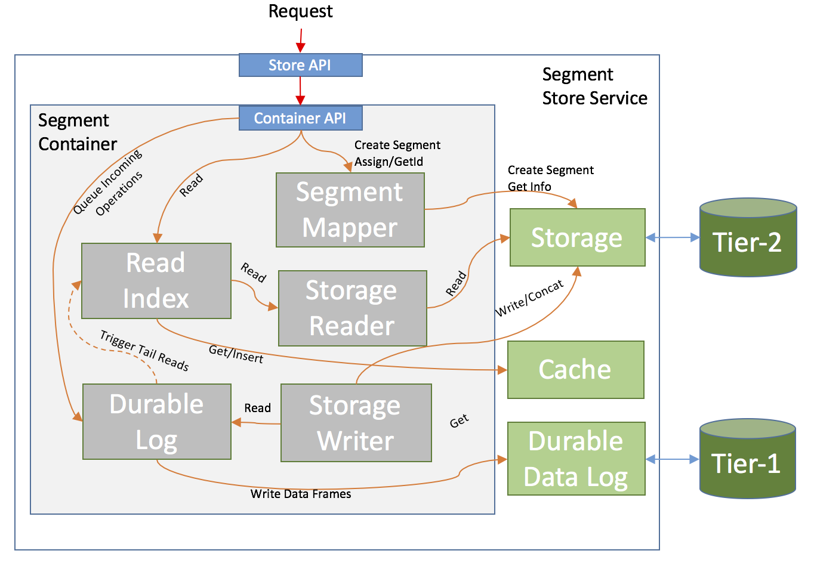
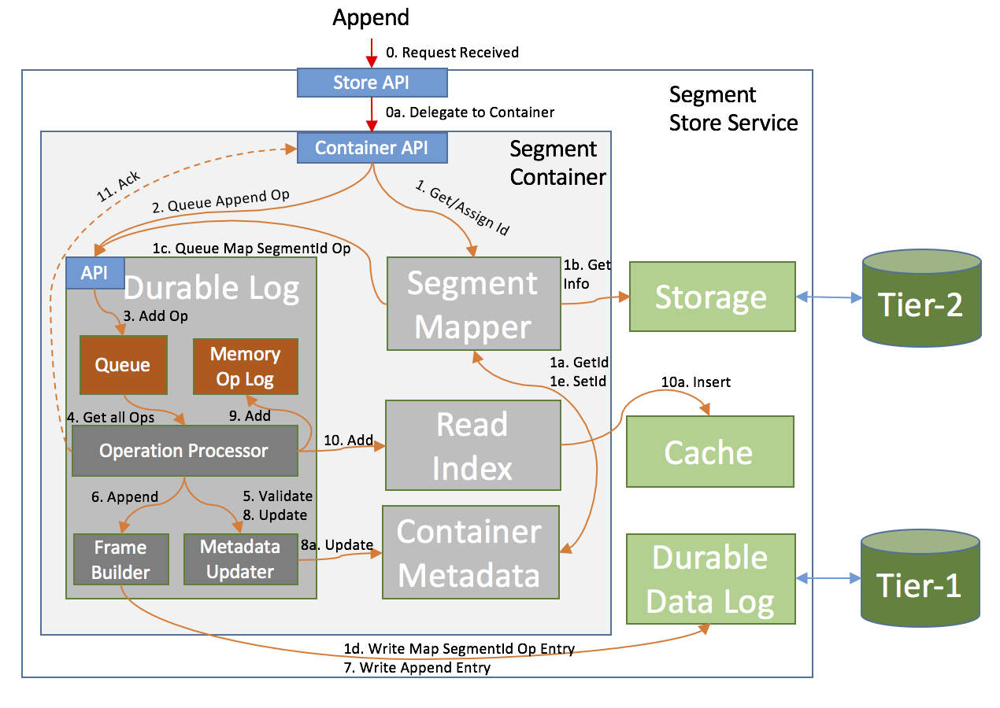
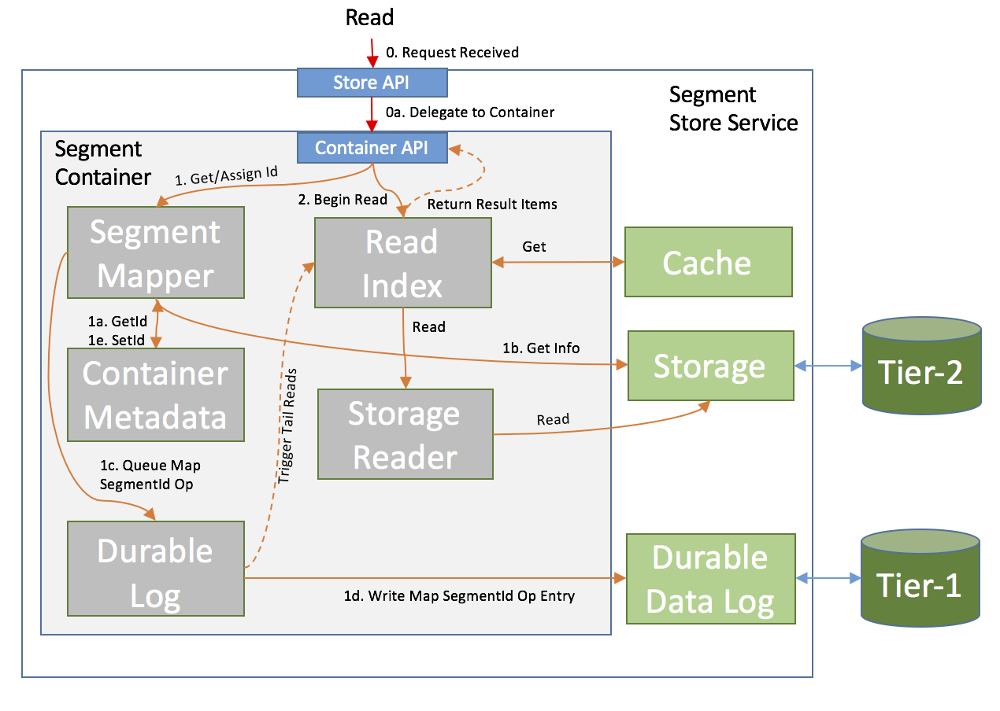

<!--
Copyright (c) 2017 Dell Inc., or its subsidiaries. All Rights Reserved.

Licensed under the Apache License, Version 2.0 (the "License");
you may not use this file except in compliance with the License.
You may obtain a copy of the License at

    http://www.apache.org/licenses/LICENSE-2.0
-->
# Pravega Segment Store Service

The Pravega Segment Store Service is a subsystem that lies at the heart of the entire Pravega deployment. It is the main access point for managing Stream Segments, providing the ability to _create_, _delete_ and _modify/access_ their contents. The Pravega Client communicates with the Pravega Stream Controller to figure out which Segments need to be used (for a Stream), and both the Stream Controller and the Client deal with the Segment Store Service to actually operate on them.

The basic idea behind the Segment Store Service is that, it buffers the incoming data in a very fast and durable append-only medium (Tier 1), and syncs it to a high-throughput (but not necessarily low latency) system (Tier 2) in the background, while aggregating multiple (smaller) operations to a Segment into a fewer (but larger) ones.

The Pravega Segment Store Service can provide the following guarantees:

- Stream Segments that are unlimited in length, with append-only semantics, yet supporting arbitrary-offset reads.
- No throughput degradation when performing small appends, regardless of the performance of the underlying Tier 2 storage system.
- Multiple concurrent writers to the same Segment.
 - Order is guaranteed within the context of a single writer, but appends from multiple concurrent writers will be added in the order in which they were received (appends are atomic without interleaving their contents).
- Writing to and reading from a Segment concurrently with relatively low latency between writing and reading.

# Terminology
The follwoing terminologies are used throughout the document:

- _Stream Segment_ or _Segment_: A contiguous sequence of bytes, similar to a file of unbounded size. This is a part of a Stream, limited both temporally and laterally (by key). The scope of Streams and mapping Stream Segments to such Streams is beyond the purpose of this document.
- _Tier 2 Storage_ or _Permanent Storage_: The final resting place of the data.
- _Tier 1 Storage_: Fast append storage, used for durably buffering incoming appends before distributing to Tier 2 Storage.
- _Cache_: A key-value local cache with no expectation of durability.
- _Pravega Segment Store Service_ or _Segment Store_: The Service that this document describes. 
- _Transaction_: A sequence of appends that are related to a Segment, which, if persisted, would make up a contiguous range of bytes within it. This is used for ingesting very large records or for accumulating data that may or may not be persisted into the Segment (but its fate cannot be determined until later in the future).
    - **Note:** At the Pravega level, a Transaction applies to an entire Stream. In this document, a Transaction applies to a single Segment.

# Architecture
The _Segment Store_ is made up of the following components:

- _Pravega Node_: A host running a Pravega Process.
- _Stream Segment Container_ (or _Segment Container_): A logical grouping of Stream Segments. The mapping of Segments to Containers is deterministic and does not require any persistent store; Segments are mapped to Containers via a hash function (based on the Segment's name).
- _Durable Data Log Adapter_ (or _Durable Data Log_): An abstraction layer for Tier 1 Storage.
- _Storage Adapter_: An abstraction layer for Tier 2 Storage.
- _Cache_: an abstraction layer for append data caching.
- _Streaming Client_: An API that can be used to communicate with the Pravega Segment Store.
- _Segment Container Manager_: A component that can be used to determine the lifecycle of Segment Containers on a Pravega Node. This is used to start or stop Segment Containers based on an external coordination service (such as the Pravega Controller).

The Segment Store handles writes by first writing them to a log (_Durable Data Log_) on a fast storage (SSDs preferably) and immediately acking back to the client after they have been persisted there. Subsequently, those writes are then aggregated into larger chunks and written in the background to Tier 2 storage. Data for appends that have been acknowledged (and are in Tier 1) but not yet in Tier 2 is stored in the Cache (in addition to Tier 1). Once such data has been written to Tier 2 Storage, it may or may not be kept in the Cache, depending on a number of factors, such as Cache utilization/pressure and access patterns.

More details about each component described above can be found in the [Components](#Components) section.

## System Diagram

In the above diagram, the major components of the Segment Store is shown and for simplicity, only one Segment Container is depicted. All Container components and major links between them (how they interact with each other) are shown. The _Container Metadata_ component is not shown, because every other component communicates with it in one form or another, and adding it would only clutter the diagram.

More detailed diagrams can be found under the [Data Flow](#Data Flow) section.

# Components 

## Segment Containers
Segment Containers are a logical grouping of Segments, and are responsible for all operations on those Segments within their span. A Segment Container is made of multiple sub-components:

- _Segment Container Metadata_: A collection of Segment-specific metadata that describe the current state of each Segment (how much data in Tier 2, how much in Tier 1, whether it is sealed, etc.), as well as other miscellaneous info about each Container.
- _Durable Log_: The Container writes every operation it receives to this log and acks back only when the log says it has been accepted and durably persisted.
- _Read Index_: An in-memory index of where data can be read from. The Container delegates all read requests to it, and it is responsible for fetching the data from wherever it is currently located (Cache, Tier 1 Storage or Tier2 Storage).
- _Cache_: Used to store data for appends that exist in Tier 1 only (not yet in Tier 2), as well as blocks of data that support reads.
- _Storage Writer_: Processes the durable log operations and applies them to Tier 2 storage (in the order in which they were received). This component is also the one that coalesces multiple operations together, for better back-end throughput.

### Segment Container Metadata
The Segment Container Metadata is critical to the good functioning and synchronization of its components. This metadata is shared across all components and it comes at two levels: Container-wide Metadata and per-Segment Metadata. Each serves a different purpose and is described below.

#### Container Metadata 

Each **Segment Container** needs to keep some general-purpose metadata that affects all operations inside the container:

- _Operation Sequence Number_: The largest sequence number assigned by the _Durable Log_. Every time a new Operation is received and successfully processed by the _Durable Log_, this number is incremented (its value never decreases or otherwise roll back, even if an operation failed to be persisted).
    - The Operation Sequence Number is guaranteed to be strict-monotonic increasing (no two Operations have the same value, and an Operation will always have a larger Sequence Number than all Operations before it).
- _Epoch_: A number that is incremented every time a successful recovery (Container Start) happens. This value is durably incremented and stored as part of recovery and can be used for a number of cases (a good use is Tier 2 fencing for HDFS, which doesn't provide a good, native mechanism for that).
- _Active Segment Metadata_: Information about each active Segment (see next section below). A Segment is active if it has had activity (read or write) recently and is currently loaded in memory. If a Segment is not used for a while, or if there are many Segments currently active, a Segment becomes inactive by having its outstanding metadata flushed to Tier 2 Storage and evicted from memory.
- _Tier 1 Metadata_: Various pieces of information that can be used to accurately truncate the Tier 1 Storage Log once all operations prior to that point have been durably stored to Tier 2.
- _Checkpoints_: Container Metadata is periodically checkpointed by having its entire snapshot (including Active Segments) serialized to Tier 1. A Checkpoint serves as a Truncation Point for Tier 1, meaning it contains all the updates that have been made to the Container via all the processed operations before it, so we no longer need those operations in order to reconstruct the Metadata. If we truncate Tier 1 on a Checkpoint, then we can use information from Tier 2 and this Checkpoint to reconstruct what is in the Metadata previously, without relying on any operation prior to it in Tier 1. 

#### Segment Metadata
Each Segment Container needs to keep per-segment metadata, which it uses to keep track of the state of each segment as it processes operations for it. The metadata can be volatile (it can be fully rebuilt upon recovery) and contains the following properties for each segment that is currently in use:

- `Name`: The name of the Segment.
- `Id`: Internally assigned unique Segment Id. This is used to refer to Segments, which is preferred to the Name. This Id is sticky for the lifetime of the Segment, which means that even if the Segment becomes inactive, a future reactivation will have it mapped to the same Id.
- `StartOffset` (also known as `TruncationOffset`): The lowest offset of the data that is available for reading. A non-truncated segment will have Start Offset equal to 0, while subsequent Truncate operations will increase (but never decrease) this number. 
- `StorageLength`: The highest offset of the data that exists in Tier 2 Storage.
- `Length`: The highest offset of the committed data in Tier 1 Storage.
- `LastModified`: The timestamp of the last processed (and acknowledged) append.
- `IsSealed`: Whether the Segment is closed for appends (this value may not have been applied to Tier 2 Storage yet).
- `IsSealedInStorage`: Whether the Segment is closed for appends (and this has been persisted in Tier 2 Storage).
- `IsMerged`: Whether this Segment has been merged into another one (but this has not yet been persisted in Tier 2 Storage). This only applies for Transactions. Once the merger is persisted into Tier 2, the Transaction Segment does not exist anymore (so `IsDeleted` will become true).
- `IsDeleted`: Whether the Segment is deleted or has recently been merged into another Segment. This only applies for recently deleted Segments, and not for Segments that never existed.

The following are always **true** for any Segment:

- `StorageLength` <= `Length`
- `StartOffset` <= `Length`

### Log Operations

A _Log Operation_ is the basic unit that is enqueued in the _Durable Log_. It does not represent an action, per se, but is the base for several serializable operations (we can serialize multiple types of operations, not just Appends). Each Operation is the result of an external action (which denote the alteration of a Segment), or an internal trigger, such as Metadata maintenance operations.

Every Log Operation has the following elements:
- `SequenceNumber`: The unique sequence number assigned to this entry (see more under [Container Metadata](#container Metadata).

The following are the various types of Log Operations: 

- _Storage Operations_ represent operations that need to be applied to the underlying Tier 2 Storage:
    - `StreamSegmentAppendOperation`: Represents an Append to a particular Segment.
    - `CachedStreamSegmentAppendOperation`: Same as `StreamSegmentAppendOperation`, but this is for internal use (instead of having an actual data payload, it points to a location in the cache from where the data can be retrieved).
    - `StreamSegmentSealOperation`: When processed, it sets a flag in the in-memory metadata that no more appends can be received. When the Storage Writer processes it, it marks the Segment as read-only in Tier 2 Storage.
    - `StreamSegmentTruncateOperation`: Truncates a Segment at a particular offset. This causes the Segment's `StartOffset` to change.
    - `MergeTransactionOperation`: Indicates that a Transaction is to be merged into its parent Segment.
- _Metadata Operations_ are auxiliary operations that indicate a change to the Container Metadata. They can be the result of an external operation (we received an request for a Segment we never knew about before, so we must assign a unique Id to it) or to snapshot the entire Metadata (which helps with recovery and cleaning up Tier 1 Storage). The purpose of the _Metadata Operations_ is to reduce the amount of time needed for failover recovery (when needed).
    - `StreamSegmentMapOperation`: Maps an Id to a Segment Name.
    - `TransactionMapOperation`: Maps an Id to a Transaction and to its Parent Segment.
    - `UpdateAttributesOperation`: Updates any attributes on a Segment.
    - `MetadataCheckpoint`: Includes an entire snapshot of the Metadata. This can be useful when during recovery.This contains all metadata up to this point, which is a sufficient base for all operations after it.

### Durable Log 

The _Durable Log_ is the central component that handles all Log Operations. All Operations (which are created by the Container) are added to the _Durable Log_, which processes them in the order in which they were received. It is made up of a few other components, all of which are working towards a single goal of processing all incoming operations as quickly as possible, without compromising data integrity.

#### Information Flow in the Durable Log

1. All received operations are added to an _Operation Queue_ (the caller receives a Future which will be completed when the operation is durably persisted).

2. The _Operation Processor_ picks all operations currently available in the queue (if the queue is empty, it will wait until at least one Operation is added).

3. The _Operation Processor_ runs as a continuous loop (in a background thread), and has four main stages.
   
 a. _Dequeue_ all outstanding Operations from the Operation Queue (described above).

 b. _Pre-process_ the Operations (validate that they are correct and would not cause undesired behavior, assign offsets (where needed), assign Sequence Numbers, etc.)

 c. _Write_ the operations to a _Data Frame Builder_, which serializes and packs the operations in _Data Frames_. Once a _Data Frame_ is complete (full or no more operations to add), the _Data Frame_ Builder sends the _Data Frame_ to the _Durable Data Log_. Note that, an Operation may span multiple _DataFrames_, but the goal is to make best use of the _Durable Data Log_ throughput capacity by making writes as large as possible considering the maximum size limit per write.

4. When a _Data Frame_ has been durably persisted in the _Durable Data Log_, the Operation Processor post-processes all operations that were fully written so far. It adds them to in-memory structures, updates indices, etc., and completes the Futures associated with them.

5. The _Operation Processor_ works asynchronously, by not waiting for a particular _Data Frame_ to be written before starting another one and sending it to the _Durable Data Log_. Likewise, multiple _Data Frames_ may be in flight by maintaining a specific order. The Operation Processor relies on certain ordering guarantees from the _Durable Data Log_, if a particular _Data Frame_ was acked, it assures that all the prior _Data Frames_ to it were also committed successfully, in the right order.  
     - The Operation Processor does not do any write throttling. It leaves that to the _Durable Data Log_ implementation, but it control the size of the Data Frames that get sent to it.

#### Truncation
Based on supplied configuration, the _Durable Log_ auto-adds a special kind of operation, named `MetadataCheckpointOperation`. This operation, when processed by the Operation Processor, collects a snapshot of the entire Container Metadata and serializes it to the _Durable Data Log_. This special Operation marks a **Truncation Point** - a place in the stream of Log Operations where we can issue Truncate operations. It is very important that after every truncation, the first operation to be found in the log is a `MetadataCheckpointOperation`, because without the prior operations to reconstruct metadata, this is the only way to be able to process subsequent operations.

**Note:** _Durable Data Log_ (Tier 1) truncation should not be confused with Segment Truncation. They serve different purposes and are applied to different targets.

#### Operation Processor
The _Operation Processor_ is a sub-component of the _Durable Log_ that deals with incoming Log Operations. Its purpose is to _validate, persist_, and _update_ Metadata and other internal structures based on the contents of each operation.

#### Operation Metadata Updater
The _Operation Metadata Updater_ is a sub-component of the _Durable Log_ that is responsible with validating operations based on the current state of the metadata, as well as update the Metadata after a successful commit of an operation. Internally it has various mechanisms to handle failures, and it can rollback certain changes in failure situations.

#### Durable Data Log 

The _Durable Data Log_ is an abstraction layer to an external component that provides append-only semantics. It is supposed to be a system which provides very fast appends to a log, that guarantees the durability and consistency of the written data. The read performance is not so much a factor, because we do not read directly from this component. Read is performed on it when we need to recover the contents of the _Durable Log_.

As explained above, Log Operations are serialized into _Data Frames_ (with a single Operation able to span multiple such Frames if needed), and these _Data Frames_ are then serialized as entries into this _Durable Data Log_. This is used only as a fail-safe, and we only need to read these Frames back if we need to perform recovery (in which case we need to deserialize all Log Operations contained in them, in the same order in which they were received).

#### In-Memory Operation Log
The _In-Memory Operation Log_ contains committed (and replicated) Log Operations in the exact same order as they were added to the _Durable Data Log_. While the Durable Data Log contains a sequence of Data Frames (which contain serializations of Operations), the Memory Log contains the actual Operations, which can be used throughout the _Durable Log_ and the Storage Writer.

The Memory Log is essentially a chain of Log Operations ordered by the time when the Operation was received. We always add at one end, and we remove from the other. When we truncate the _Durable Data Log_ the Memory Log is also truncated at the same location.

### Read Index 

The _Read Index_ helps the Segment Container perform reads from streams at arbitrary offsets. While the _Durable Log_ records (and can only replay) data in the order in which it is received, the _Read Index_ can access the data in a random fashion. The _Read Index_ is made of multiple _Segment Read Indices_ (one per live segment).

The _Segment Read Index_ is a data structure that is used to serve reads from memory, as well as pull data from Tier 2 Storage and provide _Future Reads_ (tail reads) when data is not yet available. When a read request is received, the _Segment Read Index_ returns a read iterator that will return data as long as the read request parameters have not yet been satisfied. The iterator will either fetch data that is immediately available in memory, or request data from Tier 2 storage (and bring it to memory) or, if it reached the current end of the Segment, return a Future that will be completed when new data is added (thus providing tailing or future reads).

At the heart of the _Segment Read Index_ lies a sorted index of entries (indexed by their start offsets) which is used to locate the requested data when needed. The index itself is implemented by a custom balanced binary search tree (AVL Tree to be more precise) with a goal of minimizing memory usage while not sacrificing insert or access performance. The entries themselves do not contain data, rather some small amount of metadata that is used to locate the data in the _Cache_ and to determine usage patterns (good for cache evictions).

### Cache
The _Cache_ is a component where all data (whether from new appends or that was pulled from Tier 2 storage) is stored. It is a key-value store entirely managed by the Read Index. 

The Cache is defined as an abstraction layer, and there are two implementations of it:

- In-memory implementation (via a `HashMap`). This is currently used only for unit tests.
- Memory-disk hybrid, powered by **RocksDB**. This is the preferred (and default) implementation, since it is not limited by available heap space or machine RAM. Performance is comparable to the in-memory implementation.

### Storage Writer
Pravega is by no means the final resting place of the data, nor it is meant to be a storage service. The Tier 2 Storage is where we want data to be in the long term and Pravega is only used to store a very short tail-end of it (using Tier 1 Storage), enough to make appends fast and aggregate them into bigger chunks for committal to Tier 2 Storage. To perform this, it needs another component (**Storage Writer**) that reads data from the _Durable Log_ inthe order in which it was received, aggregates it, and sends it to Tier 2 Storage.

Just like the _Durable Log_, there is one Storage Writer per Segment Container. Each Writer reads Log Operations from the In-Memory Operation Log (exposed via the `read()` method in the _Durable Log_) in the order they were processed. It keeps track of the last read item by means of its Sequence Number. This state is not persisted, and upon recovery, it can just start from the beginning of the available _Durable Log_.

The Storage Writer can process any Storage Operation (_Append, Seal, Merge_), and as Pravega being the sole actor it modifies such data in Tier 2 and applies them without any constraints. It has several mechanisms to detect and recover from possible data loss or external actors modifying data concurrently.

# Integration with Controller
Methods for mapping Segment Containers to hosts and rules used for moving from one to another are beyond the scope of this document. Here, we just describe how the Segment Store Service interacts with the _Controller_ and how it manages the lifecycle of Segment Containers based on external events.

## Segment Container Manager
Each instance of a Segment Store Service needs a _Segment Container Manager_. The role of this component is to manage the lifecycle of the Segment Containers that are assigned to that node (service). It performs the following duties:

- Connects to the Controller Service-Side Client (i.e., a client that deals only with Segment Container events, and not with the management of Streams and listens to all changes that pertain to Containers that pertain to its own instance.
- When it receives a notification that it needs to start a Segment Container for a particular Container Id, it initiates the process of bootstrapping such an object. It does not notify the requesting client of success until the operation completes without error.
- When it receives a notification that it needs to stop a Segment Container for a particular Container Id, it initiates the process of shutting it down. It does not notify the requesting client of success until the operation completes without error.
- If the Segment Container shuts down unexpectedly (whether during Start, or during its normal operation), it will not attempt to restart it locally; instead it will notify the Controller.

# Storage Abstractions
The Segment Store was not designed with particular implementations for Tier 1 or Tier 2. Instead, all these components have been abstracted out in simple, well-defined interfaces, which can be implemented against any standard file system (Tier 2) or append-only log system (Tier 1). 

Possible candidates for Tier-1 storage:

- **Apache BookKeeper** (preferred, adapter is fully implemented as part of Pravega)
- Non-durable, non-replicated solutions:
    - In-Memory (Single node deployment only - Pravega becomes a volatile buffer for Tier-2 storage; data loss is unavoidable and unrecoverable from in the case of process crash or system restart).
        - This is used for unit test only.
    - Local File System (Single node deployment only - Pravega becomes a semi-durable buffer for Tier-2 storage; data loss is unavoidable and unrecoverable from in the case of complete node failure)
 
Possible candidates for Tier 2 storage:

- **HDFS** (Implementation available)
- **Extended S3** (Implementation available)
- **NFS** (general **FileSystem**) (Implementation available)
- In-Memory (Single node deployment only - limited usefulness; data loss is unavoidable and unrecoverable from in the case of process crash or system restart) 
    - This is used for unit test only.

A note about **Tier 2 Truncation**:

- The Segment Store supports Segment truncation at a particular offset, which means that, once that request is complete, no offset below that one will be available for reading.
- This above is only a metadata update operation, however this also needs to be supported by Tier 2 so that the truncated data is physically deleted from it.
- If a Tier 2 implementation does not natively support truncation from the beginning of a file with offset preservation (i.e., a Segment of length 100 is truncated at offset 50, then offsets 0..49 are deleted, but offsets 50-99 are available and are not shifted down), then the **Segment Store** provides a wrapper on top of a generic Tier 2 implementation that can do that.
- The `RollingStorage` Tier 2 wrapper splits a Segment into multiple _Segment Chunks_ and exposes them as a single Segment to the upper layers. _Segment Chunks_ that have been truncated out, are deleted automatically. This is not a very precise application (since it relies heavily on a rollover policy dictating granularity), but it is a practical solution for those cases when the real Tier 2 implementation does not provide the features that we need.  

# Data Flow 

Here are a few examples on how data flows inside the Pravega Segment Store Service.

## Appends

The diagram above depicts these steps (note the step numbers may not match, but the order is the same):

1. **Segment Store** receives append request with params: Segment Name, Payload and AttributeUpdates.
2. **Segment Store** determines the ContainerId for the given Segment and verifies that the **Segment Container** is registered locally. If not, it returns an appropriate error code.
3. **Segment Store** delegates request to the appropriate **Segment Container** instance.
    a. **Segment Container** verifies that the Segment belongs to the Segment Container and that the Segment actually exists. If not, it returns an appropriate error code. 
        - During this process, it also get an existing Segment Id or assigns a new one (by using the **Segment Mapper** component).
    b.  Segment Container creates a `StreamSegmentAppendOperation` with the input data and sends it to the _Durable Log_.
4. **Durable Log** takes the Append Operation and processes it according to the algorithm described in the [Durable Log](#Durable Log) section.  
    a. Puts it in its Operation Queue.
    b. Operation Processor pulls all operations off the Queue.
    c. Operation Processor uses the _Data Frame Builder_ to construct _Data Frames_ with the operations it has.
    d. _Data Frame Builder_ asynchronously writes the _Data Frame_ to the _Durable Data Log_.
    e. Upon completion, the following are done in parallel:
         - Metadata is updated.
         - The Operation is added to the _Memory Operation Log_ and _Read Index_.
         - An call that triggered the Operation is acked.
    f. The above process is asynchronous, which means the Operation Processor will have multiple _Data Frames_ in flight (not illustrated). It will keep track of each one's changes and apply or roll them back as needed. 

This process applies for every single operation that the **Segment Store** supports. All _modify_ operations go through the Operation Processor and have a similar path.

## Reads

The diagram above depicts these steps (note the step numbers may not match, but the order is the same):

1. **Segment Store** receives read request with params: Segment Name, Read Offset, Max-Length.
    a. **Segment Store** determines the ContainerId for the given Segment and verifies if it is Leader for given **Segment Container**. If not, it returns an appropriate error code.
    b. **Segment Store** delegates request to the **Segment Container** instance.
2. **Segment Container** verifies that the Segment belongs to that Container and that it actually exists. If not, it returns an appropriate error code to the client. 
    - During this process, it also get an existing Segment Id or assigns a new one (by using the **Segment Mapper** component).
3. **Segment Container** delegates the request to its _Read Index_, which processes the read as described in the _[Read Index]_(#Read Index) section, by issuing Reads from **Storage** (for data that is not in the **Cache**), and querying/updating the **Cache** as needed.

## Synchronization with Tier 2 (Storage Writer)

The diagram above depicts these steps (note the step numbers may not match, but the order is the same):

1. The **Storage Writer**'s main loop is the sub-component that triggers all these operations.
2. Read next Operation from the _Durable Log_ (in between each loop, the Writer remembers what the Sequence Number of the last processed Operation was).
3. All operations are processed, and added to the internal **Segment Aggregators** (one Aggregator per Segment).
4. Eligible Segment Aggregators are flushed to **Storage** (eligibility depends on the amount of data collected in each aggregator, and whether there are any Seal, Merge or Truncate operations queued up).
    - Each time an Append operation is encountered, a trip to the _Read Index_ may be required in order to get the contents of the append.
5. After every successful modification (_write/seal/concat/truncate_) to **Storage**, the **Container Metadata** is updated to reflect the changes.
6. The _Durable Log_ is truncated (if eligible).

## Container Startup (Normal/Recovery)

The diagram above depicts these steps (note the step numbers may not match, but the order is the same):

1. The **Container Manager** receives a request to start a Container in this instance of the **Segment Store Service**.
    - It creates, registers, and starts the Container.
2. The **Container** starts the _Durable Log_ component.
3. _Durable Log_ initiates the recovery process (coordinated by the **Recovery Executor**).
4. **Recovery Executor** reads all _Data Frames_ from _Durable Data Log_.
5. Deserialized Operations from the read _Data Frames_ are added to the **Memory Operation Log**.
6. The **Container Metadata** is updated by means of the **Operation Metadata Updater** (same as the one used inside Operation Processor).
7. The _Read Index_ is populated with the contents of those Operations that apply to it.
8. The **Container** Starts the **Storage Writer**.
    - The **Storage Writer**'s Main Loop starts processing operations from the _Durable Log_, and upon first encountering a new Segment, it reconciles its content (and metadata) with the reality that exists in **Storage**.
8. After both the **Durable Log** and the **Storage Writer** have started, the **Container** is ready to start accepting new external requests.
