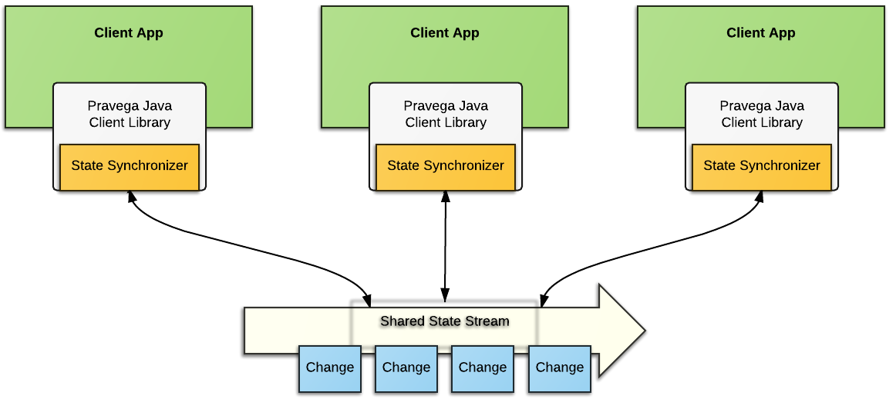
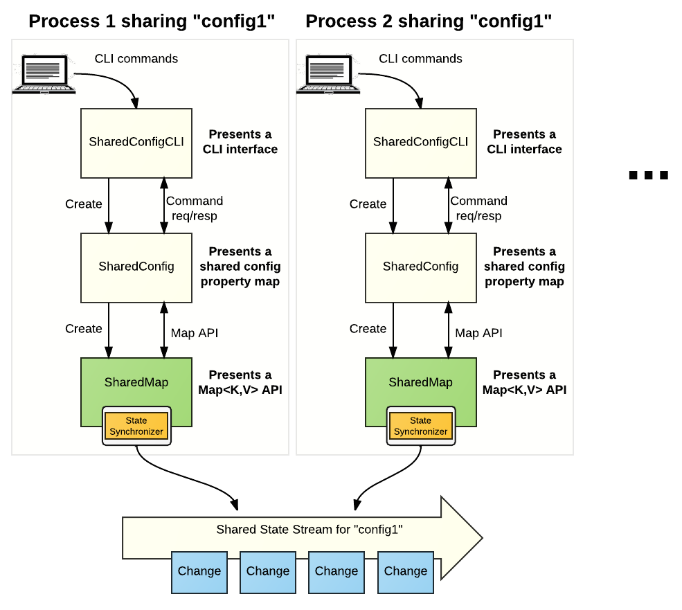
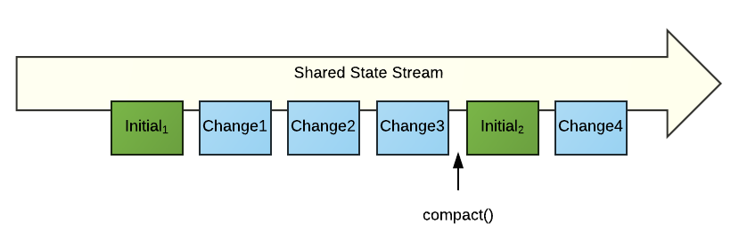

<!--
Copyright Pravega Authors.

Licensed under the Apache License, Version 2.0 (the "License");
you may not use this file except in compliance with the License.
You may obtain a copy of the License at

    http://www.apache.org/licenses/LICENSE-2.0

Unless required by applicable law or agreed to in writing, software
distributed under the License is distributed on an "AS IS" BASIS,
WITHOUT WARRANTIES OR CONDITIONS OF ANY KIND, either express or implied.
See the License for the specific language governing permissions and
limitations under the License.
-->
# Working with Pravega: State Synchronizer

You can think about Pravega as a streaming storage primitive, because it is a
great way to durably persist data.  You can think about Pravega as a great
pub-sub messaging system, because with Readers, Writers and ReaderGroups it is a
great way to do messaging at scale.  But you can also think about Pravega as a
way to implement shared state in a consistent fashion across multiple
cooperating processes distributed in a cluster.  It is this latter category that
we explore with this document.

Instructions for running the sample applications can be found in the[ Pravega
Samples
readme](https://github.com/pravega/pravega-samples/blob/v0.5.0/pravega-client-examples/README.md).

You really should be familiar with Pravega Concepts (see [Pravega
Concepts](pravega-concepts.md)) before continuing reading this page.
 In particular, you should be somewhat familiar with the [State
Synchronizer](pravega-concepts.md#state-synchronizers)
concept.

## Shared State and Pravega

State Synchronizer is a facility provided by the Pravega programming model to
make it easy for developers to use Pravega to coordinate shared state between
processes.



The idea is that a Stream is used to persist a sequence of changes to shared
state and that various applications use their Pravega Java Client Library to
concurrently read and write the shared state in a consistent fashion. 

## SharedStateMap and Shared Configuration Example

Before we dive into the details about how to use State Synchronizer, let's take
a quick look at an example application that uses State Synchronizer.  We have
provided a simple yet illustrative example of using State
Synchronizer [here.](https://github.com/pravega/pravega-samples/tree/v0.5.0/pravega-client-examples/src/main/java/io/pravega/example/statesynchronizer)

The example uses State Synchronizer to build an implementation of Java's Map
data structure called SharedMap.  We use that primitive SharedMap data structure
to build a Shared Config, that allows a set of processes to consistently
read/write a shared, configuration object of key/value pair properties.  Also as
part of that example, we provide a simple command line-based application that
allows you to play around with the SharedConfig app.



Here is a menu of the available commands in the SharedConfigCLI application:

```
Enter one of the following commands at the command line prompt:

GET_ALL - prints out all of the properties in the Shared Config.
GET {key} - print out the configuration property for the given key.
PUT {key} , {value} - update the Shared Config with the given key/value pair.  Print out previous value (if it existed).
PUT_IF_ABSENT {key} , {value} - update the Shared Config with the given key/value pair, only if the property is not already defined.
REMOVE {key} [ , {currentValue}] - remove the given property from the Shared Config.  If {currentValue} is given, remove only if the property's current value matches {currentValue}..
REPLACE {key} , {newValue} [ , {currentValue}] - update the value of the property.  If {currentValue} is given, update only if the property's current value matches {cuurentValue}.
CLEAR - remove all the keys from the Shared Config.
REFRESH - force an update from the Synchronized State.
HELP - print out a list of commands.
QUIT - terminate the program.
```

Install the Pravega-Samples and launch two instances of the SharedConfigCLI
using the same scope and stream name.  This will simulate how two different
processes can coordinate their local copy of the SharedConfig with one shared
state object.  You can follow these steps to get a feel for how the SharedConfig
is coordinated:

| **\#** | **Process 1**                  | **Process 2**              | **Discussion**                                                                                                                                                                |
|--------|--------------------------------|----------------------------|-------------------------------------------------------------------------------------------------------------------------------------------------------------------------------|
| 1      | **GET\_ALL**                   | **GET\_ALL**               | Shows that both processes see an empty SharedConfig                                                                                                                           |
| 2      | **PUT** p1,v1                  |                            | Process 1 adds a property named p1                                                                                                                                            |
| 3      | **GET** p1                     | **GET** p1                 | Process 1 sees value v1 for the property                                                                                                                                      |
|        |                                |                            | Process 2 does not have a property named p1. Why? Because it has not refreshed its state with the shared state                                                                                                                                                                              |
| 4      |                                | **REFRESH**                | Re-synchronize Process 2's state with the shared state                                                                                                                        |
| 5      |                                | **GET** p1                 | Now Process 2 sees the change Process 1 made in step 2                                                                                                                        |
| 6      |                                | **REPLACE** p1, newVal, v1 | Process 2 attempts to change the value of p1, but uses a conditional replace, meaning the change should be made only if the old value of p1 is v1 (which it is at this point) |
| 7      |                                | **GET** p1                 | Sure enough, the value of p1 was changed to newVal                                                                                                                            |
| 8      | **REPLACE** p1, anotherVal, v1 |                            | Process 1 tries to change the value of p1 in the same way Process 2 did in step 6. This will fail because the value of p1 in shared state is no longer v1                     |
| 9      | **GET** p1                     |                            | The failed replace operation in step 8 caused Process 1's copy of the shared state to be updated, its value is now newVal because of step 6.                                  |


You can repeat with a similar sequence to explore the semantics of
PUT\_IF\_ABSENT and other operations that modify shared state.

The idea is that modifications to the SharedConfig succeed only if they operate
on the latest value.  We use optimistic concurrency to implement efficient
consistency across multiple consumers of the SharedConfig object.

You can have multiple different SharedConfig state objects running
simultaneously, each separate SharedConfig uses State Synchronizer objects based
on a different Pravega Stream.  Of course if you launch two applications using
State Synchronizer objects backed by the same Stream, you get two processes
concurrently accessing the shared state.  This is exactly the situation we
illustrated above.

## Using State Synchronizer to Build the SharedMap

We used the State Synchronizer to build the SharedMap object in Pravega-Samples.
 State Synchronizer can be used to build a shared version of almost any data
structure.  Maybe your app needs to share just a simple integer count of
something; we can use State Synchronizer to build a simple shared counter.
 Maybe the data you are sharing is a Set of currently running servers in a
cluster;  we can use State Synchronizer to build  a shared Set.  The
possibilities are many.

Let's explore how to build shared objects using State Synchronizer by examining
how we built Shared Map.

### State Synchronizer

State Synchronizer is a type of Pravega client, similar to an EventStreamReader
or EventStreamWriter.  A State Synchronizer is created via a ClientFactory
object.  Each State Synchronizer has a unique name within a Scope.  A
SynchronizerConfig object is used to tailor the behavior of a StateSynchronizer
(although currently, there are no properties on a State Synchronizer that are
configurable).  State Synchronizer uses Java generic types to allow a developer
to specify a type specific State Synchronizer.  All of these things are done in
a fashion similar to how EventStreamReaders and EventStreamWriters are used.

### StateT

When designing an application that uses State Synchronizer, the developer needs
to decide what type of state is going to be synchronized (shared).  Are we
sharing a Map?  A Set?  A Pojo? What is the data structure that is being shared.
 This defines the core "type" of the State Synchronizer (the StateT generic type
in the State Synchronizer interface).  The StateT object can be any Java object
that implements the *Revisioned* interface defined by Pravega.  *Revisioned* is
a simple interface that allows Pravega to ensure it can properly compare two
different StateT objects.

In our example, the SharedMap is the State Synchronizer application.  It defines
a simple Map object presenting the typical get(key), set (key, value) etc.
operations you would expect from a key-value pair map object.  It
implements  the *Revisioned* interface, as required to use the State
Synchronizer, and uses a simple ConcurrentHashMap as its internal implementation
of the Map.  So in our example, StateT corresponds to SharedStateMap\<K,V\>.

### UpdateT and InitialUpdateT

In addition to StateT, there are two other generic types that need to be defined
by a StateSynchronizer app: an Update type and an InitialUpdate type).  The
UpdateType represents the "delta" or change objects that are persisted on the
Pravega Stream.  The InitialUpdateType is a special update object used to to
start the State Synchronizer off.  Both UpdateType and InitialUpdateType are
defined in terms of StateT.

The StateSynchronizer uses a single Segment on a Stream to store updates
(changes) to the shared state object.  Changes, in the form of Initial or Update
type objects, are written to the Stream based on whether the update is relative
to the most current copy of the state in the Stream.  If an update is presented
that is based on an older version of the state, the update is not made.

The StateSynchronizer object itself keeps a local in memory copy of the state,
it also keeps version metadata about that copy of the state.  Local state can be
retrieved using the getState() operation.  The local in memory copy could be
stale, and it can be refreshed by an application using the fetchUpdates()
operation, that retrieves all the changes made to the given version of the
state.

Most changes from the application are made through the updateState() operation.
 The updateState() operation takes a Function as parameter.  The Function is
invoked with the latest state object, and computes the updates to be applied.

In our example, InitialUpdateT is implemented as:

```java
/**
 * Create a Map. This is used by StateSynchronizer to initialize shared state.
 */
private static class CreateState<K, V> implements InitialUpdate<SharedStateMap<K,V>>, Serializable {
    private static final long serialVersionUID = 1L;
    private final ConcurrentHashMap<K, V> impl;

    public CreateState(ConcurrentHashMap<K, V> impl) {
        this.impl = impl;
    }

    @Override
    public SharedStateMap<K, V> create(String scopedStreamName, Revision revision) {
        return new SharedStateMap<K, V>(scopedStreamName, impl, revision);
    }
}
```

In this case, the CreateState class is used to initialize the shared state in
the Stream by creating a new, empty SharedStateMap object.  You could imagine
other examples of InitialUpdate that would set a counter to 1, or perhaps
initialize a Set to a fixed initial set of members.

It may seem a bit odd that functions like "initialize" and "update" are
expressed as classes, but when you think about it, that makes sense.  The
changes, like initialize and update, need to be stored in Pravega, therefore
they need to be serializable objects.  It must be possible for client
applications to be able to start at any time, compute the current state and then
keep up as changes are written to the Stream.  If we just stored "the latest
state value" in the Stream, there would be no way to consistently provide
concurrent update and read using optimistic concurrency.

UpdateT is a bit more tricky.  There isn't just one kind of update to a Map, but
rather there are all sorts of updates: put of a key/value pair, put of a
collection of key/value pairs, removing a key/value pair and clearing all of the
key/value pairs,  Each of these "kinds" of updates are represented by their own
Class.  We define an abstract class, called StateUpdate, from which all of these
"operational" update classes inherit.  

**StateUpdate abstract class**
```java
/**
 * A base class for all updates to the shared state. This allows for several different types of updates.
 */
private static abstract class StateUpdate<K,V> implements Update<SharedStateMap<K,V>>, Serializable {
    private static final long serialVersionUID = 1L;

    @Override
    public SharedStateMap<K,V> applyTo(SharedStateMap<K,V> oldState, Revision newRevision) {
        ConcurrentHashMap<K, V> newState = new ConcurrentHashMap<K, V>(oldState.impl);
        process(newState);
        return new SharedStateMap<K,V>(oldState.getScopedStreamName(), newState, newRevision);
    }

    public abstract void process(ConcurrentHashMap<K, V> updatableList);
}
```

By defining an abstract class, we can define UpdateT in terms of the abstract
StateUpdate class.  The abstract class implements the "applyTo" method that is
invoked by the StateSynchronizer to apply the update to the current state object
and return an updated state object.  The actual work is done on a copy of the
old state's underlying Map (impl) object, a "process" operation is applied
(specific to each subclass) to the impl object and a new version of the
SharedState, using the post-processed impl as the internal state.  The abstract
class defines a process() method that actually does the work of whatever update
needs to be applied.  This method is implemented by the various concrete classes
that represent Put, PutAll etc. operations on the shared map.

Here, for example, is the way we implement the Put(key,value) operation on the
SharedMap object:

**Put as an Update Object**
```java
/**
 * Add a key/value pair to the State.
 */
private static class Put<K,V> extends StateUpdate<K,V> {
    private static final long serialVersionUID = 1L;
    private final K key;
    private final V value;

    public Put(K key, V value) {
        this.key = key;
        this.value = value;
    }

    @Override
    public void process(ConcurrentHashMap<K, V> impl) {
        impl.put(key, value);
    }
}
```

Here, the process() operation is to add a key/value pair to the map, or if the
key already exists, change the value.  Each of the "operations" on the SharedMap
is implemented in terms of creating instances of the various subclasses of
StateUpdate.

## Executing Operations on SharedMap

SharedMap demonstrates the typical operations on a StateSynchronizer.  SharedMap
presents an API, very similar to Java's Map\<K,V\> interface.  It implements the
Map operations in terms of manipulating the StateSynchronizer, using the various
subclasses of StateUpdate to perform state change (write) operations.

### Create/Initialize 

**Creating a SharedMap**

```java
/**
  * Creates the shared state using a synchronizer based on the given stream name.
  *
  * @param clientFactory - the Pravega ClientFactory to use to create the StateSynchronizer.
  * @param streamManager - the Pravega StreamManager to use to create the Scope and the Stream used by the StateSynchronizer
  * @param scope - the Scope to use to create the Stream used by the StateSynchronizer.
  * @param name - the name of the Stream to be used by the StateSynchronizer.
  */
public SharedMap(ClientFactory clientFactory, StreamManager streamManager, String scope, String name){
    streamManager.createScope(scope);

    StreamConfiguration streamConfig = StreamConfiguration.builder().scope(scope).streamName(name)
            .scalingPolicy(ScalingPolicy.fixed(1))
            .build();

    streamManager.createStream(scope, name, streamConfig);

    this.stateSynchronizer = clientFactory.createStateSynchronizer(name,
                                            new JavaSerializer<StateUpdate<K,V>>(),
                                            new JavaSerializer<CreateState<K,V>>(),
                                            SynchronizerConfig.builder().build());

    stateSynchronizer.initialize(new CreateState<K,V>(new ConcurrentHashMap<K,V>()));
}
```

A SharedMap object is created by defining the scope and stream (almost always
the case, the scope and stream probably already exist, so the steps in lines
10-16 are usually no-ops.  The StateSynchronizer object itself is constructed in
lines 18-21 using the ClientFactory in a fashion similar to the way a Pravega
Reader or Writer would be created.  Note that the UpdateT object and
InitialUpdateT object can have separate Java serializers specified.  Currently,
the SynchronizerConfig object is pretty dull; there are no configuration items
currently available on the StateSynchronizer.

The StateSynchronizer provides an initialize() API that takes an InitialUpdate
object.  This is called in the SharedMap constructor to make sure the
SharedState is properly initialized.  Note, in many cases, the SharedMap object
will be created on a stream that already contains shared state for the
SharedMap.  Even in this case, it is ok to call initialize() because
initialize() won't modify the shared state in the Stream.

### Read Operations

The read operations, operations that do not alter shared state, like get(key)
 containsValue(value) etc., work against the local copy of the
StateSynchronizer.  All of these operations retrieve the current local state
using getState() and then do the read operation from that state.  The local
state of the StateSynchronizer might be stale.  In these cases, the SharedMap
client would use refresh() to force the StateSynchronizer to refresh its state
from shared state using the fetchUpdates() operation on the StateSynchronizer
object.

Note, this is a design decision to trade off staleness for responsiveness.  We
could easily have implemented the read operations to instead always do a refresh
before doing the read against local state.  That would be a very efficient
strategy if the developer expected that there will be frequent updates to the
shared state.  In our case, we had imagined that the SharedMap would be read
frequently but updated relatively infrequently, and therefore chose to read
against local state.

### Write (update) Operations

Each write operation is implemented in terms of the various concrete StateUpdate
objects we discussed earlier.  The clear() operation uses the Clear subclass of
StateUpdate to remove all the key/value pairs, put() uses the Put class, etc.

Lets dive into the implementation of the put() operation to discuss
StateSynchronizer programming in a bit more detail:

**Implementing put(key,value)**

```java
/**
 * Associates the specified value with the specified key in this map.
 *
 * @param key - the key at which the value should be found.
 * @param value - the value to be entered into the map.
 * @return - the previous value (if it existed) for the given key or null if the key did not exist before this operation.
 */
public V put(K key, V value){
    final AtomicReference<V> oldValue = new AtomicReference<V>(null);
    stateSynchronizer.updateState((state, updates) -> {
        oldValue.set(state.get(key));
        updates.add(new Put<K,V>(key,value));
    });
    return oldValue.get();
}
```

It is important to note that the function provided to the StateSynchronizer's
updateState() will be called potentially multiple times. The result of applying the function to the old state is written
only when it is applied against the most current revision of the state.
If there was a race and the optimistic concurrency check fails, it will be called again.
Most of the time there will only be a small number of invocations.  In some cases, the
developer may choose to use fetchUpdates() to synchronize the StateSynchronizer
with the latest copy of shared state from the stream before running
updateState().  This is a matter of optimizing the tradeoff between how frequent
updates are expected and how efficient you want the update to be.  If you expect
a lot of updates, call fetchUpdates() before calling updateState().  In our
case, we didn't expect a lot of updates and therefore we process potentially
several invocations of the function each time put() is called.

### Delete Operations

We chose to implement the delete (remove) operations to also leverage the
compact() feature of StateSynchronizer.  We have a policy that after every 5
remove operations, and after every clear() operation, we do a compact operation.
 Now, we could have chosen to do a compact() operation after every 5 update
operations, but we wanted to isolate the illustration of using compact() to just
delete operations.

You can think of compact() as a form of "garbage collection" in
StateSynchronizer.  After a certain number of changes have been written to
SharedState, it might be efficient to write out a new initial state, an
accumulated representation of all the changes, to the Stream.  That way data
older than the compact operation can be ignored and eventually removed from the
Stream.



As a result of the compact() operation, a new initial sate (Initial2) is written
to the stream.  Now, all the data from Change3 and older is no longer relevant
and can be garbage collected out of the Stream.
